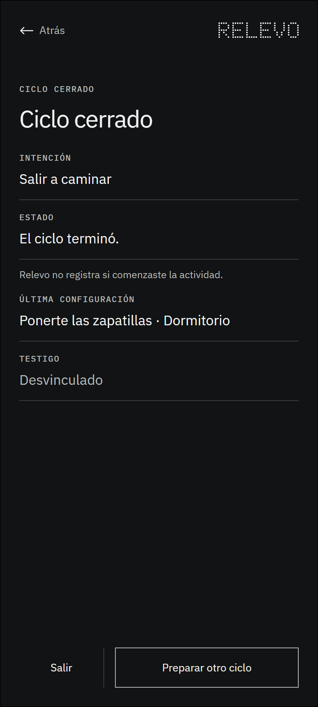

# 3.3 Cerrar o recuperar

## Qué muestra y por qué existe

Permite terminar el ciclo o resolver un fallo técnico sin abrir una cuarta interacción. El cierre describe el estado del sistema, no confirma que la persona haya realizado la actividad. La recuperación distingue problemas de vínculo, batería o permisos de cualquier juicio sobre la decisión personal.

## Lugar dentro del recorrido

Este marco pertenece a la interacción 3 de la ruta principal. La numeración permite reconocer su posición sin confundirla con los estados técnicos y las excepciones de cobertura.

## Decisiones visuales

El cierre se presenta como un estado neutral, sin recompensa ni evaluación de conducta. La última configuración queda disponible como referencia y las acciones permiten salir o preparar otro ciclo sin rearmarlo automáticamente.

---

## Registro de cambios (disclaimer)

- **Qué se incorporó:** el wireframe, su explicación y su ubicación dentro del mapa organizado.
- **Cómo estaba antes:** la imagen estaba disponible únicamente en una carpeta plana junto a los demás marcos.
- **Por qué se hizo:** facilitar la revisión individual sin perder la relación con la sección y el recorrido completo.
- **Alcance:** este archivo documenta una decisión estructural; no acredita validación con personas ni funcionamiento técnico.