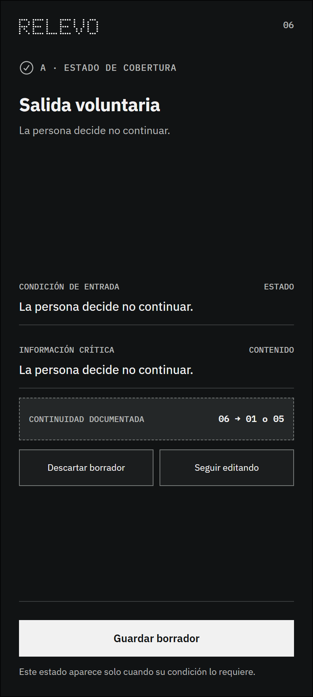

# Estado 06 — Salida voluntaria

## Qué resuelve

Reconoce que la persona puede detener la preparación sin que eso se trate como fallo.

## Qué puede ocurrir después

Guardar, descartar o seguir editando.

Este estado forma parte de la cobertura del sistema. Aparece solo cuando se cumple su condición y no agrega un paso obligatorio a la ruta principal.

---

## Registro de cambios (disclaimer)

- **Qué se incorporó:** el wireframe y una explicación breve de su función y continuidad.
- **Cómo estaba antes:** la imagen estaba reunida en una carpeta plana con los demás estados.
- **Por qué se hizo:** permitir una lectura individual y mantener visible la familia a la que pertenece.
- **Alcance:** este archivo anticipa un estado posible; no demuestra que la condición técnica ya haya sido implementada o validada.