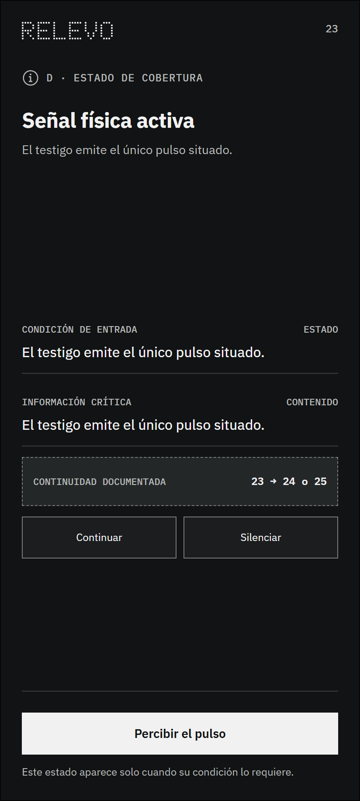

# Estado 23 — Señal física activa

## Qué resuelve

Representa el único pulso situado del testigo. En la entrega fechada, el rojo identifica ese acontecimiento. La dirección posterior usa ámbar; este archivo no redefine la paleta vigente.

## Qué puede ocurrir después

Percibir, silenciar, continuar o cerrar.

Este estado forma parte de la cobertura del sistema. Aparece solo cuando se cumple su condición y no agrega un paso obligatorio a la ruta principal.

---

## Registro de cambios (disclaimer)

### 2026-09-09 — Limpieza y vigencia documental

- **Cambio:** se fechó la función del rojo descrito en esta entrega.
- **Antes:** el texto podía interpretarse como una regla actual de color.
- **Motivo:** evitar contradicciones con la decisión cromática posterior.
- **Alcance:** Solo cambia la explicación; la imagen de la entrega se conserva.

- **Qué se incorporó:** el wireframe y una explicación breve de su función y continuidad.
- **Cómo estaba antes:** la imagen estaba reunida en una carpeta plana con los demás estados.
- **Por qué se hizo:** permitir una lectura individual y mantener visible la familia a la que pertenece.
- **Alcance:** este archivo anticipa un estado posible; no demuestra que la condición técnica ya haya sido implementada o validada.
