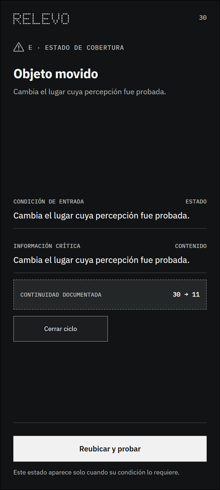

# Estado 30 — Objeto movido

## Qué resuelve

Representa la revisión del lugar cuando la persona informa que movió el objeto. Permite volver a probar la señal; no presupone detección automática del desplazamiento.

## Qué puede ocurrir después

Repetir la prueba de lugar.

Este estado forma parte de la cobertura del sistema. Aparece solo cuando se cumple su condición y no agrega un paso obligatorio a la ruta principal.

---

## Registro de cambios (disclaimer)

### 2026-09-09 — Limpieza y vigencia documental

- **Cambio:** se aclaró que el cambio de ubicación se declara por la persona.
- **Antes:** la descripción podía atribuir al sistema una detección automática no definida.
- **Motivo:** hacer explícito el alcance del estado sin añadir sensores ni funciones.
- **Alcance:** Solo cambia la explicación del estado; no se desarrolla ni modifica el wireframe.

- **Qué se incorporó:** el wireframe y una explicación breve de su función y continuidad.
- **Cómo estaba antes:** la imagen estaba reunida en una carpeta plana con los demás estados.
- **Por qué se hizo:** permitir una lectura individual y mantener visible la familia a la que pertenece.
- **Alcance:** este archivo anticipa un estado posible; no demuestra que la condición técnica ya haya sido implementada o validada.
