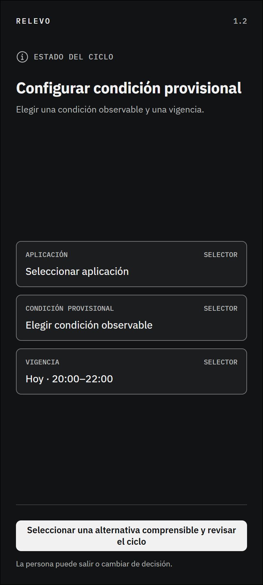

# 1.2 Configurar condición provisional

## Qué muestra y por qué existe

Reúne la aplicación, la condición observable y la vigencia del ciclo. La condición se presenta como provisional porque todavía debe comprobarse que sea comprensible, técnicamente viable y pertinente. La persona puede corregirla, cambiarla o salir sin perder lo que ya formuló.

## Lugar dentro del recorrido

Este marco pertenece a la interacción 1 de la ruta principal. La numeración permite reconocer su posición sin confundirla con los estados técnicos y las excepciones de cobertura.

---

## Registro de cambios (disclaimer)

- **Qué se incorporó:** el wireframe, su explicación y su ubicación dentro del mapa organizado.
- **Cómo estaba antes:** la imagen estaba disponible únicamente en una carpeta plana junto a los demás marcos.
- **Por qué se hizo:** facilitar la revisión individual sin perder la relación con la sección y el recorrido completo.
- **Alcance:** este archivo documenta una decisión estructural; no acredita validación con personas ni funcionamiento técnico.