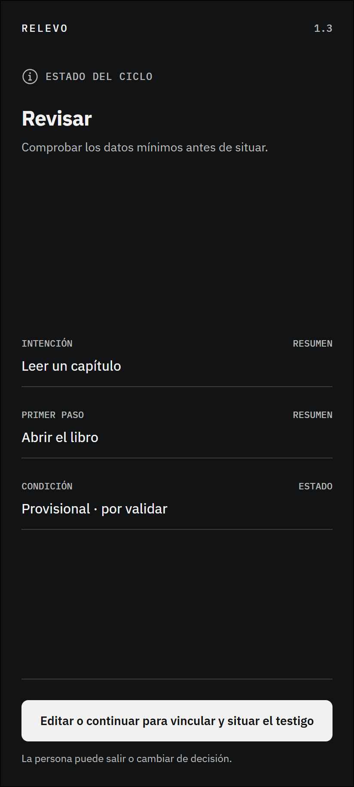

# 1.3 Revisar

## Qué muestra y por qué existe

Ordena en una sola lectura la intención, el primer paso, la condición y la vigencia. Esta pausa evita que el ciclo avance con datos ambiguos y permite editar antes de involucrar el testigo físico. Los permisos pendientes se comunican como una limitación técnica, no como un error personal.

## Lugar dentro del recorrido

Este marco pertenece a la interacción 1 de la ruta principal. La numeración permite reconocer su posición sin confundirla con los estados técnicos y las excepciones de cobertura.

---

## Registro de cambios (disclaimer)

- **Qué se incorporó:** el wireframe, su explicación y su ubicación dentro del mapa organizado.
- **Cómo estaba antes:** la imagen estaba disponible únicamente en una carpeta plana junto a los demás marcos.
- **Por qué se hizo:** facilitar la revisión individual sin perder la relación con la sección y el recorrido completo.
- **Alcance:** este archivo documenta una decisión estructural; no acredita validación con personas ni funcionamiento técnico.