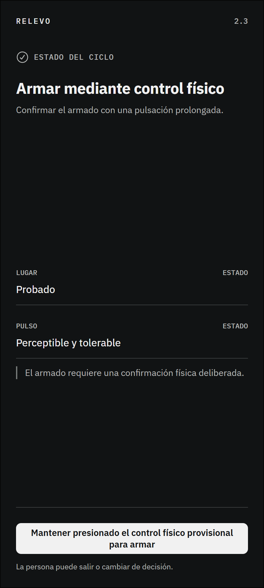

# 2.3 Armar mediante control físico

## Qué muestra y por qué existe

Cierra la preparación mediante una acción deliberada. El armado no sucede automáticamente después de configurar la aplicación: exige una confirmación explícita vinculada al testigo. Si la confirmación no llega, se puede reintentar, revisar el vínculo o salir sin armar.

## Lugar dentro del recorrido

Este marco pertenece a la interacción 2 de la ruta principal. La numeración permite reconocer su posición sin confundirla con los estados técnicos y las excepciones de cobertura.

---

## Registro de cambios (disclaimer)

- **Qué se incorporó:** el wireframe, su explicación y su ubicación dentro del mapa organizado.
- **Cómo estaba antes:** la imagen estaba disponible únicamente en una carpeta plana junto a los demás marcos.
- **Por qué se hizo:** facilitar la revisión individual sin perder la relación con la sección y el recorrido completo.
- **Alcance:** este archivo documenta una decisión estructural; no acredita validación con personas ni funcionamiento técnico.