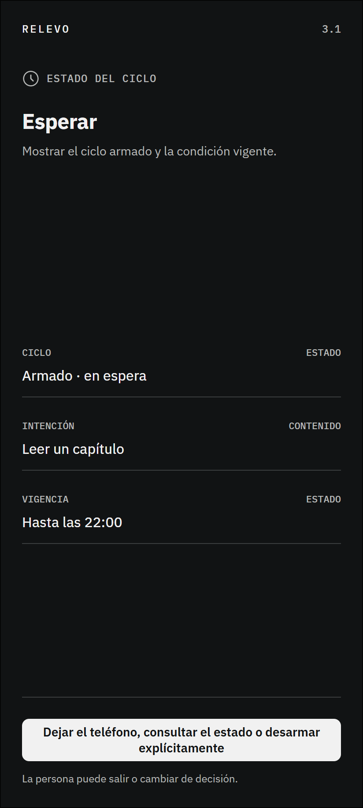

# 3.1 Esperar

## Qué muestra y por qué existe

Muestra que el ciclo está activo y que la condición sigue vigente. La pantalla evita contadores, premios o evaluaciones porque esperar no significa que la persona esté fallando. También mantiene visible la posibilidad de desarmar el ciclo en cualquier momento. Su desarrollo en alta fidelidad se eligió como pantalla destacada porque reúne intención, primer paso, condición, vigencia y testigo.

## Lugar dentro del recorrido

Este marco pertenece a la interacción 3 de la ruta principal. La numeración permite reconocer su posición sin confundirla con los estados técnicos y las excepciones de cobertura.

## Desarrollo visual relacionado

pantalla-alta-fidelidad.png desarrolla este marco con el sistema visual oscuro vigente. Se eligió como pantalla destacada porque reúne las variables centrales del ciclo y representa una vista real de la aplicación. El pulso situado todavía no ocurre, por lo que el rojo permanece ausente.

---

## Registro de cambios (disclaimer)

- **Qué se incorporó:** el wireframe, su explicación, su ubicación dentro del mapa organizado y la versión relacionada de alta fidelidad.
- **Cómo estaba antes:** la imagen estaba disponible únicamente en una carpeta plana junto a los demás marcos.
- **Por qué se hizo:** facilitar la revisión individual sin perder la relación con la sección y el recorrido completo.
- **Alcance:** este archivo documenta una decisión estructural; no acredita validación con personas ni funcionamiento técnico.