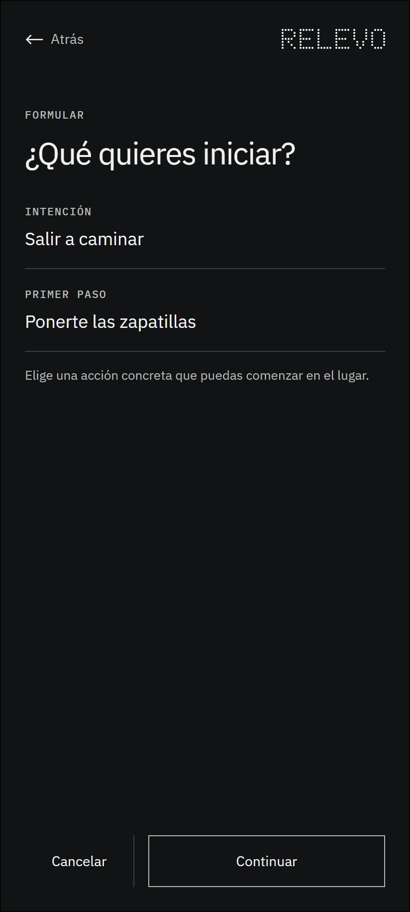
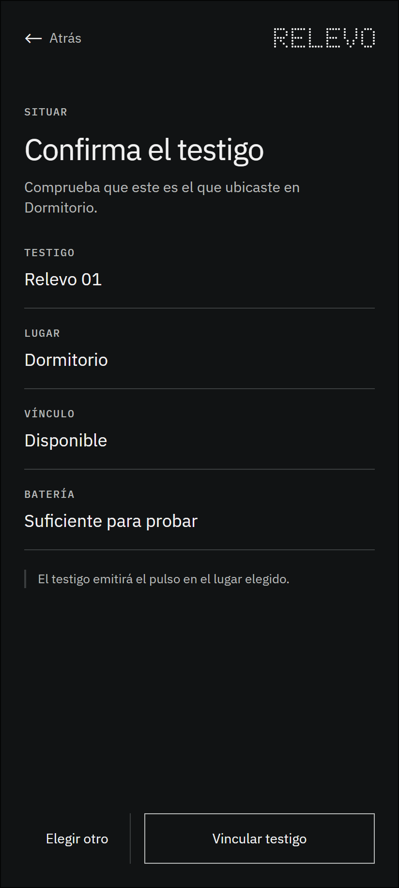
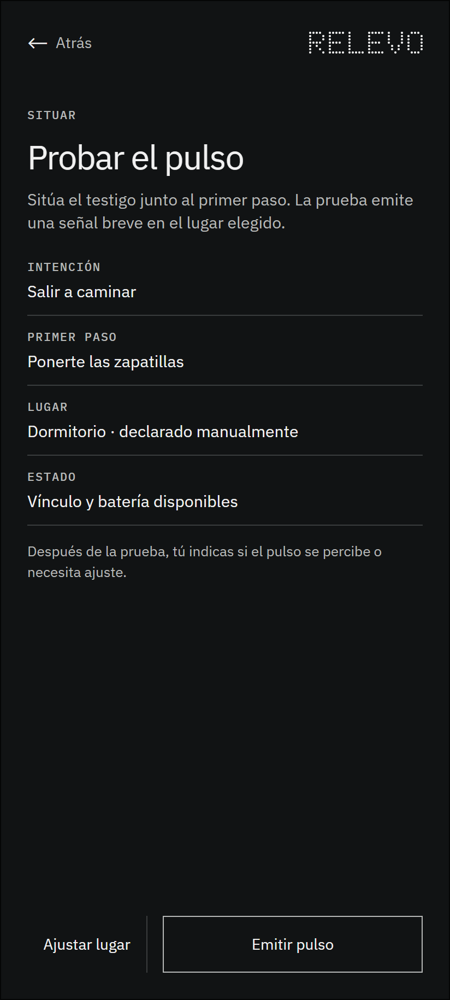
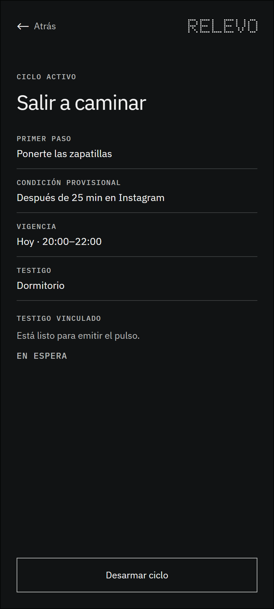
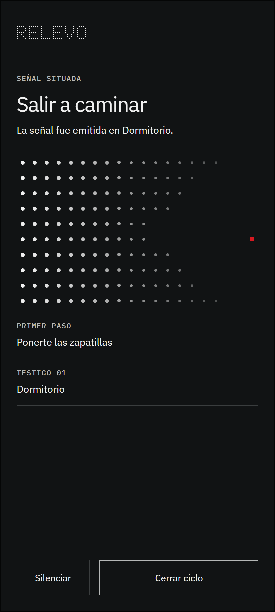

# Auditoría visual de la ruta principal

## Alcance

Se revisaron las nueve pantallas exportadas el 2 de septiembre de 2026. La observación considera continuidad del recorrido, jerarquía, legibilidad, diferencia entre información y controles, uso semántico del color y riesgos de accesibilidad visibles. No reemplaza una prueba interactiva con personas.

## Resultado general

La ruta mantiene una estructura visual consistente y permite reconocer formulación, preparación, espera, señal y cierre. El hallazgo prioritario estaba en 3.2: un icono de menú parecía accionable aunque no tenía una función definida. Se retiró. La pantalla conserva ahora únicamente la marca, el gráfico informativo y las dos acciones que pertenecen al recorrido.

## Revisión por paso

### 1. Formular — Salud: buena

La intención y el primer paso se leen como campos relacionados. La ayuda es breve y la acción principal se distingue de la salida.

### 2. Configurar condición provisional — Salud: buena con una decisión pendiente

Las tres elecciones comparten estructura y jerarquía. Antes de implementar debe precisarse la consecuencia de cada salida para evitar que el retorno superior y la acción inferior parezcan equivalentes.

### 3. Revisar — Salud: buena

El resumen separa datos y estado. La advertencia de que el ciclo aún no está armado evita confundir revisión con activación.

### 4. Situar — Salud: buena

El testigo se reconoce por su nombre, lugar, vínculo y batería. La interfaz no fija una forma industrial y mantiene una acción principal clara.

### 5. Probar el pulso — Salud: buena

La prueba se diferencia del armado. El texto explica que la evaluación posterior depende de la percepción declarada por la persona.

### 6. Armar mediante control físico — Salud: buena

La pantalla instruye el gesto, pero no ofrece un botón digital para armar. El estado de espera se presenta como información y la única acción permite salir sin activar el ciclo.

### 7. Esperar — Salud: buena

La espera se comunica sin progreso, recompensa ni evaluación. El rojo permanece ausente y el desarme continúa disponible.

### 8. Recibir el pulso situado — Salud: buena después de la corrección

El campo de puntos está acompañado por texto equivalente y contiene un solo nodo rojo. Silenciar y cerrar aparecen como acciones; se eliminó el menú sin función que podía confundirse con una tercera alternativa.

### 9. Cerrar — Salud: buena

El cierre describe el estado del sistema sin afirmar que la actividad se realizó. La recuperación de fallos queda documentada en los estados complementarios, sin recargar este final normal.

## Riesgos que requieren prototipo funcional

- comprobar orden de foco, teclado y lectura con TalkBack;
- verificar el significado de volver, cancelar y salir en cada momento;
- comprobar ampliación de texto y reflujo sin pérdida de contenido;
- validar que el gráfico de 3.2 conserve su significado en escala de grises;
- probar percepción, detención y recuperación del pulso físico.

---

## Registro de cambios (disclaimer)

### 2026-09-02 — Primera auditoría de la ruta reconstruida

- **Qué se incorporó:** revisión visual de las nueve pantallas, estado general por paso y riesgos que requieren interacción real.
- **Cómo estaba antes:** existían fundamentos individuales, pero no una lectura continua basada en las exportaciones vigentes.
- **Qué se reemplazó:** en 3.2 se retiró un menú sin función definida.
- **Por qué se hizo:** asegurar que todo elemento con apariencia de control corresponda a una interacción real y dejar visibles los límites de la revisión visual.
