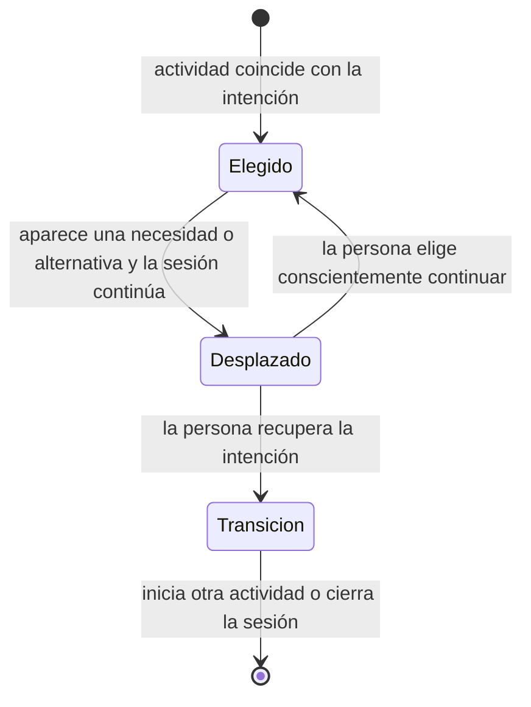

# Comparación y definición de dos tipos de usuario

## Decisión

Se utilizarán dos tipos situacionales:

1. **Usuario principal — continuidad digital con intención desplazada.**
2. **Usuario límite — ocio digital elegido y coherente.**

Un tipo situacional es un patrón de experiencia que puede aparecer en personas distintas y también en momentos diferentes de una misma persona. No es un segmento demográfico ni una identidad estable.

El término **usuario límite** designa el patrón que establece cuándo la propuesta no debería intervenir. Su función no es representar a una persona secundaria, sino proteger el alcance ético y funcional del proyecto.

## Alternativas comparadas

### Alternativa A — Dos variantes dentro del público objetivo

Una posibilidad era dividir el público potencial, por ejemplo, entre quienes experimentan olvido y culpa y quienes reconocen una actividad alternativa pero no logran iniciarla.

### Alternativa B — Usuario principal y usuario límite

La segunda posibilidad era definir un patrón que justifica apoyo y otro que delimita situaciones de ocio digital legítimo donde intervenir sería innecesario o contraproducente.

## Evaluación

| Criterio | Dos variantes del público objetivo | Usuario principal más usuario límite |
|---|---|---|
| Ajuste a P1–P8 | Separa tensiones que suelen coexistir en un mismo caso | Explica el contraste entre episodios con y sin conflicto |
| Distinción | Olvido, culpa y dificultad de cambio se superponen | La presencia o ausencia de intención desplazada establece una diferencia operativa |
| Casos contradictorios | Tiende a excluir P6, P7 y parte de P8 | Integra esos casos como evidencia de no intervención |
| Utilidad para diseñar | Permite imaginar funciones, pero no define cuándo callar | Define tanto la oportunidad como el límite del sistema |
| Riesgo ético | Puede convertir todo ocio digital en problema | Reduce paternalismo y falsos positivos |
| Evolución futura | Requeriría crear más subvariantes | Admite ampliar matices dentro de cada patrón sin perder la frontera principal |
| Relación con el corpus | Favorece clasificar personas | Respeta que P4 y P6 contienen ambos patrones según el episodio |

## Razón de la elección

La intención desplazada explica mejor la pertinencia del proyecto que el tiempo de pantalla, la aplicación utilizada o el recuerdo por separado.

- P2 conserva un recuerdo claro y, aun así, continúa después de reconocer que necesita dormir.
- P8 reconoce una rutina difícil de describir, pero valora la sesión como descanso y no expresa conflicto.
- P6 mantiene una videollamada extensa, memorable y significativa; la duración no constituye un problema.
- P4 diferencia dentro del mismo teléfono un sudoku dirigido y un consumo de TikTok difícil de recuperar.

Estos contrastes muestran que el sistema no puede decidir desde fuera que una pantalla es problemática. Relevo tendría valor cuando ayuda a recuperar una intención que ya pertenece a la persona.

## Tipo U1 — Continuidad digital con intención desplazada

### Definición

Patrón en el que una sesión de ocio digital comienza o continúa mientras una intención, necesidad o alternativa valorada pierde capacidad de orientar la acción. La persona puede reconocer que quiere dormir, hacer otra actividad, atender una obligación o simplemente cerrar la sesión, pero la continuidad disponible en el teléfono sostiene el comportamiento actual.

No requiere que exista olvido. Tampoco implica que todo el episodio haya sido desagradable.

### Evidencia central

- **P2:** reconoce sueño y deseo de dormir, recuerda la sesión con claridad y continúa en Instagram.
- **P3:** pierde noción del tiempo, reconoce mejores cosas por hacer y evalúa la sesión como una porción perdida del día.
- **P5:** pasa del entretenimiento al aburrimiento, resume la tarde como nada y sus intentos de separación son frágiles.

### Evidencia complementaria

- P4 describe TikTok como una sucesión de videos que no permanece en la mente.
- P6 reservaría el objeto para momentos en que mira redes sin pensar.
- P8 reconoce el hábito de abrir Instagram sin darse cuenta cuando tiene tareas.
- P1 separa el teléfono porque su cercanía favorece que lo revise durante otras actividades.

### Condiciones de entrada

El patrón se considera presente cuando convergen, con evidencia suficiente:

1. una sesión digital en continuidad;
2. una intención, necesidad o alternativa reconocible;
3. dificultad para convertir esa intención en una transición;
4. una consecuencia relevante para la persona, como cierre ambivalente, malestar, pérdida temporal o estrategia fallida.

No todos los elementos deben expresarse con la misma intensidad, pero no basta con observar una aplicación o una duración.

### Necesidades

- Recuperar en el momento una intención ya formulada.
- Crear una transición breve entre reconocer y actuar.
- Mantener capacidad de elegir continuar sin sanción.
- Reducir la dependencia de fuerza de voluntad o configuraciones frágiles.
- Distinguir descanso elegido de continuidad no deliberada.
- Recibir una señal comprensible que no convierta el ocio en rendimiento.

### Puntos de dolor

- Saber que quiere cambiar de actividad y continuar igualmente.
- Tener el teléfono al alcance y volver a revisarlo.
- Percibir después aburrimiento, tiempo perdido o falta de cierre.
- Asociar el ocio con culpa o productividad.
- Abandonar estrategias porque requieren repetición o autocontrol constante.
- Sentir fricción o ansiedad inicial ante la separación.

### Deseos y criterios de valor

- Dormir cuando aparece sueño.
- Retomar hobbies, ejercicio, lectura, dibujo, cocina o actividades sociales.
- Descansar sin pensar en obligaciones.
- Poder reconocer que el ocio ocurrió y tuvo sentido.
- Elegir sin comparaciones entre días, notas o castigo.

### Oportunidad preliminar para Relevo

El proyecto podría apoyar una transición que la persona haya definido previamente: hacer perceptible una intención, ofrecer un lugar físico para el teléfono y devolver una señal breve de cierre. La investigación todavía debe determinar el momento, el canal y la forma exactos.

### Qué no debe asumir el sistema

- Que toda sesión larga es indeseada.
- Que toda red social produce conflicto.
- Que la persona desea ser interrumpida cada vez.
- Que una actividad no productiva carece de valor.
- Que recuerdo débil significa daño.
- Que continuar siempre es un error.

## Tipo U2 — Ocio digital elegido y coherente

### Definición

Patrón en el que una actividad digital coincide con la intención actual de la persona o cumple una función aceptada de descanso, relación, concentración o entretenimiento. No existe una necesidad competidora suficientemente reconocida, o la persona decide continuar de manera coherente con sus prioridades.

El episodio puede ser largo, cotidiano, emocionalmente neutro o incluso difícil de resumir. La ausencia de conflicto pesa más que una norma externa sobre cómo debería usar su tiempo.

### Evidencia central

- **P6:** la videollamada prolongada es relacional, memorable y deseada; la persona excluye ese uso de una posible intervención.
- **P7:** el podcast en YouTube es una actividad elegida, recordada y legítima porque no hay obligaciones pendientes; no experimenta lagunas.

### Evidencia complementaria

- P1 valora la lectura de manga en el teléfono como reflexiva y satisfactoria.
- P4 experimenta el sudoku digital como concentración y descanso.
- P8 considera Instagram un descanso legítimo cuando está al día, aunque la rutina sea difícil de describir.

### Condiciones de entrada

1. existe una elección o aceptación suficiente del episodio;
2. no aparece una intención competidora que la persona quiera recuperar;
3. el uso cumple una función reconocida o no genera conflicto relevante;
4. una interrupción externa aportaría poco o podría deteriorar la experiencia.

### Necesidades

- Conservar autonomía sobre el ocio.
- No ser juzgado por duración, aplicación o productividad.
- Mantener continuidad en actividades relacionales o concentradas.
- Poder desactivar, ignorar o posponer cualquier señal.
- Evitar comparaciones y clasificaciones de desempeño.

### Puntos de dolor frente a una intervención inadecuada

- Interrupción de una conversación, juego, lectura o contenido significativo.
- Falsa alarma basada solo en tiempo o aplicación.
- Conversión del descanso en una tarea medible.
- Sensación de vigilancia o paternalismo.
- Pérdida de confianza en el sistema.
- Refuerzo de la culpa que el proyecto busca reducir.

### Deseos y criterios de valor

- Que el tiempo libre pueda ser neutral y aun así legítimo.
- Elegir la tecnología por su valor social, narrativo o recreativo.
- Recibir apoyo solo cuando lo solicita o configura.
- Mantener señales discretas y reversibles.
- No comparar su descanso con días anteriores ni con otras personas.

### Implicación preliminar para Relevo

El comportamiento correcto del sistema puede ser **no actuar**. Si la persona no ha declarado una intención alternativa o decide continuar, el objeto debería permanecer silencioso, permitir descartar la señal y evitar inferencias morales.

## Relación dinámica entre ambos tipos

El cambio de estado depende de la intención de la persona, no de una clasificación automática de la aplicación.

## Comparación resumida

| Dimensión | U1 — Intención desplazada | U2 — Ocio elegido |
|---|---|---|
| Relación con la sesión | Quiere o necesita cambiar, pero continúa | Quiere continuar o acepta la actividad |
| Recuerdo | Puede ser claro o débil | Puede ser claro o débil |
| Afecto | Puede haber entretenimiento y luego ambivalencia | Puede ser positivo o neutral |
| Obligación | Puede existir una necesidad o alternativa activa | No existe o ya fue resuelta |
| Estrategia | Suele ser frágil o dependiente de autocontrol | Puede no necesitar estrategia |
| Papel de Relevo | Hacer recuperable una intención y apoyar la transición | Permanecer silencioso o disponible bajo demanda |
| Riesgo principal | No actuar cuando la persona pide apoyo | Interrumpir, juzgar o convertir descanso en rendimiento |

## Vacíos antes de convertir los tipos en personas

Los tipos son suficientes para orientar la siguiente etapa, pero no justifican todavía completar una persona con biografía, ocupación, vivienda o rasgos emocionales estables. Deben resolverse mediante nuevas preguntas o validación:

- cómo y cuándo se formula una intención antes de una sesión;
- qué señal resulta perceptible sin sentirse intrusiva;
- cuánto cambia la pertinencia según cama, escritorio, comedor u otro contexto;
- cómo se descarta o pospone una señal;
- qué grado de separación física es aceptable;
- si una persona entiende y adopta la distinción entre continuar por elección y continuar por inercia;
- qué datos necesita el sistema y cuáles no debería registrar.

## Criterio de revisión

La tipología deberá revisarse si nuevas entrevistas muestran que:

- existe intención desplazada sin continuidad digital;
- la ausencia de conflicto no basta para proteger un episodio;
- un tercer patrón modifica decisiones de diseño de manera sustantiva;
- los participantes no reconocen la distinción entre ambos estados;
- el objeto genera más culpa o fricción que autonomía.

---

## Registro de cambios (disclaimer)

### 2026-08-23 — Creación y elección de estructura

- **Cambio:** se compararon dos variantes del público objetivo frente a usuario principal más usuario límite y se definieron U1 y U2.
- **Versión anterior:** la estructura de los dos usuarios permanecía abierta y existían perfiles históricos no respaldados.
- **Motivo:** la matriz P1–P8 muestra que recuerdo, duración y aplicación no distinguen por sí solos la pertinencia; la intención desplazada sí ofrece una frontera operativa y ética.
- **Decisión derivada:** desarrollar personas y recorridos como estados situacionales, evitando asignar de forma rígida cada participante a un único grupo.
