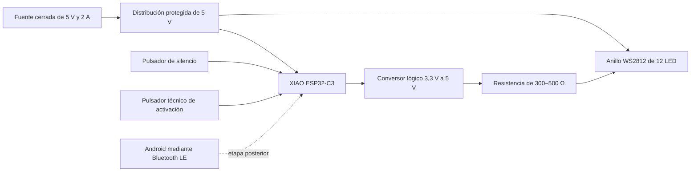

# Esquema provisional del núcleo físico de 5 V

**Fecha de corte:** 30 de agosto de 2026

**Estado:** preparado para revisión electrónica; no aprobado para compra, conexión o energización

**Arquitectura evaluada:** Seeed Studio XIAO ESP32-C3, anillo WS2812 de 12 LED, alimentación de 5 V, control físico y activación técnica separada de Bluetooth

## Propósito

Este esquema convierte la [alternativa de 5 V](alternativas-arquitectura-fisica-2026-08-30.md) en relaciones que una persona competente pueda revisar. No fija una placa de circuito, una forma industrial ni la arquitectura final de Relevo. Su función es comprobar si una señal luminosa pequeña puede ejecutar la fase A con menos piezas y menor corriente que el montaje provisional de 12 V.

La selección de una placa documentada corrige la ambigüedad de la ESP32-C3 Super Mini genérica considerada inicialmente. La XIAO ESP32-C3 dispone de mapa de pines, esquema y archivos de diseño publicados por Seeed Studio.

## Límites de la propuesta

- Se utiliza una fuente cerrada de 5 V; no se incorpora batería.
- El anillo no se alimenta desde la salida de 3,3 V de la placa.
- Bluetooth no participa en la primera comprobación luminosa.
- El pulsador técnico cableado existe solo para aislar la señal del enlace inalámbrico.
- Ninguna conexión se acepta hasta identificar físicamente la placa, el anillo y los componentes auxiliares.
- La protoboard, si se utiliza, queda restringida a señales lógicas; la distribución de alimentación debe revisarse y conectarse mediante terminales adecuados.

## Arquitectura funcional

La fuente alimenta dos ramas desde un punto común. Una llega a la entrada de 5 V aprobada para la XIAO; la otra alimenta directamente el anillo. No se asumirá que la corriente del anillo puede atravesar la placa hasta que una revisión confirme la ruta y su capacidad.

## Asignación provisional de señales

El mapa oficial de Seeed Studio permite proponer pines concretos para revisión. Se evitan D0/GPIO2, D8/GPIO8 y D9/GPIO9 porque el fabricante los identifica como pines que participan en la configuración de arranque.

| Función | Pin XIAO propuesto | Pin del chip | Motivo | Estado |
| --- | --- | --- | --- | --- |
| Datos luminosos | D6 | GPIO21 | Salida digital disponible; no figura entre los pines de arranque advertidos por Seeed Studio. | Por confirmar en placa y firmware. |
| Silencio normal | D1 | GPIO3 | Entrada digital disponible y apta para despertar desde reposo según la documentación del fabricante. | Por confirmar con pulsador real. |
| Activación técnica cableada | D2 | GPIO4 | Permite probar el patrón antes de introducir Bluetooth. | Temporal; no pertenece al producto final. |
| Referencia común | GND | GND | Placa, conversor y anillo necesitan una referencia compartida. | Obligatoria. |

La asignación no autoriza cableado. Debe comprobarse la serigrafía de la unidad comprada y la continuidad hasta cada terminal antes de energizar.

## Conexiones que debe revisar una persona competente

| Tramo | Origen funcional | Destino funcional | Condición anterior a energizar |
| --- | --- | --- | --- |
| Alimentación principal | Fuente cerrada de 5 V | Punto de distribución con protección definida | Medir tensión, polaridad y comportamiento sin carga. |
| Rama del controlador | Distribución de 5 V | Entrada aprobada de la XIAO | Definir si se emplea USB-C o 5V/VBUS; no conectar ambas rutas simultáneamente sin aprobación. |
| Rama luminosa | Distribución de 5 V | +5 V y GND del anillo | Confirmar corriente, conductor, terminal y protección. |
| Conversión lógica | D6/GPIO21 | Entrada de un 74AHCT125 o equivalente aprobado | Alimentar el conversor según su ficha y compartir GND. |
| Datos del anillo | Salida del conversor | Resistencia de 300–500 Ω y luego DIN | Situar la resistencia cerca del primer LED; confirmar DIN y DOUT en la unidad real. |
| Reserva de energía | +5 V y GND del anillo | Condensador de 500–1000 µF, mínimo 6,3 V | Verificar polaridad y tensión nominal. |
| Silencio | D1/GPIO3 | Pulsador momentáneo hacia GND | Usar estado definido mediante resistencia interna o externa y comprobar antirrebote. |
| Activación técnica | D2/GPIO4 | Pulsador temporal hacia GND | Mantener el cable fuera del recorrido y retirar al integrar Bluetooth. |

Adafruit recomienda convertir la señal de 3,3 V cuando los WS2812 reciben 5 V, añadir una resistencia de 300–500 Ω en la línea de datos y disponer un condensador de 500–1000 µF junto a la alimentación del conjunto. El anillo consultado declara hasta 60 mA por LED; doce unidades representan un máximo teórico de 0,72 A a brillo completo. El prototipo debe comenzar con un límite de brillo bajo y medir la corriente real, no dimensionarse a partir de una apariencia esperada.

## Silencio, corte y arranque

El pulsador de silencio es el control normal de la experiencia. Al accionarlo, el programa debe:

1. enviar inmediatamente valor cero a todos los LED;
2. cancelar cualquier secuencia activa;
3. rechazar órdenes acumuladas;
4. volver a reposo;
5. exigir una nueva activación para emitir otro pulso.

Un interruptor general o la desconexión de la fuente funciona como corte técnico de emergencia, no como interacción cotidiana. Cortar solo la alimentación del anillo mientras la línea de datos permanece activa puede producir alimentación parásita; por eso no se incorpora un corte parcial hasta que la revisión defina cómo dejar también la salida de datos en alta impedancia o apagar el conjunto completo.

Durante cada encendido, la placa debe mantener apagada la salida, inicializar el anillo en cero y esperar una orden nueva. La prueba de recuperación de energía debe comprobar que no existe destello, reanudación ni activación espontánea.

## Secuencia anterior a Bluetooth

1. Revisar visualmente placa, anillo, fuente, aislación y rotulados.
2. Completar la tabla de terminales reales sin alimentación.
3. Revisar el esquema y la distribución de corriente con una persona competente.
4. Medir 5 V y polaridad sin conectar placa ni anillo.
5. Conectar y programar solo la XIAO; comprobar reposo y entradas mediante registro serial.
6. Añadir conversor lógico, resistencia y anillo con brillo limitado.
7. Medir corriente durante reposo, pulso y arranque.
8. Probar diez activaciones cableadas y diez silenciamientos antes de habilitar Bluetooth.
9. Solo después, sustituir la activación cableada por un comando Bluetooth con vencimiento.

Esta separación permite saber si un fallo pertenece a la luz, al programa, a la alimentación o al enlace inalámbrico.

## Registro para la revisión

| Elemento | Marca y modelo reales | Terminales o revisión | Evidencia | Aprobación |
| --- | --- | --- | --- | --- |
| XIAO ESP32-C3 | ____ | D1 / D2 / D6 / 5 V / GND | Foto y continuidad | ____ |
| Anillo WS2812 | ____ | +5 V / GND / DIN / DOUT | Foto, ficha y continuidad | ____ |
| Conversor lógico | ____ | Alimentación / entrada / salida / habilitación | Hoja de datos | ____ |
| Fuente de 5 V | ____ | Positivo / negativo / corriente nominal | Medición sin carga | ____ |
| Condensador | ____ | Capacidad / tensión / polaridad | Rotulado | ____ |
| Resistencia de datos | ____ | Valor medido | Multímetro | ____ |
| Pulsadores | ____ | Común / contacto | Continuidad | ____ |
| Distribución y protección | ____ | Terminales / conductor / protección | Inspección | ____ |

## Puerta de decisión

El esquema puede pasar a montaje únicamente cuando:

- la ruta de 5 V hacia placa y anillo esté definida y aprobada;
- el conversor lógico y sus terminales reales estén identificados;
- la protección y distribución de la rama luminosa estén especificadas;
- el estado de arranque y el silencio estén representados en el firmware;
- la lista de materiales incorpore todos los auxiliares y un costo actualizado.

Si alguno de estos puntos queda abierto, la Issue #10 continúa bloqueada para construcción. Una revisión favorable habilita un ensayo técnico sin participantes; no autoriza reclutamiento.

## Referencias

Adafruit Industries. (2026, 20 de agosto). *Best practices*. En *NeoPixel Überguide*. https://learn.adafruit.com/adafruit-neopixel-uberguide/best-practices

Afel. (s. f.). *Anillo LED RGB WS2812 de 12 leds*. Recuperado el 30 de agosto de 2026, de https://afel.cl/products/anillo-led-rgb-ws2812-de-12-leds

Android Developers. (2026, 26 de febrero). *Bluetooth Low Energy overview*. https://developer.android.com/develop/connectivity/bluetooth/ble/ble-overview

Seeed Studio. (s. f.). *Getting started with Seeed Studio XIAO ESP32C3*. Recuperado el 30 de agosto de 2026, de https://wiki.seeedstudio.com/XIAO_ESP32C3_Getting_Started/

## Registro de cambios (disclaimer)

### 2026-08-30 — Creación para revisión

- **Cambio:** se tradujo la alternativa de 5 V a una arquitectura funcional, una asignación provisional de señales y una secuencia comprobable anterior a Bluetooth.
- **Versión anterior:** la exploración identificaba componentes y riesgos, pero no mostraba cómo revisar alimentación, conversión lógica, silencio y arranque como un conjunto.
- **Motivo:** permitir una revisión electrónica informada antes de comprar o energizar componentes.
- **Alcance:** no se diseñó una placa, no se cerraron terminales físicos y no existe montaje ni resultado técnico.
