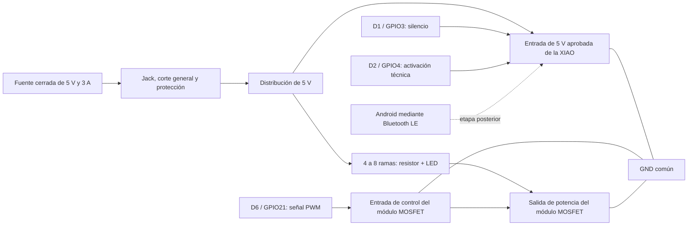

# Esquema provisional B2: XIAO y luz cálida de 5 V

**Fecha de corte:** 30 de agosto de 2026

**Estado:** preparado para revisión electrónica; no aprobado para compra, conexión o energización

**Alcance:** prototipo técnico abierto, sin Bluetooth, forma final ni participantes

## Propósito

Este documento hace revisable la variante B2 de Relevo. La propuesta utiliza una XIAO ESP32-C3 y varias ramas de LED blancos controladas al mismo tiempo mediante un módulo MOSFET. No busca crear una matriz, representar información ni controlar puntos por separado. Su única función es comprobar si una luz breve, uniforme y regulable puede comunicar la señal prevista con menos funciones innecesarias que un anillo direccionable.

El diagrama describe relaciones funcionales. Los terminales reales, la polaridad, la protección y la compatibilidad del módulo deben comprobarse en las piezas adquiridas por una persona competente antes de montar o energizar.

## Criterios de la alternativa

- una sola alimentación cerrada de 5 V;
- encendido simultáneo de todas las ramas LED;
- brillo regulado mediante modulación por ancho de pulso, es decir, encendidos y apagados rápidos cuyo promedio se percibe como una variación de intensidad;
- un resistor independiente por LED para limitar y equilibrar la corriente;
- estado apagado durante arranque, reinicio y pérdida de control;
- silencio local inmediato y corte técnico del conjunto completo;
- activación cableada durante la prueba inicial para no confundir fallos luminosos con fallos de Bluetooth.

## Arquitectura funcional

El módulo MOSFET se propone como interruptor electrónico de la rama luminosa. La placa entrega la orden, pero no alimenta directamente los LED desde un pin de propósito general. La referencia de tierra debe ser común entre fuente, placa y entrada de control. La disposición exacta de los bornes no se deduce de fotografías comerciales: se registra y revisa en la unidad real.

## Dimensionamiento provisional de cada rama

La publicación local del LED informa una tensión directa de 3,0 a 3,2 V y una corriente recomendada de 20 mA. La resistencia se estima con la relación `R = (Vfuente − VLED) / I`.

- cálculo nominal con 5,0 V, 3,1 V y 20 mA: `(5,0 − 3,1) / 0,020 = 95 Ω`;
- una resistencia de 100 Ω se aproxima a 19 mA, pero podría superar 20 mA si la fuente entrega más de 5 V o la tensión directa del LED es menor;
- para el primer ensayo se propone **150 Ω por rama**: con 5,0 V y 3,1 V entrega cerca de 12,7 mA; con 5,25 V y 3,0 V entrega 15 mA;
- ocho ramas en esa condición conservadora demandarían cerca de 120 mA, sin contar la placa ni las pérdidas del módulo.

Los valores son hipótesis de revisión, no mediciones. Se comenzará con cuatro ramas, brillo limitado y pulsos breves. Solo se ampliará hasta ocho si la perceptibilidad o la uniformidad lo requieren. Cada LED debe conservar su propia resistencia; no se conectarán varios LED en paralelo con una sola resistencia porque las diferencias de tensión directa pueden repartir la corriente de forma desigual.

La publicación de Altronics asocia el producto al intervalo 2800–3200, pero presenta ese dato con una unidad ambigua. Por ello sirve como muestra local para comparar una apariencia cálida, no como confirmación de una temperatura de color final. La pieza real debe observarse y, si se exige especificar kelvin, reemplazarse por un componente con ficha técnica trazable.

## Asignación provisional de señales

| Función | Pin propuesto | Uso | Condición |
| --- | --- | --- | --- |
| Control luminoso | D6 / GPIO21 | Señal PWM hacia la entrada del módulo MOSFET. | Confirmar que el módulo real reconoce 3,3 V y permanece apagado cuando la entrada queda inactiva. |
| Silencio normal | D1 / GPIO3 | Pulsador momentáneo hacia GND. | Configurar un estado definido y comprobar antirrebote. |
| Activación técnica | D2 / GPIO4 | Pulsador temporal hacia GND. | Retirar de la experiencia final al integrar Bluetooth. |
| Referencia | GND | Tierra común de placa, fuente y control. | Obligatoria; verificar continuidad sin energía. |

Se evitan D0/GPIO2, D8/GPIO8 y D9/GPIO9 porque la documentación de la XIAO los relaciona con el arranque. La serigrafía y el mapa de pines de la unidad real prevalecen sobre esta tabla.

## Relaciones que deben verificarse

| Tramo | Relación funcional | Verificación anterior a energizar |
| --- | --- | --- |
| Entrada | Fuente → jack → corte general → protección → distribución | Medir tensión y polaridad sin carga; identificar centro positivo o negativo. |
| Controlador | Distribución → entrada de 5 V aprobada de la XIAO | Definir 5V/VBUS o USB-C. No usar alimentación externa y USB-C simultáneamente hasta que una revisión apruebe la ruta. |
| Ramas LED | +5 V → resistor de 150 Ω → ánodo LED; cátodos hacia la salida conmutada | Identificar ánodo y cátodo; medir cada resistor y revisar que exista uno por rama. |
| Potencia | Salida conmutada del módulo → GND común | Confirmar bornes de alimentación, carga y control con la unidad y su documentación. |
| Control | D6/GPIO21 → entrada PWM del módulo; GND común | Probar primero sin carga y confirmar apagado con placa reiniciada o desconectada. |
| Estado inicial | Entrada de control → resistencia de 10 kΩ a GND si el módulo no integra un estado seguro | Verificar el circuito real; no duplicar ni omitir una resistencia sin conocer la entrada. |
| Protección | Rama principal o luminosa → portafusible | El valor de fusible se selecciona después de medir la corriente y revisar conductor y fuente; 0,5 o 1 A son candidatos, no valores aprobados. |

## Comportamiento de arranque y silencio

El programa debe configurar la salida en apagado antes de iniciar otros servicios. Tras encender, reiniciar o recuperar energía, la luz no puede emitir destellos ni reanudar una secuencia anterior. El pulsador de silencio debe cancelar el patrón, fijar la salida en cero, descartar órdenes acumuladas y exigir una nueva activación.

El interruptor general o la desconexión de la fuente constituyen el corte técnico. No se propone cortar solo la luz mientras la placa permanece alimentada hasta comprobar que el módulo y sus entradas quedan en un estado seguro.

## Secuencia de comprobación

1. Identificar marca, modelo, terminales y polaridad de cada pieza sin alimentación.
2. Revisar el esquema, el fusible candidato y los conductores con una persona competente.
3. Medir la fuente sin carga.
4. Programar solo la XIAO mediante USB-C y comprobar entradas y salida lógica.
5. Desconectar USB-C; montar el módulo sin LED y comprobar que su salida permanece apagada en arranque y silencio.
6. Añadir una rama LED con 150 Ω; medir tensión y corriente durante reposo y pulso.
7. Probar cuatro ramas y luego, solo si hace falta, ocho ramas.
8. Ejecutar diez activaciones, diez silenciamientos y cinco ciclos de pérdida y recuperación de energía.
9. Comparar B2 con B1 usando el mismo difusor, distancia, duración, iluminación ambiente y límite perceptual.
10. Introducir Bluetooth únicamente después de cerrar la comparación luminosa.

## Registro de revisión

| Elemento | Identificación real | Dato medido o comprobado | Evidencia | Revisión |
| --- | --- | --- | --- | --- |
| XIAO ESP32-C3 | ____ | Pines, entrada de 5 V y GND | Foto y continuidad | ____ |
| Fuente 5 V / 3 A | ____ | Tensión y polaridad sin carga | Foto y multímetro | ____ |
| Módulo MOSFET | ____ | Bornes, nivel de control y estado sin señal | Foto, ficha y prueba sin carga | ____ |
| LED | ____ | Polaridad, tensión directa y apariencia | Foto y medición | ____ |
| Resistores de 150 Ω | ____ | Valor individual | Multímetro | ____ |
| Resistencia de 10 kΩ | ____ | Necesidad y valor | Esquema real y multímetro | ____ |
| Protección | ____ | Fusible, conductor y ubicación | Inspección | ____ |
| Difusor común | ____ | Distancia y montaje | Foto | ____ |

## Puerta de salida

B2 puede pasar a montaje comparativo únicamente cuando:

- la entrada de 5 V y la imposibilidad de alimentación simultánea estén resueltas;
- los bornes y el comportamiento del módulo MOSFET hayan sido comprobados;
- cada rama posea una resistencia aprobada y medida;
- el estado apagado de arranque y silencio se verifique sin carga;
- protección, conductor y terminales estén definidos;
- una persona competente registre la revisión.

Cumplir esta puerta habilita un ensayo técnico sin participantes. No selecciona B2, no autoriza una forma final y no sustituye la comparación con B1.

## Referencias

Altronics. (s. f.). *LED 5 mm blanco*. Recuperado el 30 de agosto de 2026, de https://altronics.cl/led-5mm-blanco

Altronics. (s. f.). *Pack 100 resistencias 150 Ω, 0,25 W, 1 %*. Recuperado el 30 de agosto de 2026, de https://altronics.cl/pack-100-res-150-025w1p

MechatronicStore. (s. f.). *Módulo regulador switch PWM para circuitos de potencia*. Recuperado el 30 de agosto de 2026, de https://www.mechatronicstore.cl/modulo-regulador-switch-pwm-circuitos-de-potencia-15a-400w-mosfet/

Seeed Studio. (s. f.). *Getting started with Seeed Studio XIAO ESP32C3*. Recuperado el 30 de agosto de 2026, de https://wiki.seeedstudio.com/XIAO_ESP32C3_Getting_Started/

## Registro de cambios (disclaimer)

### 2026-08-30 — Creación del esquema B2

- **Cambio:** se definieron la arquitectura funcional, el cálculo provisional de resistencias, los estados de arranque y silencio, la secuencia de comprobación y la puerta de revisión de B2.
- **Versión anterior:** B2 figuraba como una fuente cálida no direccionable, pero no tenía relaciones eléctricas, cantidades, valores ni criterios equivalentes al esquema B1.
- **Motivo:** permitir una comparación justa y evitar que una alternativa aparentemente simple se compre o conecte sin hacer visibles sus riesgos y auxiliares.
- **Alcance:** no se aprobaron terminales, fusible, cantidad definitiva de LED, temperatura de color, placa de circuito ni forma final.
