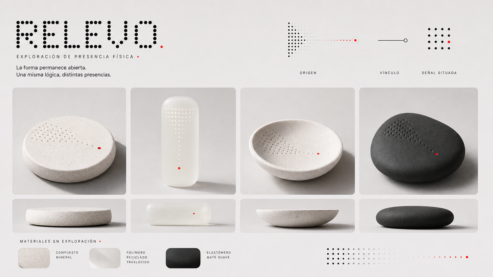
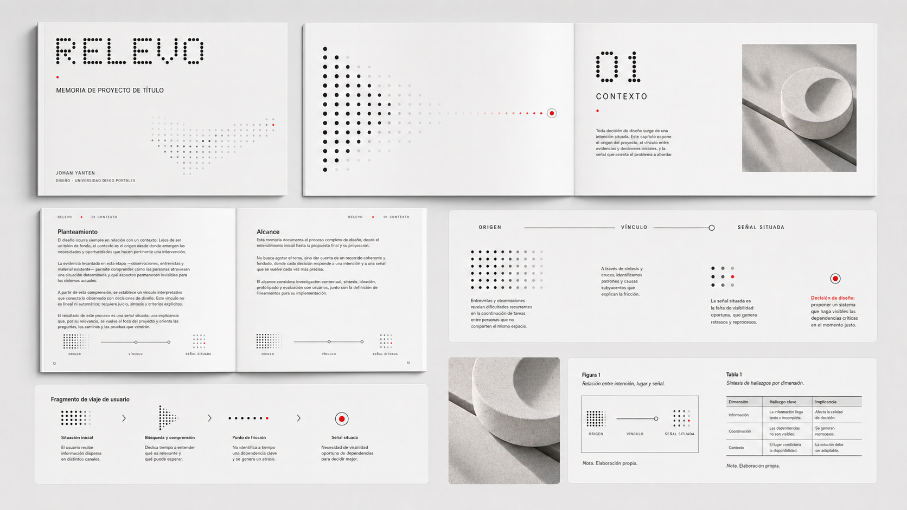
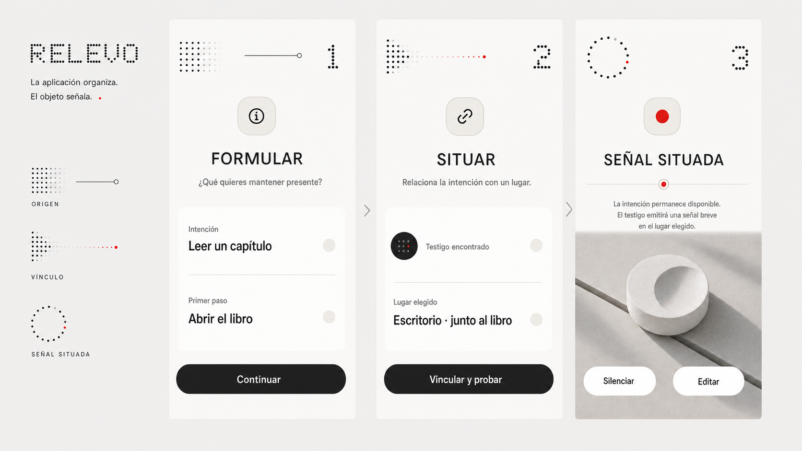

# Aplicaciones del sistema visual

## Propósito

Esta carpeta explora cómo la dirección `Transferencia situada` puede conservar una misma lógica y modificar su expresión según el soporte. Las piezas no representan resultados finales: permiten comparar posibilidades, detectar contradicciones y establecer reglas antes de producir originales editables.

La relación común es:

> origen → vínculo → señal situada

Su función cambia según el medio:

- **aplicación:** organiza información, estados y decisiones;
- **objeto:** hace perceptible una señal breve en el entorno;
- **memoria:** explica relaciones entre evidencia, razonamiento y decisiones de diseño.

## Piezas

### Presencia física

Compara cuatro familias formales sin seleccionar una carcasa. La matriz se traduce a perforación, difusión o cambio material; el punto acentuado representa una señal localizada. El color rojo es un recurso gráfico del tablero y no define el canal físico.

### Sistema editorial para la memoria

Ensaya portada, apertura, texto continuo, diagrama, recorrido y tratamiento de figuras y tablas. La matriz se reserva para identidad, numerales y relaciones; el cuerpo académico permanece en tipografía convencional. Los textos menores de la imagen son muestras visuales y no deben incorporarse a la memoria.

### Aplicación Android

Aplica el sistema a tres momentos ya documentados: formular, situar y recibir la señal. La gráfica acompaña el estado sin alterar el flujo. La información crítica continúa expresada mediante texto y forma, no solo por color.

## Documentación asociada

- [Matriz entre soportes](matriz-intersoportes.md).
- [Investigación de referentes aplicada](investigacion-referentes-aplicados.md).
- [Auditoría de las piezas](auditoria-piezas.md).
- [Producción y prompts](prompts-y-produccion.md).

---

## Registro de cambios (disclaimer)

### 2026-08-28 — Primera familia de aplicaciones

- **Cambio:** se incorporaron tres tableros coordinados para objeto, memoria y aplicación.
- **Versión anterior:** la dirección seleccionada se mostraba en un tablero general, sin explorar sistemáticamente su comportamiento por soporte.
- **Motivo:** comprobar que la identidad puede conservar significado sin repetir una composición única.
- **Alcance:** las piezas orientan desarrollo y comparación; no validan forma física, legibilidad, experiencia, señal ni producción.
