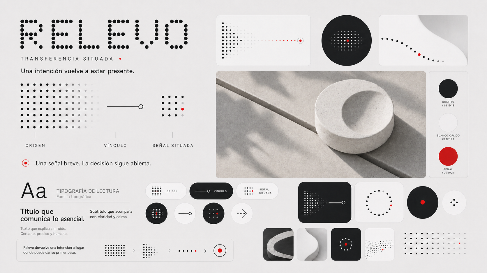
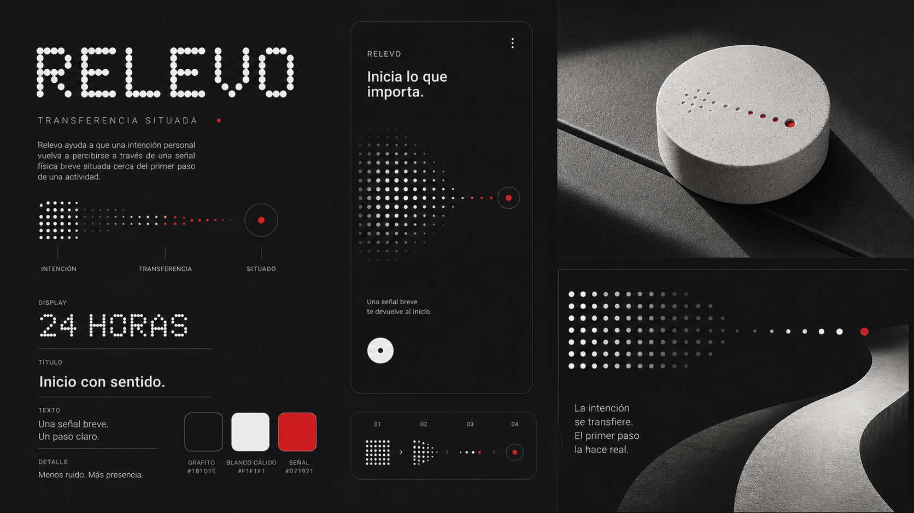
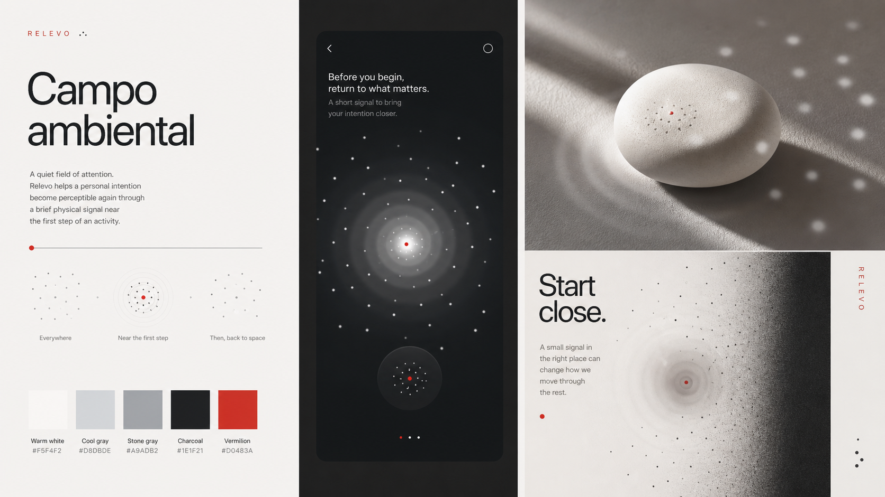
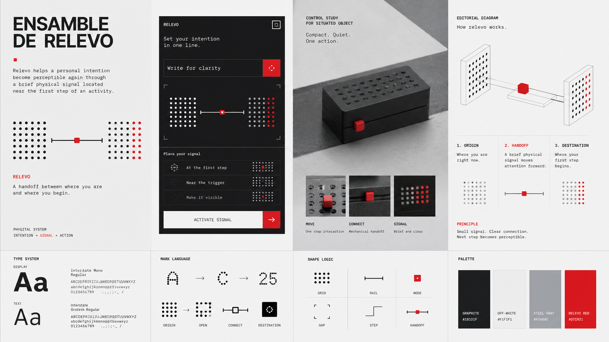

# Exploraciones de dirección visual

## Estado

Tres alternativas generadas para comparación. La dirección 01, `Transferencia situada`, fue seleccionada como base conceptual. Los textos y formas de las primeras imágenes continúan siendo material exploratorio y no constituyen el diseño final de la aplicación o del objeto.

## Dirección seleccionada

La versión refinada conserva la jerarquía, el contraste y la noción de transferencia de la primera alternativa. De la dirección 03 adopta solo una regla abstracta: un origen se relaciona mediante un vínculo breve con una señal situada. No adopta su objeto rectangular, su apariencia mecánica ni la idea de progreso lineal.

También corrige problemas detectados en la primera generación. Se elimina la instrucción `Inicia lo que importa`, porque atribuye valor a una actividad y contradice la autonomía que busca Relevo. En su lugar, el tablero utiliza una formulación descriptiva: `Una señal breve. La decisión sigue abierta.` El objeto representado continúa siendo un estudio material, no una forma seleccionada.

La segunda iteración recupera la densidad y variedad de la primera propuesta mediante módulos de distintas escalas. Esta decisión no es decorativa: permite comprobar que la secuencia origen–vínculo–señal puede sostener el nombre, los diagramas, los componentes digitales y la comunicación editorial. La matriz de puntos se reserva para signos y transiciones; el texto explicativo utiliza una tipografía de lectura convencional.

## Dirección 01 — Transferencia situada

### Idea

Una matriz densa cede protagonismo a un punto situado mediante una trayectoria breve. El contraste negro, blanco y rojo se utiliza con máxima intensidad.

### Fortalezas

- expresa con claridad el paso entre origen y señal;
- reúne interfaz, objeto y gráfica mediante una misma transformación;
- mantiene una jerarquía fuerte y un uso controlado del acento;
- se aproxima al tono tecnológico y minimalista solicitado por el autor.

### Riesgos y correcciones necesarias

- el logotipo construido con puntos puede aproximarse demasiado a referentes comerciales del mismo territorio;
- la frase `Inicia lo que importa` jerarquiza moralmente una actividad y no corresponde al tono autónomo de Relevo;
- la forma circular mostrada es una hipótesis visual, no una decisión industrial;
- el rojo aplicado a la señal puede interpretarse como alarma;
- los textos generados no deben trasladarse directamente a la interfaz.

## Dirección 02 — Campo ambiental

### Idea

La señal aparece como una concentración local dentro de un campo amplio. La propuesta reduce la dureza del contraste mediante blancos cálidos, grises y difusión.

### Fortalezas

- comunica calma, proximidad y presencia ambiental;
- se distancia con mayor claridad del antecedente modular principal;
- permite relacionar la señal con espacio, distancia y luz;
- ofrece una transición natural hacia materialidad y fotografía.

### Riesgos y correcciones necesarias

- la intención y el primer paso resultan menos evidentes que la atmósfera;
- la nube de puntos puede convertirse en decoración sin significado estable;
- el objeto continúa apareciendo como una forma concreta no validada;
- los textos están en inglés y no corresponden a la redacción del proyecto;
- el sistema puede perder reconocimiento en tamaños pequeños.

## Dirección 03 — Ensamble de relevo

### Idea

Dos campos intercambian una unidad activa por medio de un conector. La identidad se apoya en origen, vínculo y destino, no en un glifo aislado.

### Fortalezas

- traduce el nombre Relevo a una regla gráfica específica;
- ofrece el mayor potencial de diferenciación frente a los referentes;
- permite construir diagramas, componentes y estados mediante una lógica estable;
- facilita documentar arquitectura, montaje y relación entre capas.

### Riesgos y correcciones necesarias

- el lenguaje puede sentirse excesivamente técnico o controlador;
- el riel puede interpretarse como progreso lineal o cumplimiento;
- el objeto rectangular perforado es una exploración y no debe tratarse como forma seleccionada;
- la interfaz contiene órdenes y textos en inglés que no representan el tono final;
- requiere una capa más cálida para escenas domésticas y comunicación editorial.

## Comparación preliminar

Escala: 1 = débil; 5 = fuerte. La evaluación es editorial y sirve para orientar la selección; no corresponde a una prueba con usuarios.

| Criterio | Transferencia situada | Campo ambiental | Ensamble de relevo |
| --- | ---: | ---: | ---: |
| Relación con el propósito | 5 | 4 | 5 |
| Diferenciación frente a los referentes | 3 | 4 | 5 |
| Calma y ausencia de sanción | 3 | 5 | 3 |
| Coherencia entre soportes | 5 | 4 | 5 |
| Legibilidad potencial | 4 | 4 | 5 |
| Flexibilidad ante cambios del objeto | 4 | 4 | 5 |
| Potencia editorial | 5 | 4 | 4 |

## Lectura de la comparación

`Transferencia situada` es la alternativa más próxima al gusto expresado por el autor y comunica con fuerza el cambio de estado, pero necesita alejarse de la tipografía punteada y suavizar su semántica. `Campo ambiental` protege mejor el tono de Relevo, aunque requiere una estructura más reconocible. `Ensamble de relevo` ofrece la gramática más propia y transferible, pero debe reducir su apariencia mecánica.

La selección confirma la jerarquía de `Transferencia situada` e incorpora la lógica origen–vínculo–señal de `Ensamble de relevo`. La calma material de `Campo ambiental` permanece como criterio secundario para futuras aplicaciones, sin convertir las tres propuestas en una mezcla indistinta.

## Producción

Las tres imágenes fueron generadas mediante el generador integrado, utilizando las dos referencias aportadas como inspiración visual. Cada prompt prohibió reproducir marcas, signos o composiciones reconocibles y mantuvo abiertos la forma industrial, el canal físico y la señal definitiva.

---

## Registro de cambios (disclaimer)

### 2026-08-28 — Segunda iteración seleccionada

- **Cambio:** el tablero oscuro de síntesis fue sustituido por una versión clara, modular y más cercana a la primera exploración elegida por el autor.
- **Versión anterior:** la versión v1 concentraba la propuesta en pocos elementos de gran tamaño y perdía parte del ritmo modular buscado.
- **Motivo:** perfeccionar la dirección seleccionada sin cambiar su concepto y demostrar su funcionamiento en más de un soporte.
- **Alcance:** se precisan jerarquía, modularidad y uso de la matriz; tipografía definitiva, objeto y señal física permanecen abiertos.

### 2026-08-28 — Selección y refinamiento

- **Cambio:** se registró la selección de la dirección 01 y se añadió una versión refinada con la lógica relacional de la dirección 03.
- **Versión anterior:** el documento terminaba en una comparación abierta y sugería una combinación todavía no elegida.
- **Motivo:** convertir la preferencia del autor en una decisión trazable y separar la gramática gráfica adoptada de la forma objetual descartada.
- **Alcance:** el tablero orienta la siguiente etapa; tipografías, retícula, componentes, objeto y señal física aún deben sistematizarse o validarse según corresponda.

### 2026-08-28 — Tres direcciones comparables

- **Cambio:** se produjeron y auditaron tres tableros conceptuales con enfoques distintos de transición, ambiente y ensamble.
- **Versión anterior:** existían colecciones visuales amplias, pero no alternativas comparables construidas desde una misma pregunta y una misma paleta de referencia.
- **Motivo:** permitir una selección fundamentada antes de desarrollar identidad, componentes o aplicaciones finales.
- **Alcance:** las imágenes contienen formas y textos exploratorios; no validan legibilidad, percepción, señal, materialidad ni experiencia de uso.
