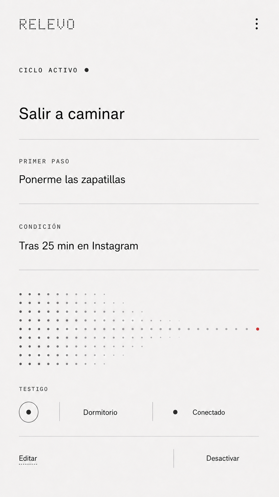
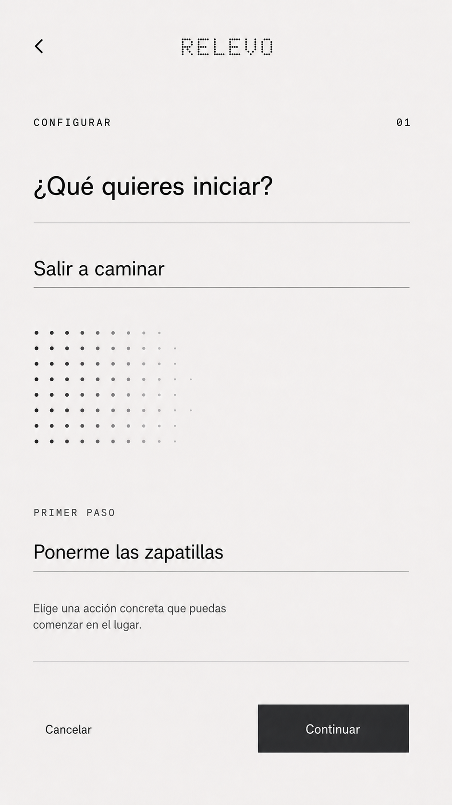
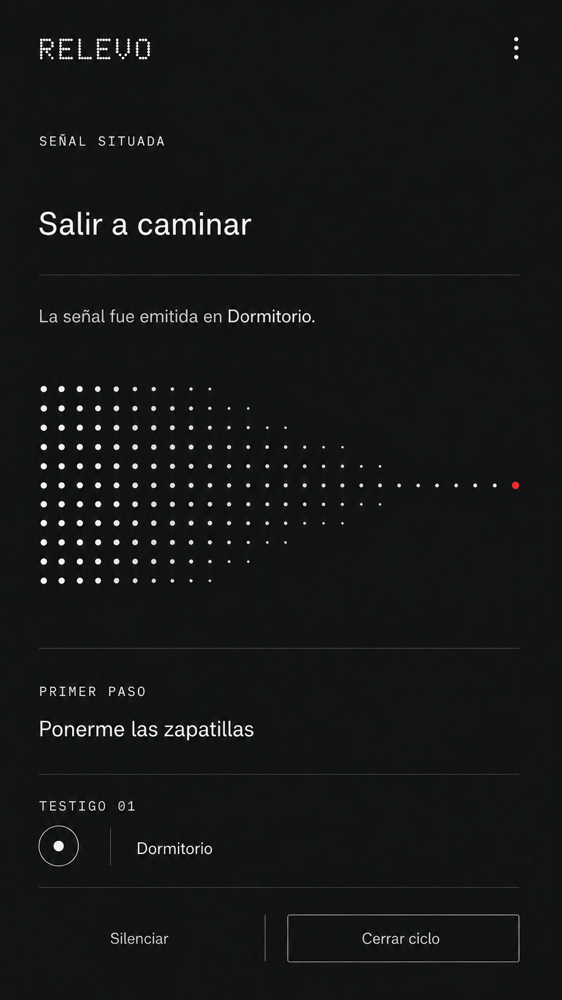

# Android v4

## 01. Inicio — ciclo activo, tema claro

### Función

La pantalla permite reconocer qué intención está activa, cuál es su primer paso, qué condición fue configurada y dónde se encuentra el testigo. También ofrece dos salidas: editar la configuración o desactivarla.

La aplicación informa el vínculo, pero no representa el pulso como si ocurriera en el teléfono. El campo de puntos termina en un nodo rojo porque su función es mostrar que la intención fue situada; no comunica progreso ni cumplimiento.

### Decisiones visuales

| Decisión | Fundamento | Comprobación posterior |
| --- | --- | --- |
| Título contenido | Evita que la intención adopte el tono promocional de una pantalla de bienvenida. | Probar lectura con escalamiento de fuente. |
| Información separada por reglas | Primer paso y condición son datos relacionados, no tarjetas independientes. | Comprobar comprensión del agrupamiento. |
| Campo de transferencia asimétrico | Relaciona intención y testigo mediante una reducción de densidad. | Verificar que no se interprete como avance o cuenta regresiva. |
| Un solo nodo rojo | El color identifica la señal situada y no compite con conexión, peligro o acciones. | Probar comprensión sin depender solo del color. |
| Estado del testigo en una franja compacta | Mantiene visibles lugar y conexión sin convertir el dispositivo físico en protagonista de la aplicación. | Evaluar legibilidad y estados de desconexión. |
| Acciones de bajo peso visual | Editar y desactivar son controles disponibles, pero no deben desplazar la intención activa. | Confirmar objetivos táctiles mínimos de 48 dp al reconstruir la pantalla. |

### Auditoría de la imagen

- **Aprobado:** jerarquía, retícula, tono, densidad informativa, reducción de tarjetas, relación entre intención y testigo, y uso localizado del rojo.
- **Debe reconstruirse manualmente:** tipografía exacta, medidas en dp y sp, iconografía, áreas táctiles, estados de foco y contraste final.
- **No constituye validación:** la pieza es una dirección visual de alta fidelidad; no demuestra comprensión, accesibilidad ni funcionamiento del sistema.

### Estado

Dirección aprobada para desarrollar las siguientes pantallas. No debe tomarse como archivo de producción ni copiarse sin reconstruir su retícula y controles.

## 02. Configurar intención — tema claro

### Función

La pantalla transforma una actividad general en una intención activa y un primer paso concreto. Este momento todavía no vincula el testigo; por esa razón, la composición utiliza un campo de origen en grafito y no presenta un nodo rojo.

### Decisiones visuales

- La navegación de retorno ocupa el extremo izquierdo y la marca queda centrada, de acuerdo con una lectura convencional del encabezado móvil.
- Los campos se construyen mediante reglas continuas. Así se distinguen de la matriz de puntos y se evita convertir cada dato en una tarjeta.
- La matriz permanece densa y abierta: representa una intención todavía no situada, no una transferencia terminada.
- Las acciones comparten una fila. `Continuar` conserva contraste y tamaño táctil sin transformarse en una superficie dominante; `Cancelar` permanece disponible con menor peso.
- No se utiliza rojo porque aún no existe una señal situada.

### Estado

Dirección aprobada. La siguiente comprobación debe revisar la comprensión de `primer paso`, el orden de foco, el comportamiento del teclado y los estados vacío, activo y error de ambos campos.

## 03. Señal situada — tema oscuro

### Función

La pantalla confirma que el testigo emitió la señal en el lugar configurado. No reproduce el pulso en el teléfono, no solicita cumplimiento ni evalúa la decisión posterior. La persona puede silenciar el testigo o cerrar el ciclo.

### Decisiones visuales

- El modo oscuro concentra la atención en un estado puntual sin cambiar la arquitectura tipográfica del tema claro.
- Un campo claro se reduce hasta un único nodo rojo. La posición y el texto permiten comprender el estado sin depender exclusivamente del color.
- La intención, el primer paso y el lugar permanecen visibles para favorecer reconocimiento y control.
- Las acciones no usan relleno rojo ni una jerarquía punitiva. `Cerrar ciclo` recibe un borde; `Silenciar` conserva menor peso.
- No aparecen confirmaciones de éxito, métricas, rachas ni preguntas sobre cumplimiento.

### Estado

Dirección aprobada. Debe evaluarse frente a una notificación equivalente y junto al pulso físico real; la imagen por sí sola no demuestra el valor del cambio de medio.

---

## Registro de cambios (disclaimer)

### 2026-08-29 — Creación

- **Cambio:** se reemplazó la composición Android anterior por una pantalla individual de mayor fidelidad.
- **Versión anterior:** saludo y títulos sobredimensionados, grandes superficies vacías, tarjetas genéricas y botones negros dominantes.
- **Motivo:** acercar Android al lenguaje modular de Relevo mediante precisión editorial, densidad controlada y una relación funcional entre intención, transferencia y señal situada.

### 2026-08-29 — Segunda pantalla

- **Cambio:** se incorporó la configuración de intención y primer paso con campos lineales y acciones compactas.
- **Versión anterior:** la primera exploración usaba cajas sobredimensionadas, grandes superficies vacías y un botón negro de ancho completo.
- **Motivo:** demostrar que la identidad puede mantenerse durante una tarea de escritura sin sacrificar controles reconocibles ni convertir la matriz en decoración.

### 2026-08-29 — Tema oscuro y señal situada

- **Cambio:** se incorporó el estado oscuro que confirma la emisión del pulso en el lugar elegido.
- **Versión anterior:** la exploración oscura utilizaba varios acentos rojos y controles genéricos, lo que confundía señal, estado técnico y acción.
- **Motivo:** reservar el rojo para un único nodo situado y sostener que el pulso pertenece al testigo físico, no a la pantalla.
