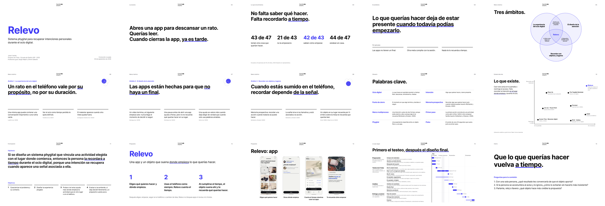

# Presentación de la corrección cruzada del 30 de septiembre: estado y cómo se hizo

**Archivo:** [Relevo — Corrección cruzada 30 sep](https://www.figma.com/slides/zhLK5LTPQWXPHIQeq4wuE8) (Figma Slides).
**Estado al 30 de septiembre de 2026:** 15 diapositivas principales para unos 5 minutos y 12 de respaldo que se omiten al presentar. Cada diapositiva tiene notas del orador.
**Imágenes:** las 15 diapositivas principales están exportadas en [presentacion-correccion-cruzada-2026-09-30/](presentacion-correccion-cruzada-2026-09-30/), con una [hoja de contacto](presentacion-correccion-cruzada-2026-09-30/hoja-de-contacto.png). Incluyen los últimos cambios hechos a mano por el autor.
**Guion:** el relato largo sigue en el [guion de la corrección cruzada](../00_gobernanza/guion-presentacion-correccion-cruzada-2026-09-30.md).

## 1. Estructura vigente

| N.º | Diapositiva | Qué dice | Fuente |
| --- | --- | --- | --- |
| 1 | Portada | Relevo, título de la memoria, autor, profesores guía y fecha. | Memoria, portada. |
| 2 | La escena | «Abres una app para descansar un rato. Querías leer. Cuando cierras la app, ya es tarde.» | Capítulo 2. |
| 3 | Lo que encontramos | «No falta saber qué hacer. Falta recordarlo a tiempo.» y cuatro cifras con su significado: 43 de 47, 21 de 43, 42 de 43 y 44 de 47. | [Encuesta de 53 respuestas](../03_usuarios/encuesta-53-respuestas-2026-09.md) (D-092). |
| 4 | El problema | Una frase y tres causas breves. | Capítulos 3 y 6. |
| 5 | Tres ámbitos | Venn con los títulos del capítulo 6 (D-094) y las intersecciones del examen de julio del autor. Relevo va al centro. | Capítulo 6; presentación del examen de julio. |
| 6 | Ámbito 1 · La experiencia del ocio digital | Una idea y tres apoyos, cada uno con su autor. | Lukoff et al. (2018); Tonietto et al. (2021); de Segovia Vicente et al. (2024). |
| 7 | Ámbito 2 · El diseño de la atención | «Las apps están hechas para que no haya un final.» | Montag et al. (2019); Grüning et al. (2023); Smit et al. (2019). |
| 8 | Ámbito 3 · Recordar con objetos y lugares | «Recordar depende de la señal.» | McDaniel y Einstein (2000); Kirsh (1995); Gilbert et al. (2023). |
| 9 | Palabras clave | Glosario de ocho conceptos, con su fuente teórica cuando la tienen. | Glosario de la memoria. |
| 10 | Lo que existe | Mapa de referentes en dos ejes: pantalla o entorno, y restringir o recordar. | Capítulo 8, Tabla 2. |
| 11 | Hipótesis y objetivos | La hipótesis literal de la memoria (D-091) y los cuatro objetivos en palabras simples. | Capítulo 10. |
| 12 | Relevo | Qué es y tres pasos. | Capítulos 10 y 11. |
| 13 | La app | Cuatro capturas del producto: elegir qué hacer, decir dónde empieza, el relevo que cuenta y el aviso. | Capturas de Android 2.10 y 2.13. |
| 14 | Lo que sigue | «Primero el testeo, después el diseño final.» Carta Gantt desde hoy hasta el examen, con el formato de la del respaldo: 14 tareas con sus fechas y una línea de detalle en tercera persona, en cuatro etapas (preparación, testeo de 21 días, análisis, y entrega y examen), cada una con su para qué. Muestra lo que se hace en paralelo al testeo y la semana de Pruebas Solemnes. | [Plan de cierre](../00_gobernanza/plan-de-cierre-agosto-diciembre-2026.md) y [protocolo 02](../07_validacion/protocolo-02-prueba-21-dias.md). |
| 15 | Cierre | «Que lo que querías hacer vuelva a tiempo.» y tres preguntas a la comisión sobre los puntos débiles. | — |

**Respaldo (se omite al presentar):** árbol de problemas, marco multiproceso, entrevistas, dos diapositivas de gráficos de la encuesta, criterios de diseño, versiones detalladas de hipótesis, funcionamiento y prueba, qué se registra en la prueba (la diapositiva 14 anterior), carta Gantt y referencias en APA 7. Sirven para responder preguntas.

## 2. Reglas de diseño

- **Estilo del autor:** fondo blanco, Inter (negrita en títulos, regular en texto), texto negro y azul `#3D38F5` como único acento. El azul marca un subrayado grueso en la frase clave y los datos destacados. Arriba, a la izquierda, va la etiqueta de sección y, a la derecha, el número. El autor agregó después el logo de la Facultad.
- **Nivel keynote:** una idea por diapositiva, frases grandes y poco texto. Los métodos (encuesta, entrevistas) quedan en una línea de fuente; al frente van los resultados y lo que significan.
- **Textos que no se inventan:** la hipótesis, la pregunta y el objetivo general son literales de la memoria; los títulos de los ámbitos son los del capítulo 6. Las cifras vienen del análisis de la encuesta, con sus límites declarados.
- **Lenguaje simple:** «metido» o «sumido en el teléfono» en vez de «absorto»; títulos de ámbitos sin jerga (D-094). La comisión de julio criticó el vocabulario barroco.

## 3. Cómo se hizo

1. **Referencias.** Se revisaron las presentaciones del examen de julio de otros estudiantes y tres presentaciones de compañeros para el 30 de septiembre. De ellas se tomaron recursos: Venn del marco teórico, cifras grandes, mapa de referentes en dos ejes, gráficos de encuesta, una diapositiva por ámbito y líneas de tiempo.
2. **Primera versión completa (18 diapositivas).** Archivo nuevo de Figma Slides, construido con el estilo del autor: árbol de problemas, Venn, diagrama del marco multiproceso, gráficos de la encuesta, mapa de referentes, criterios, hipótesis, funcionamiento, capturas, prueba, carta Gantt y referencias.
3. **Simplificación para 5 minutos.** A pedido del autor, el flujo quedó en 14 diapositivas con una idea cada una: resultados en vez de métodos, una diapositiva por ámbito, un glosario y capturas del producto en vez de las de la prueba. Las diapositivas de detalle pasaron a «Respaldo» sin borrarse.
4. **Notas del autor.** El autor dejó comentarios dentro de los textos («*Claude por favor reescribe…»). Se reescribieron los puntos de los ámbitos 2 y 3, el glosario (con fuentes), los objetivos, los pasos de Relevo y las preguntas a la comisión. «Siguiente paso» sumó qué se registra en la prueba, y el mapa de referentes volvió al flujo principal.
5. **Venn.** Se recuperaron las intersecciones. Tras contrastar con la memoria y con el examen de julio, los círculos usan los títulos simples del capítulo 6 (D-094) y las intersecciones son las del autor: «Interfaz que interrumpe el propósito», «Lo físico como apoyo a la reflexión» y «El dispositivo también ocupa atención».
6. **Cambios a mano del autor, que se conservan:** «sumido en el teléfono» en el ámbito 3, «Relevo: app» en la diapositiva 13, la leyenda «Cuenta el tiempo mientras usas tus apps» y el logo de la Facultad.
7. **Lo que sigue.** El autor pidió reemplazar «Siguiente paso», que explicaba la prueba, por lo que sigue en las próximas semanas y meses, bien explicado y con sentido. La diapositiva 14 muestra cuatro etapas con las fechas del plan de cierre y el para qué de cada una. La versión anterior quedó en el respaldo como R10. Después, el autor hizo visible la carta Gantt del respaldo (R11) y pidió la diapositiva 14 bien ordenada y desglosada con ese formato: ahora es una carta Gantt de lo que sigue, con una fila por tarea y la línea «Hoy». La R11 volvió a omitirse al presentar. Por último, el autor pidió textos más claros: la etapa es el testeo de 21 días con el usuario, hay que mostrar qué más se hace en ese tiempo y el detalle de cada tarea, y «Lugar y objeto decididos» no decía nada. Cada tarea tiene ahora una línea de detalle, y el hito del 8 de noviembre dice qué se decide: qué objeto suena y dónde se deja. Después pidió los textos en tercera persona («El usuario elige…»), la compra de los materiales del testeo, que hace esta semana, y quitar la revisión del consentimiento. El objeto en paralelo se describe con sus palabras: «Testeo de objeto físico; forma, materiales y costos».

**Herramientas.** La presentación se construyó con Claude Code mediante el conector de Figma: guiones de la API de complementos de Figma para crear formas, textos, diagramas, notas del orador y secciones, y para marcar el respaldo como omitido. Las capturas de la app se subieron desde el repositorio. Cada tanda se revisó con imágenes y con un control de que ningún elemento saliera de los márgenes.

## 4. Pendiente

- El autor debe revisar las notas del orador y ensayar con reloj: 15 diapositivas en 5 minutos son unos 20 segundos cada una.
- Las capturas de la diapositiva 13 son de las versiones 2.10 y 2.13; pueden reemplazarse por capturas de la 2.14.
- Si se adopta el reloj o el llavero como objeto (D-093), la diapositiva 12 y el cierre deben decir cuál.

## Registro de cambios (disclaimer)

### 2026-09-30 — Diapositiva 14 en tercera persona

- **Qué cambió:** los textos de la carta Gantt pasan a tercera persona; se suma la compra de materiales (30 de septiembre al 4 de octubre); se quita la revisión del consentimiento; el objeto en paralelo usa las palabras del autor. Se actualizaron su imagen, la hoja de contacto, la tabla y el proceso.
- **Cómo estaba antes:** los detalles estaban en primera persona («Aplico…», «Pruebo el reloj y el llavero…») y la preparación incluía revisar el consentimiento.
- **Por qué:** pedido del autor.

### 2026-09-30 — Diapositiva 14: textos y detalles

- **Qué cambió:** la carta Gantt tiene título y etapas más claros («Testeo de 21 días» en vez de «Probar»), una línea de detalle por tarea, dos tareas en paralelo al testeo, la semana de Pruebas Solemnes y un hito del 8 de noviembre que explica qué se decide. Se actualizaron su imagen, la hoja de contacto y la tabla.
- **Cómo estaba antes:** las etapas eran verbos sueltos, las tareas no tenían detalle y el hito decía «Lugar y objeto decididos».
- **Por qué:** el autor pidió cambiar los textos, mostrar qué más se hace durante el testeo y los detalles, no solo el hecho.

### 2026-09-29 — Diapositiva 14 como carta Gantt

- **Qué cambió:** la diapositiva 14 pasó a ser una carta Gantt de lo que sigue, con el formato de la R11: 13 tareas con fechas en cuatro etapas. Se actualizaron su imagen, la hoja de contacto, la tabla y el proceso.
- **Cómo estaba antes:** mostraba las cuatro etapas en columnas de texto.
- **Por qué:** el autor pidió ordenarla y desglosarla con el formato de la carta Gantt del respaldo.

### 2026-09-29 — Diapositiva 14: lo que sigue

- **Qué cambió:** la diapositiva 14 muestra lo que sigue hasta el examen en cuatro etapas: preparar, probar, decidir y defender. Se actualizaron su imagen, la hoja de contacto, la tabla y el proceso. El respaldo pasa a 12 diapositivas.
- **Cómo estaba antes:** la diapositiva 14, «Siguiente paso», explicaba las tres semanas de la prueba y qué se registra.
- **Por qué:** al autor no le convencía; pidió mostrar lo que sigue en las próximas semanas y meses, bien explicado y con sentido.

### 2026-09-29 — Creación

- **Qué se añadió:** estado, estructura, reglas de diseño y proceso de la presentación en Figma, con las 15 diapositivas exportadas y una hoja de contacto.
- **Cómo estaba antes:** la presentación solo estaba en Figma; el repositorio tenía el guion de texto.
- **Por qué:** el autor pidió subir todo a GitHub, documentar el estado y explicar cómo se hizo la presentación.
