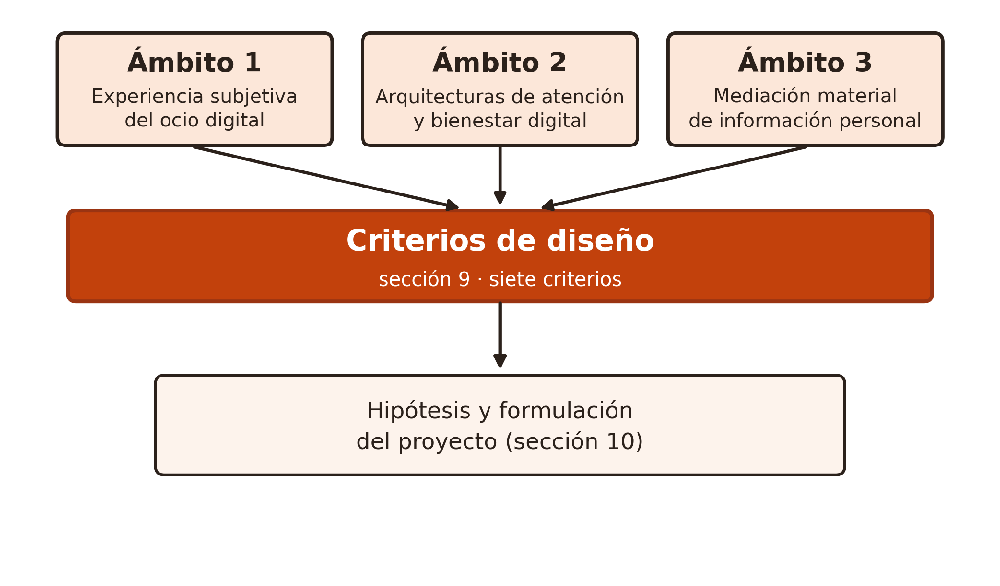
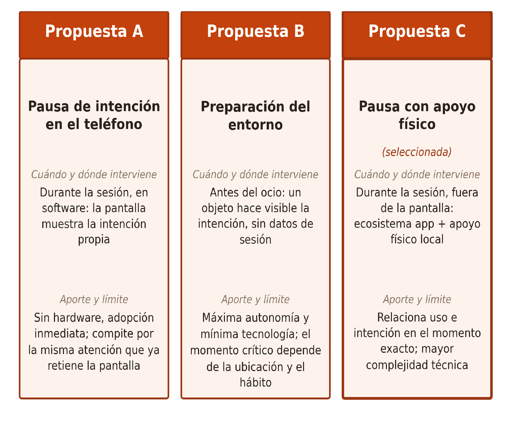
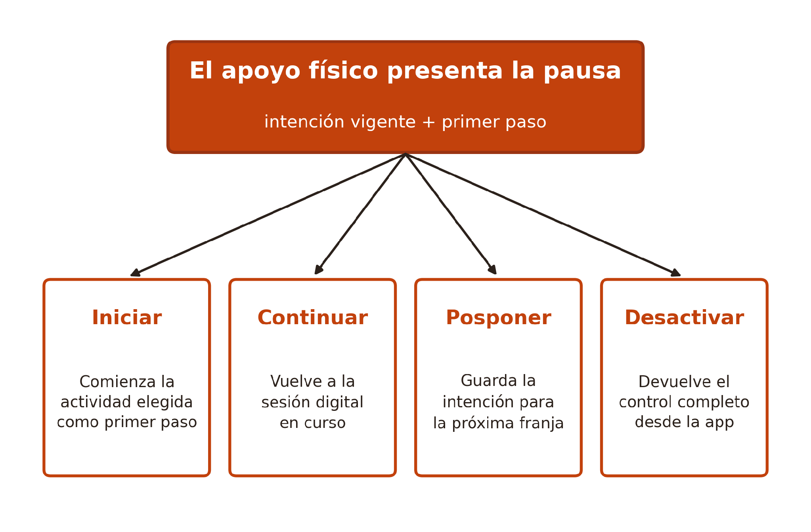

# Relevo

## Una mediación phygital no punitiva que, mediante una pausa configurable, devuelve las intenciones propias a la decisión durante el ocio digital automático de adultos jóvenes

**Johan Yantén · Diseño · Universidad Diego Portales · Seminario de Título · 2026, noveno semestre**

**Profesores guía:** Sergio Majluf y Simón Gallardo  
**Lugar y fecha:** Santiago de Chile, 8 de julio de 2026

## Nota archivística

Esta es la conversión de la memoria de Relevo encontrada en `Fin semestre 1`. Es la copia de cierre más tardía localizada para esa carpeta y reemplaza, como referencia del cierre semestral, la antigua identificación de la memoria E12 de In(Visible). Se conserva como fuente histórica: sus afirmaciones, cifras y decisiones deben contrastarse con el corpus y con la investigación vigente antes de reutilizarse.

No se encontró una fuente DOCX o Markdown equivalente después de revisar los 74 DOCX locales y los textos del archivo. El PDF tiene una copia binaria exacta en `SEMESTRE 2`, registrada en el informe de equivalencias.

## Resumen

El ocio digital no siempre es una decisión: algunas sesiones continúan sin que la persona la renueve, y actividades que también deseaba realizar dejan de ser consideradas. Este proyecto investigó esa brecha en adultos jóvenes para determinar cómo abordarla desde el diseño, sin castigar el ocio digital ni convertir el descanso en una exigencia de rendimiento. La investigación combinó revisión bibliográfica en tres ámbitos —experiencia subjetiva del ocio, arquitecturas de atención y mediación material de información personal—, ocho entrevistas exploratorias en Santiago y un análisis comparativo de seis referentes. Las entrevistas revelaron estrategias informales de separación del teléfono, actividades concretas que las personas querían retomar y un rechazo consistente hacia devoluciones que comparan o evalúan el desempeño. De ahí se derivaron siete criterios de diseño y una hipótesis: un apoyo físico que, al cumplirse una condición configurada por la persona, presente su intención junto con un primer paso simple, favorece que esa intención vuelva a una decisión consciente. Se compararon tres propuestas y se seleccionó Relevo, un ecosistema de aplicación y apoyo físico conectado que traslada la decisión fuera de la pantalla en el momento exacto en que compite con el uso automático. El aporte no es reducir el tiempo de pantalla, sino convertir una continuación automática en una elección entre formas de ocio igualmente legítimas.

**Palabras clave:** ocio digital automático; toma de decisiones; mediación material; datos personales

## Abstract

Digital leisure is not always a decision: some sessions continue without the person renewing it, and activities they also wanted to do stop being considered. This project investigated that gap among young adults to determine how design might address it without punishing digital leisure or turning rest into a performance demand. The research combined a literature review across three domains —subjective leisure experience, attention architectures, and material mediation of personal information—, eight exploratory interviews in Santiago, and a comparative analysis of six references. The interviews revealed informal strategies for stepping away from the phone, concrete activities participants wanted to resume, and a consistent rejection of feedback that compares or evaluates performance. These findings led to seven design criteria and a hypothesis: a physical support that, once a person-configured condition is met, presents their intention alongside a simple first step favors that intention re-entering a conscious decision. Three proposals were compared and Relevo was selected: an ecosystem of a mobile app and a connected physical support that moves the decision outside the screen at the exact moment it competes with automatic use. The contribution is not reducing screen time, but turning automatic continuation into a choice between equally legitimate forms of leisure.

**Keywords:** automatic digital leisure; decision-making; material mediation; personal data

## Índice

- 1. Motivación personal
- 2. Introducción
- 3. Planteamiento del problema
  - 3.1 Arista psicológica: una intención deja de estar disponible
  - 3.2 Arista tecnológica: la continuidad también está diseñada
  - 3.3 Arista evaluativa: el ocio se juzga frente a otras intenciones
- 4. Justificación
- 5. Antecedentes y estado de la cuestión
- 6. Marco teórico por ámbitos
  - 6.1 Ámbito 1: Experiencia subjetiva del ocio digital
  - 6.2 Ámbito 2: Arquitecturas de atención y bienestar digital
  - 6.3 Ámbito 3: Mediación material de información personal
  - 6.4 Conclusiones del marco teórico
- 7. Usuario, contexto y hallazgos de entrevistas
  - 7.1 Muestra y método
  - 7.2 Hallazgos
  - 7.3 Usuario y contexto de aplicación
- 8. Estado del arte y referentes
  - 8.1 Muestra y criterio de selección
  - 8.2 Matriz comparativa
  - 8.3 Conclusión
- 9. Criterios de diseño
- 10. Formulación
  - 10.1 Problema de diseño
  - 10.2 Perspectiva del usuario
  - 10.3 Pregunta de investigación
  - 10.4 Hipótesis
  - 10.5 Objetivos
  - 10.6 Mapa de actores
- 11. Bajada proyectual
- 12. Factibilidad y límites
  - 12.1 Factibilidad funcional
  - 12.2 Factibilidad productiva
  - 12.3 Límites y consideraciones éticas
  - 12.4 Marco de colaboración interdisciplinaria
- 13. Plan de desarrollo y validación
- 14. Referencias
- Anexo: Pauta de entrevista semiestructurada

## 1. Motivación personal

Mi interés nació de una situación cotidiana: abrir una aplicación por unos minutos, quedarme más de lo previsto y terminar sin recordar qué había visto, postergando actividades que sí quería realizar —dibujar, leer, salir a caminar— sin haber decidido abandonarlas.

Durante un tiempo lo interpreté como falta de disciplina, pero esa explicación no consideraba el diseño de las plataformas, la formación de hábitos ni la diferencia entre querer una actividad y recordarla a tiempo; tampoco distinguía una sesión elegida y satisfactoria de otra reactiva.

Esa diferencia orientó la investigación. Me interesa comprender por qué ciertas intenciones dejan de ser consideradas durante el uso automático y cómo podría intervenir el diseño sin castigar el ocio digital ni transformar el descanso en una obligación. No busco eliminar el teléfono, sino recuperar capacidad de decisión entre actividades que pueden ser igualmente legítimas.

## 2. Introducción

Tomar el teléfono, abrir una aplicación y permanecer en ella puede ocurrir sin una decisión explícita sobre cómo ocupar el tiempo libre. La sesión puede resultar entretenida y, aun así, extenderse mientras otras actividades que también importaban —leer, dibujar, cocinar o conversar con alguien— dejan de ser consideradas. No fueron rechazadas: simplemente dejaron de estar presentes como opciones. ¿Qué ocurre entre la intención de realizar una actividad y el momento en que esa intención desaparece de la decisión? La pregunta no es retórica: nombra el instante preciso en que una tarde deja de parecerse a lo que la persona había imaginado para ella, sin que medie ninguna decisión reconocible.

El ocio digital no constituye por sí mismo un problema. Puede ofrecer descanso, vínculo social o disfrute. Una sesión extensa tampoco es necesariamente negativa si fue elegida. El foco está en episodios iniciados o prolongados de manera automática, que la persona no reconoce después como una elección. Saber cuántos minutos transcurrieron no explica si ese tiempo fue deseado, significativo o coherente con otras intenciones. Distinguir ambos casos es la primera tarea de cualquier respuesta seria.

Tres nociones delimitan el fenómeno. El ocio digital corresponde al uso recreativo de dispositivos y plataformas. El uso automático describe episodios iniciados o continuados sin una decisión renovada. Una actividad significativa es aquella que la propia persona desea mantener disponible en su tiempo libre; no necesita ser productiva, útil ni ajena a las pantallas. Esta precisión evita una jerarquía moral entre leer, conversar, jugar o ver videos.

Si la duración no alcanza como medida, la pregunta debe situarse en un momento más preciso: ¿cómo favorecer que una actividad previamente deseada vuelva a ser considerada cuando el uso automático ha desplazado esa posibilidad?

Medir cuánto tiempo pasó no resuelve esta brecha, y compararlo con otras actividades tampoco: convertir los minutos de una aplicación en una equivalencia de rendimiento solo traslada el problema a otra métrica. Antes de proponer cualquier respuesta hay que examinar tres aristas: qué ocurre con las intenciones de la persona durante el uso automático, qué decisiones de interfaz sostienen la continuidad de la sesión, y qué exigencias convierten el descanso en una obligación de rendimiento.

Este desafío no es ajeno al diseño: nace de él. Las plataformas que sostienen sesiones automáticas, las herramientas de bienestar que solo miden o bloquean, y los reportes que comparan y generan culpa, son decisiones de diseño, no fenómenos naturales del uso de pantallas. Por eso una respuesta también debe venir del diseño: decidir qué información se muestra, cuándo aparece y cuánto control conserva la persona. El análisis se concentra en adultos jóvenes que reconocen esta brecha entre sesiones automáticas y actividades que aún desean realizar, y no busca diagnosticar adicción ni establecer que el ocio digital sea inferior a otras formas de descanso.

La investigación avanza desde una observación cotidiana —el desajuste entre lo que se quiere hacer y lo que se termina haciendo durante el ocio digital— hacia una pregunta de diseño: cómo sostener una decisión propia cuando la continuidad automática ya está en curso.

## 3. Planteamiento del problema

El problema no es usar demasiado el teléfono ni preferir una pantalla: aparece cuando una sesión recreativa continúa sin decisión renovada y desplaza actividades que la persona también deseaba. La duración no basta para explicarlo: una sesión larga puede ser elegida y satisfactoria, y una breve, automática.

El contexto se dimensiona con indicadores de acceso y uso, que no demuestran la brecha: Kemp (2025) estima 6 horas y 38 minutos diarios de internet para adultos; en Chile, el 96,5 % de los hogares declara acceso propio y pagado (Subsecretaría de Telecomunicaciones, 2024). Estos datos no miden el uso automático ni definen un tiempo saludable: muestran la infraestructura sobre la que el problema se despliega en tres aristas.

### 3.1 Arista psicológica: una intención deja de estar disponible

Querer realizar una actividad y considerarla en el momento oportuno son cosas distintas: una sesión puede comenzar como consulta breve y continuar mientras otras actividades igualmente deseadas dejan de estar presentes como opciones. La teoría de sistemas duales (Lyngs et al., 2019) ayuda a entender esa deriva sin culpar a la disciplina de la persona: el comportamiento responde a dos sistemas, uno rápido y automático que reacciona a señales del entorno, y otro lento y deliberado que sopesa intenciones. Cuando una sesión de pantalla activa el primero, una intención como leer o dibujar no desaparece de la conciencia, pero deja de ser consultada por el sistema que decide en ese momento. La pregunta no es solo cómo detener una conducta, sino cómo volver disponible esa posibilidad.

### 3.2 Arista tecnológica: la continuidad también está diseñada

La permanencia en las plataformas no depende solo de una decisión individual: el desplazamiento continuo y la reproducción automática reducen las pausas y ofrecen contenido siguiente sin solicitar una nueva elección (Bhargava y Velasquez, 2021; Montag et al., 2019). Temporizadores y bloqueos introducen fricción, pero exigen resistir dentro del mismo entorno (Cecchinato et al., 2019). El vacío no es la ausencia de límites, sino la escasez de apoyos accesibles a las actividades deseadas.

### 3.3 Arista evaluativa: el ocio se juzga frente a otras intenciones

La evaluación posterior agrega una tercera tensión: Reinecke y Meier (2020) relacionan la culpa mediática con percibir una actividad incompatible con metas u obligaciones personales; si la culpa nace de esa incongruencia, una devolución que compare días o cuente horas perdidas no la alivia, la confirma, y medir, clasificar o comparar puede reproducir el malestar que se busca abordar.

Una precisión: una sesión difícil de recordar no es diagnóstico ni resultado exigible; puede deberse a repetición, baja diferenciación o límites del relato. El problema de diseño es más acotado: una alternativa con valor deja de considerarse mientras el uso continúa.

Las tres aristas delimitan una brecha precisa: en ciertas sesiones automáticas una actividad deseada deja de ser considerada y, al finalizar, las respuestas disponibles devuelven tiempo, restricción o comparación, no esa posibilidad personal. El desafío es volverla disponible sin convertir restricción, juicio o una forma correcta de descansar en la respuesta principal.

## 4. Justificación

La presencia cotidiana del teléfono vuelve relevante estudiar no solo cuánto se usa, sino qué capacidad de decisión existe durante ese uso. La oportunidad no está en promover el abandono de las pantallas, sino en la distancia entre querer hacer algo y volver a considerarlo a tiempo, una distancia que cada persona administra sola frente a entornos diseñados para la permanencia.

Esa distancia también está construida mediante diseño: una respuesta distinta debe trabajar las mismas variables —momento, canal, lenguaje, control— orientándolas a una decisión comprensible en vez de contabilizar o impedir.

Los resultados variables de la desconexión impiden asumir que reducir pantalla mejore por sí sola la experiencia (Radtke et al., 2022); el aporte no se medirá en minutos evitados, sino en si la persona reconoce opciones, conserva autonomía y puede iniciar otra actividad cuando lo decide. Este criterio vale igual para una intervención digital o física.

La pertinencia disciplinar de abordar este problema desde el diseño, y no solo desde la psicología o la informática, radica en que la brecha depende de decisiones de interacción: qué información se muestra, cuándo aparece, cuánta fricción introduce y qué control conserva la persona. El diseño de interacción cuenta con un repertorio propio —arquitecturas de elección, mediación material, ritmo de la interfaz— que ni la investigación clínica ni el desarrollo de software abordan como problema proyectual. Quien no decide esas variables a favor de la persona las está decidiendo, por omisión, a favor de la permanencia.

## 5. Antecedentes y estado de la cuestión

El bienestar digital se consolidó como campo de la interacción humano-computador en la última década: Cecchinato et al. (2019) organizan sus preguntas en torno al uso significativo, la responsabilidad del diseño y el control; Lyngs et al. (2019) estudian cómo las herramientas de autocontrol intervienen antes, durante o después de la conducta. Estos antecedentes abren una discusión más amplia que la reducción del tiempo.

La informática personal estudia otra parte: las personas interpretan sus registros según propósitos cambiantes, y disponer de un dato no garantiza que resulte significativo (Rooksby et al., 2014); esa línea no resuelve cómo una intención vuelve a considerarse tras la sesión.

Estas discusiones avanzan por separado; consideradas en conjunto revelan una dificultad central: una respuesta puede entregar información precisa y aun así resultar irrelevante, o captar la atención sin respetar la decisión de quien la usa.

El objetivo tampoco es la “desconexión digital”. Radtke et al. (2022) revisaron 21 intervenciones de digital detox —programas que buscan que la persona reduzca o abandone el uso de dispositivos digitales por un tiempo— y encontraron resultados variables: efectos positivos, nulos e incluso negativos. El problema estudiado es más acotado —sesiones no elegidas que compiten con intenciones personales en rutinas cotidianas—, lo que permite evaluar respuestas sin volver la abstinencia criterio de éxito.

Las tres aristas requieren una base conceptual capaz de sostenerlas sin adelantar una solución. Por eso, la revisión teórica cruza experiencia subjetiva del ocio, arquitecturas de atención y mediación material de información personal: tres entradas que permiten evaluar después cualquier respuesta de diseño por su relación con la decisión, no solo por su forma.

## 6. Marco teórico por ámbitos

### 6.1 Ámbito 1: Experiencia subjetiva del ocio digital

¿Cómo se debería medir una experiencia de ocio digital: por cuánto duró, por cómo participó la persona en ella, o por cómo la vivió y la recuerda después? La respuesta importa para el diseño porque cada una lleva a una métrica distinta: si lo que importa es la duración, basta un contador de minutos; si importa la forma de participación, hay que mirar la estructura de la actividad; si importa la vivencia y su recuerdo, ningún número alcanza por sí solo. Antes de seguir, dos aclaraciones. Este ámbito no dice que el ocio digital dañe la memoria, ni que perderse en una sesión sea siempre malo. Dice algo más simple: que el sentido común mezcla varias cosas distintas bajo la misma palabra —tiempo, participación, recuerdo— y que separarlas ayuda a ver mejor el problema.

#### Memoria episódica: recordar algo o recordar haberlo vivido

La psicología distingue dos tipos de memoria. La memoria semántica guarda datos sueltos, como saber un dato sin recordar cuándo ni dónde se aprendió. La memoria episódica es distinta: permite revivir una experiencia como algo que ocurrió en un momento y un lugar concretos, con la sensación de haberla protagonizado (Tulving, 2002). Recordar en este segundo sentido no es consultar un dato archivado, es volver a situarse en lo vivido. Staniloiu et al. (2020) agregan que la memoria episódica siempre incluye al yo: no basta con registrar que algo pasó, hace falta recordarlo como propio. Ninguno de estos dos estudios investiga el consumo digital, pero ofrecen un vocabulario útil para nombrar algo que sí se observa en el ocio digital: una sesión de scroll puede dejar un rastro semántico —la persona sabe que estuvo en la aplicación— sin llegar a convertirse en un episodio que después pueda recorrer como suyo. Esta distinción también evita una lectura alarmista: no recordar el contenido de una sesión de descanso puede ser irrelevante. Lo que sí importa es si la persona reconoce esa tarde como algo que eligió vivir.

#### Absorción y flujo

Estar absorto en algo tampoco es siempre lo mismo. Khoshnoud et al. (2020) estudian el flujo —el estado de estar completamente concentrado en una actividad, perdiendo la noción del tiempo— en videojuegos, y muestran que aparece cuando hay un desafío a la medida de la persona, metas claras y retroalimentación constante; además confirman que ese estado puede medirse en el cuerpo, no es solo una forma de hablar. Su estudio no mira el consumo pasivo, como el scroll sin rumbo: ese tipo de desplazamiento continuo no tiene, por diseño, ni meta ni cierre. No hay evidencia todavía de que produzca el mismo flujo que un videojuego, pero tampoco de que sea igual de vacío; esa comparación sigue pendiente de investigarse.

#### Evaluación retrospectiva y culpa

La evaluación retrospectiva agrega otra dimensión. Reinecke y Meier (2020) relacionan la culpa mediática con la incongruencia percibida entre una actividad y las metas u obligaciones personales, no con el medio digital por sí mismo. Meier y Reinecke (2021), en una metarrevisión de 594 publicaciones, muestran que las asociaciones entre redes sociales y bienestar son heterogéneas y no sostienen una condena general. La culpa, en esta literatura, no es un juicio moral externo sino una emoción autorreferida que aparece cuando el uso se percibe incongruente con metas propias; por eso puede convivir con el disfrute e incluso seguirlo de inmediato.

La misma línea de investigación documenta una paradoja relevante para el descanso: el uso recreativo de medios puede efectivamente recuperar energía y ánimo, pero la valoración negativa posterior erosiona ese beneficio; el descanso ocurre y, sin embargo, no se acredita como tal ante uno mismo. El problema no es entonces solo iniciar sesiones no elegidas, sino el circuito completo en que una sesión —elegida o no— termina evaluada con criterios de obligación. Cualquier aproximación que agregue juicio a ese circuito trabaja en contra del descanso que dice proteger.

Que a alguien le cueste recordar con detalle una sesión no significa que tenga un problema de memoria. Duración, forma de participación y evaluación posterior son cosas distintas, y contar los minutos no alcanza para saber si esa experiencia fue elegida, significativa o coherente con lo que la persona realmente quería hacer. Pedirle a alguien que recuerde una sesión cumple aquí un rol metodológico, no clínico: es la forma en que una entrevista puede acceder a cómo se vivió esa experiencia. Si el relato se repite o cuesta diferenciarlo de otras sesiones, eso es información sobre el tipo de sesión que fue —automática, sin un propósito que la distinga— y no un diagnóstico sobre la persona.

#### El desplazamiento sin propósito en la vida diaria

De Segovia Vicente et al. (2024) aportan evidencia reciente sobre esta misma tensión. En un estudio observacional longitudinal intensivo con más de 1.300 adultos, muestran una asociación entre el mindless scrolling —un desplazamiento continuo sin propósito claro—, un mayor conflicto con otras metas personales y la culpa experimentada el mismo día; ese conflicto media parcialmente la relación entre desplazamiento y culpa, y la culpa antecede pequeñas caídas en el bienestar diario. Al tratarse de un diseño observacional, estos resultados describen asociaciones y no permiten establecer una dirección causal definitiva. La asociación con el conflicto es mayor en personas con menor autocontrol rasgo autoinformado, lo que sugiere que una respuesta no puede depender solo de la fuerza de voluntad. Interesa, entonces, no el tiempo transcurrido sino la presencia o ausencia de una dirección reconocible durante la sesión. El diseño del estudio —muestreo de experiencias en el momento, combinado con registros de uso— importa tanto como su resultado: captura la evaluación mientras ocurre, no días después, y por eso puede separar el episodio de su recuerdo.

Esta evidencia afina la pregunta que abre este ámbito: no basta con distinguir una sesión elegida de una automática; importa además si, durante esa sesión, existía un propósito reconocible que la orientara. La ausencia de ese propósito explicaría el vacío que dejan algunas sesiones, sin importar cuánto duraron o qué contenido tuvieron. Para la arista evaluativa, este ámbito aporta además el mecanismo: la culpa no depende de lo que la persona vio o hizo, sino de si esa actividad calzaba con sus otras intenciones; por eso dos sesiones idénticas pueden dejarle sensaciones opuestas. Quedan, en conjunto, tres distinciones que la investigación de campo puede poner a prueba: recordar un dato versus recordar haberlo vivido, estar absorto en algo con una meta versus perderse en algo sin ella, y disfrutar una sesión versus sentir que calzó con lo que la persona quería hacer ese día.

### 6.2 Ámbito 2: Arquitecturas de atención y bienestar digital

#### La economía de la atención como problema ético

¿Por qué la continuidad se sostiene sola? Este ámbito reúne las respuestas disponibles: primero el diagnóstico económico y ético, luego el inventario de las herramientas existentes y, al cierre, los modelos que separan apoyo de coerción. La arquitectura de atención corresponde al conjunto de decisiones que organiza qué capta la mirada, cómo continúa una interacción y cuándo se solicita una nueva elección. Bhargava y Velasquez (2021) analizan su relación con la economía de la atención y la permanencia del usuario, es decir, cuánto tiempo sigue esa persona dentro de la plataforma sin haber decidido activamente continuar. Montag et al. (2019) describen recursos como el desplazamiento continuo y la reproducción automática, capaces de sostener esa permanencia sin exigir una decisión ante cada contenido. La permanencia no depende únicamente de fuerza de voluntad individual: también está condicionada por la interfaz. Bhargava y Velasquez sostienen que la adicción a redes plantea problemas éticos distintos de otros productos —el usuario no compra nada, el producto se financia con su permanencia, y las técnicas de retención operan por debajo del umbral de la deliberación—; su argumento es normativo, generar dependencia deliberadamente es injustificable, lo que exige a cualquier intervención no reproducir esa misma asimetría entre quien conoce los resortes de la atención y quien solo pone fuerza de voluntad.

#### El paisaje de las herramientas de autocontrol

Cecchinato et al. (2019) identifican dos límites del enfoque dominante de bienestar digital. Reducir o eliminar tecnología no constituye una respuesta sostenible en contextos de conectividad ubicua, y ofrecer solo métricas, temporizadores o límites puede trasladar hacia la persona la responsabilidad de enfrentar sistemas construidos para sostener su participación. Los autores proponen apoyar interacciones significativas y capacidad de control, no solo restringir. La agenda que proponen desplaza la pregunta desde cuánto reducir hacia qué interacciones vale la pena sostener, y reparte la responsabilidad entre quien usa, quien diseña y quien regula: el bienestar digital deja de ser un asunto individual de fuerza de voluntad y se vuelve un problema de diseño de sistemas.

Lyngs et al. (2019) analizaron 367 herramientas de autocontrol digital. El 73 % impide la activación de hábitos no deseados volviéndolos inaccesibles, y solo el 18 % andamia la formación de hábitos deseados: el paisaje bloquea mucho más de lo que apoya. Desde la teoría de sistemas duales que estos autores aplican, señales del contexto pueden activar respuestas automáticas antes de una deliberación. Los autores llaman andamiaje (scaffolding) al apoyo que facilita hábitos deseados. También examinan la fricción, entendida como un paso adicional que dificulta una respuesta automática sin eliminarla por completo. El análisis agrupa las funciones en cuatro conglomerados —bloqueo o remoción, autorregistro, avance de metas y recompensa o castigo—; 42 herramientas muestran temporizadores, las funciones dirigidas a la demora caen al 4 % si se excluye la mera visualización del tiempo, y solo cuatro vinculan el bloqueo a la ubicación del usuario, un disparador contextual que los autores consideran prometedor. Las combinaciones existen —bloqueo con autorregistro, metas con recompensa—, pero la zona menos poblada del paisaje es la que une el momento de uso con una alternativa deseada.

#### Modelos de conducta: del recordatorio al andamiaje

Fogg (2009) plantea que motivación, capacidad y una señal deben coincidir para que una conducta ocurra. El modelo no garantiza el resultado, pero permite distinguir recordar de facilitar: una acción inicial simple exige menos recursos que una meta abstracta. Thaler y Sunstein (2008) denominan empujón (nudge) a una modificación de la arquitectura de elección que orienta sin prohibir y debe ser fácil de evitar. Ambas perspectivas permiten separar apoyo de coerción. La condición de evitabilidad del empujón tampoco es un matiz: es lo que separa la orientación del paternalismo duro; una arquitectura de elección que no puede eludirse es una imposición con otro nombre.

Leídos en conjunto, ambos modelos delimitan un espacio de diseño con dos fronteras claras: la exhortación —mensajes que suman motivación cuando el problema era de oportunidad, y que por eso se agotan rápido y dejan culpa como residuo— y la imposición —arquitecturas que deciden por la persona y enseñan poco, pues una conducta impedida no es una conducta elegida—. Entre ambas queda la franja que interesa a este marco: modificaciones del entorno de decisión que la persona instala, entiende y puede revertir, donde la evidencia conductual y el resguardo de autonomía dejan de estar en tensión.

#### El extremo deliberado: los patrones oscuros

Mathur et al. (2019) documentan el extremo opuesto de esa distinción. Al analizar cerca de 53.000 páginas de 11.000 sitios de comercio electrónico, identificaron 1.818 instancias de dark patterns —patrones de interfaz diseñados deliberadamente para inducir decisiones que la persona no habría tomado con información completa—. Aunque se concentra en comercio electrónico, su aporte es conceptual: demuestra a escala que una interfaz puede orientarse activamente en contra de la deliberación de quien la usa, no solo pasivamente (Montag et al., 2019). La orientación en contra del usuario es detectable, medible y, por lo tanto, auditable.

Dos consecuencias se desprenden de este ámbito. La permanencia frente a una pantalla no se explica solo por la voluntad individual: está sostenida por decisiones de interfaz que pueden competir con la deliberación o dificultarla a propósito.

Además, intervenir sobre esa continuidad admite operaciones muy distintas —medir, bloquear, manipular o apoyar una actividad deseada—, de las cuales solo la última desplaza el foco desde impedir hacia hacer posible. El canal y el momento oportunos para ese apoyo permanecen como preguntas abiertas.

### 6.3 Ámbito 3: Mediación material de información personal

¿En qué condiciones un soporte físico media información sin volverse un vigilante? Este ámbito reúne cuatro líneas: cómo viven las personas sus propios registros, qué relación con el tiempo propone la tecnología lenta, qué puede y qué no puede la fisicalización, y qué efectos tiene la sola presencia del teléfono. La mediación material de información personal designa las formas físicas mediante las cuales una persona percibe, interpreta o responde a información digital; presentarla implica decidir qué se registra, cómo se muestra y quién conserva el control.

#### Informática vivida y estilos de registro

Rooksby et al. (2014) denominan lived informatics —informática vivida— al modo en que los registros se integran, abandonan y retoman según circunstancias cotidianas. Un dato no adquiere valor solo por su exactitud: su significado depende del propósito y del momento de quien lo interpreta, lo que cuestiona a los tableros que presentan una cifra como explicación suficiente; no existe el dato personal en abstracto, existe el dato dentro de un estilo de vida del registro. Para los tableros de uso del teléfono, el mismo recuento de minutos puede leerse en clave diagnóstica, documental o de recompensa, y cada lectura produce una relación distinta con la propia conducta.

#### Tecnología lenta y presencia temporal

Hallnäs y Redström (2001) proponen la slow technology, o tecnología lenta, orientada a la reflexión antes que a la eficiencia inmediata; “lenta” describe una relación temporal que permite observar y decidir sin urgencia. La distinción con la tecnología rápida no es de velocidad de procesamiento sino de relación con el tiempo: la rápida comprime el intervalo entre intención y resultado; la lenta se hace presente en el tiempo e invita a demorarse en ella —los autores llaman a esto presencia temporal—. Esa lentitud es una ética de la atención: reclama tiempo para la reflexión en lugar de administrarlo.

#### Entrada tangible y fisicalización

Adams et al. (2018) desarrollaron Keppi, una interfaz tangible para autorreportar dolor mediante presión. El caso muestra un gesto físico como entrada rápida y situada, pero no demuestra que la materialidad produzca por sí misma reflexión. Su interés para este marco no es el dolor clínico, sino el patrón de interacción: reportar apretando un objeto reduce el costo de registrar en el momento. El gesto es además privado por defecto.

Dragicevic et al. (2021), en una revisión del campo de la data physicalization —fisicalización de datos—, sistematizan por qué representar información mediante materiales, formas o texturas puede favorecer la autorreflexión de un modo distinto al de una pantalla: la persistencia física de un objeto permite percibirlo de reojo, sin requerir una consulta activa, y su manipulación directa involucra el cuerpo de un modo que una interfaz gráfica no replica. Los autores advierten que la fisicalización no es reflexiva por definición: su valor depende de qué dato se representa, con qué agregación y con qué comparación. La revisión no aborda ocio digital ni adultos jóvenes: sistematiza condiciones bajo las cuales un objeto físico puede favorecer la reflexión, sin garantizar que cualquier objeto lo logre. La advertencia es tan útil como la promesa: agregación y comparación son decisiones de diseño con efectos morales —un total semanal compara; una señal del momento, no—, y la revisión entrega criterios para elegir entre ellas sin depender del gusto.

#### La presencia material del teléfono

La presencia material del teléfono también puede formar parte del contexto de atención. Tanil y Yong (2020), en una tarea controlada con 119 universitarios, observaron menor precisión de recuerdo cuando el dispositivo permanecía presente durante el ejercicio. El efecto se relacionó con el pensamiento consciente sobre el teléfono, no con la puntuación en una escala de adicción. El estudio se limita al aprendizaje y la memoria en laboratorio: no examinó ocio doméstico, reflexión posterior ni soportes de mediación. Su aporte consiste en mostrar que la relación con el teléfono incluye su presencia física y la atención que esta puede suscitar, incluso cuando no está siendo utilizado. Para este diseño el matiz importa: no es la adicción declarada la que interfiere, sino el pensamiento consciente sobre el dispositivo; la carga es atencional antes que patológica. El resultado conversa con la informática vivida: si la sola presencia del aparato ocupa atención, el lugar donde la información aparece no es neutro; soporte y ubicación son variables de la mediación, no detalles de implementación.

#### Mediación o vigilancia

La diferencia entre mediación y vigilancia puede analizarse preguntando quién configura, es observado, recibe la información y decide. Ni un dato preciso ni una interfaz tangible son automáticamente reflexivos o éticos: importan la captura, el almacenamiento, la presentación, la privacidad y el control efectivo sobre la información. La lección de este ámbito es condicional: la materialidad puede favorecer la reflexión, pero no la garantiza; su valor depende de qué se representa, en qué momento y quién conserva el control, no de su novedad formal. Leídas juntas, las cuatro líneas dibujan las condiciones de una mediación material legítima: datos con propósito situado, tiempo sin urgencia, forma al servicio de la reflexión y control visible de quién ve qué.

### 6.4 Conclusiones del marco teórico

Los tres ámbitos cambian el modo de entender el problema: la experiencia de ocio no se evalúa solo por duración, sino por si existió un propósito reconocible (De Segovia Vicente et al., 2024); la continuidad no depende solo de disciplina, sino de decisiones de interfaz; y la información personal exige propósito, momento y control.

Leídos en conjunto, los ámbitos dejan un valor que ninguno entrega por separado: la decisión —no el tiempo— es la unidad relevante del ocio digital. Una sesión vale por haber sido elegida, no por su duración; una interfaz puede proteger o erosionar esa elección; y un dato personal solo enriquece la decisión cuando quien lo recibe conserva el control. La pregunta deja de ser cuánto tiempo reducir y pasa a ser bajo qué condiciones una alternativa deseada puede volver a la decisión.

## 7. Usuario, contexto y hallazgos de entrevistas

### 7.1 Muestra y método

Para observar si estas tensiones teóricas se reconocen en la experiencia cotidiana de adultos jóvenes, se realizaron ocho entrevistas semiestructuradas exploratorias en Santiago (P1 a P8), desde la rutina de tiempo libre hasta una sesión reciente, su evaluación y las estrategias de separación del teléfono (protocolo completo en el Anexo). Un bloque final recogió reacciones ante posibles devoluciones de información de uso, de donde provienen los límites de lenguaje, comparación y presión que orientan los criterios de diseño. Cada participante dio consentimiento informado, con confidencialidad y uso académico; la muestra es exploratoria, sin pretensión de representatividad.

### 7.2 Hallazgos

Seis de ocho reconocieron sesiones que no logran describir, incluso agradables; la incomodidad retrospectiva apareció sin reproche externo. Los ocho describieron estrategias de separación, no siempre sostenidas. Las motivaciones apuntaron a actividades concretas y al rechazo de devoluciones comparativas (Tabla 1).

*Tabla 1. Hallazgos de las entrevistas exploratorias.*

| Hallazgo | Evidencia | Alcance | Implicancia |
| --- | --- | --- | --- |
| Algunas sesiones automáticas resultan difíciles de reconstruir | Seis de ocho afirmaron sesiones que no logran describir; una parcial, una negativa | Patrón recurrente (6/8) | Evidencia de que la sesión no fue una decisión reconocible, no una falla de memoria |
| El malestar retrospectivo no requiere reproche externo | Incomodidad difusa al evaluar la tarde, sin confrontación de terceros | Patrón sustentado | No agregar juicio donde ya hay autoevaluación negativa |
| El ocio con foco sí deja recuerdo narrable | Videollamadas y juegos con desafío se relataron con detalle | Patrón sustentado | Específico del uso automático, no del ocio en general |
| Separar el teléfono es una estrategia intentada, no resuelta | Los ocho describieron estrategias (otra pieza, modo avión, borrar u ocultar); al menos tres, intermitentes | Patrón recurrente (8/8) | Estudiar qué ocurre tras la separación, sin asumir respuesta |
| La motivación apunta a una actividad concreta, no a la abstinencia | P2, P3, P6 y P8: manualidades, pintura y dibujo, concentración, lectura | Evidencia directa | Partir de actividades declaradas por la propia persona |
| Rechazo explícito a medición y comparación | P7: “no una nota ni una comparación, porque para mí el tiempo libre no debería medirse como si fuera una tarea”; P8: “si se siente como presión, no lo ocuparía” | Evidencia directa | Sin ranking, calificación ni comparación entre días |
| El problema no es universal | P7 no reportó malestar y consideró bien empleada cualquier tarde sin obligaciones | Evidencia directa (caso único) | Delimitar el usuario: quien experimenta la brecha |

Dos hallazgos precisan el enfoque: la distancia del teléfono ya se intenta y no conduce por sí sola a otra actividad; y las alternativas fueron concretas, sin deseo de abstinencia —el desequilibrio impedir/apoyar de Lyngs et al. (2019) en la vida cotidiana—. Una respuesta basada solo en alejar o bloquear sería insuficiente.

### 7.3 Usuario y contexto de aplicación

El usuario central abre aplicaciones de ocio de forma reactiva y reconoce actividades significativas postergadas sin rechazo deliberado; no está en abstinencia ni tratamiento, valora ambas formas de ocio y busca decidir mientras aún es posible.

## 8. Estado del arte y referentes

### 8.1 Muestra y criterio de selección

Antes de proponer una respuesta propia, conviene revisar qué operaciones ya existen para este usuario. La revisión aplicó un filtro: aportar una operación distinta, informar una decisión y reaparecer en los criterios o el proyecto. Seis lo superaron: Screen Time (medición y configuración en el teléfono), Pause Point (pausa del sistema operativo; Sanders, 2026), Brick (restricción por acción física), Aro (sistema doméstico conectado que registra separación; Aro, s. f.), Yoro (recordatorio material de una actividad; Diermeier et al., 2019) y Keppi (entrada tangible de baja carga; Adams et al., 2018).

La selección privilegia calidad sobre cantidad: cada familia queda representada por el caso que mejor informa una decisión, y las páginas oficiales documentan funciones declaradas, no eficacia.

### 8.2 Matriz comparativa

La matriz resume operación central, aporte adoptado, límite del que el proyecto se distancia y decisión que informa.

*Tabla 2. Matriz comparativa de referentes.*

| Referente | Operación central | Aporte adoptado | Límite del que Relevo se distancia | Decisión que informa |
| --- | --- | --- | --- | --- |
| Screen Time | Medir y limitar el uso por aplicación | Configuración personal de reglas | El reporte acumulado como respuesta central | Condición de uso configurable por la persona |
| Pause Point | Pausar la apertura desde el sistema operativo con alternativas | Legitimidad de una pausa integrada al uso | Opera por apertura, sugiere otras aplicaciones y resuelve en pantalla | Pausar por uso acumulado y presentar una intención propia |
| Brick | Restringir el acceso mediante una acción física deliberada | Decisión tomada fuera de la pantalla | El bloqueo como única función | Exteriorizar la decisión sin bloquear |
| Aro | Registrar la separación en una caja conectada | Canal físico doméstico vinculado a una aplicación | Métricas, rachas y metas que premian la abstinencia | Canal físico sin evaluación del desempeño |
| Yoro | Mantener visible una actividad elegida al depositar el teléfono | Recordatorio material no coercitivo | Actividad fija, desligada del momento de uso | Intención propia, variable y pertinente al momento |
| Keppi | Registrar una respuesta subjetiva mediante presión | Entrada tangible de baja carga | Pensada para dolor clínico, no para ocio | Gesto único y simple de respuesta |

### 8.3 Conclusión

El campo está dominado por tres operaciones —medir, interrumpir, restringir— y dos tensiones compartidas: a más fuerza, más responsabilidad trasladada a la persona cuando la herramienta falla; a más información devuelta, más cerca del juicio que dice evitar. Cada familia aporta una pieza —configuración personal, legitimidad de pausar, exteriorización, actividad visible, gesto simple—, pero ninguna las articula.

Ninguno de los seis casos reúne las operaciones que la brecha exige: las herramientas del teléfono resuelven en pantalla y sin conocer las intenciones —la pausa de plataforma confirma que medir y bloquear dejaron de bastar (Apple Inc., s. f.-c; Sanders, 2026)—; los objetos trasladan la decisión pero bloquean o premian la distancia (Brick LLC, s. f.; Aro, s. f.); y los que sostienen una actividad operan desligados del momento de uso (Diermeier et al., 2019; Adams et al., 2018). El vacío es preciso: relacionar condición de uso, intención personal, decisión revisable y primer paso frente al teléfono.

## 9. Criterios de diseño

De la relación entre teoría, entrevistas y referentes se desprenden siete criterios para comparar posibles respuestas (Figura 1):

*Tabla 3. Criterios de diseño y su fundamento.*

| Criterio | Fundamento | Tipo |
| --- | --- | --- |
| 1. Trabajar con aplicaciones e intenciones elegidas por la persona | El dato solo informa si corresponde a una app o intención que la persona ya reconoce como propia (Rooksby et al., 2014); Screen Time y las entrevistas muestran que las personas ya distinguen qué actividades les importan. | Evidencia + inferencia |
| 2. Introducir una pausa perceptible antes de solicitar una decisión | Lyngs et al. (2019) muestran que los sistemas automáticos actúan antes de la deliberación, por lo que la pausa debe notarse antes de pedir una decisión; Sanders (2026) confirma que una pausa integrada al uso es técnicamente viable; De Segovia Vicente et al. (2024) muestran que sin un propósito reconocible la pausa no tendría qué mostrar. | Decisión de diseño fundamentada |
| 3. Presentar la alternativa sin nota, racha, ranking ni comparación | P7 y P8 rechazaron explícitamente cualquier comparación o ranking; Reinecke y Meier (2020) explican por qué: la culpa aparece por incongruencia con las metas propias, no por el contenido visto, así que compararlo solo la confirma. | Evidencia + principio ético |
| 4. Mantener como opciones legítimas iniciar, continuar, posponer o desactivar | Meier y Reinecke (2021) y Radtke et al. (2022) muestran que ni el ocio digital ni la desconexión producen resultados homogéneos, por lo que ninguna respuesta debería tratarse como correcta por defecto; Cecchinato et al. (2019) fundamentan por qué apoyar es preferible a restringir. | Principio ético |
| 5. Facilitar un primer paso de baja exigencia, sin convertirlo en cuota | Fogg (2009) muestra que una conducta ocurre cuando coinciden motivación, capacidad y una señal en el momento oportuno; de ahí que el primer paso deba exigir la menor capacidad posible. | Decisión de diseño fundamentada |
| 6. Solicitar la menor cantidad posible de datos y dejar su control en la persona | Rooksby et al. (2014) muestran que un dato solo tiene sentido dentro del estilo de vida de quien lo registra, no en abstracto; pedir menos datos y dejar su control a la persona reduce el riesgo de que se vuelvan vigilancia. | Principio ético |
| 7. Comprobar el aporte de cualquier componente físico frente a una versión solo digital | Adams et al. (2018), Hallnäs y Redström (2001) y Dragicevic et al. (2021) muestran por separado que un objeto físico puede facilitar una respuesta rápida, dar tiempo para reflexionar y favorecer la autorreflexión; ninguno demuestra que un componente físico funcione mejor que una notificación, por lo que ese aporte debe comprobarse, no asumirse. | Decisión de diseño fundamentada |

*Figura 1. Convergencia de los tres ámbitos teóricos en los siete criterios de diseño.*

Una alternativa que bloquee sin consentimiento, compare días o imponga equivalencias incumple estos criterios, aunque sea viable de construir. No todos tienen el mismo respaldo: el criterio tres es el de base empírica más acotada —surge de dos participantes y de la relación entre culpa e incongruencia que documentan Reinecke y Meier (2020)—; el séptimo depende de la literatura sobre fisicalización y tecnología lenta, que advierte sus propios límites, por lo que el aporte de un componente físico se trata como pregunta abierta, no como ventaja asumida (Tabla 4; Tabla 5, etapa 3).

## 10. Formulación

### 10.1 Problema de diseño

Quienes experimentan la brecha abren aplicaciones de ocio de forma reactiva mientras actividades significativas dejan de considerarse. En los referentes, registro, restricción, separación física y recordatorio aparecen como operaciones separadas —el desequilibrio entre impedir y apoyar que Lyngs et al. (2019) documentaron—, y ninguno relaciona condición de uso, intención, decisión revisable y primer paso mediante un canal externo.

### 10.2 Perspectiva del usuario

Estas personas requieren recuperar una intención propia mientras aún pueden decidir entre continuar el ocio o iniciar otra actividad, sin comparación, juicio ni exigencia de productividad.

### 10.3 Pregunta de investigación

Las tres aristas dejan sus interrogantes —cómo vuelve a estar disponible una intención, cómo intervenir una continuidad diseñada, cómo hacerlo sin volver el descanso deuda— y convergen en una pregunta:

> **Pregunta de investigación:** ¿Bajo qué condiciones de diseño una actividad previamente deseada puede volver a ser considerada durante una sesión de ocio digital automático, sin castigar el ocio, sin comparar el desempeño y sin convertir el descanso en una exigencia de productividad?

La pregunta orienta la creación: fija condiciones que la propuesta debe cumplir y que la validación pondrá a prueba.

### 10.4 Hipótesis

Si un ecosistema phygital interviene fuera de la pantalla que sostiene la sesión automática —con una aplicación donde la persona configura de antemano su condición de uso y la intención que quiere proteger, y un apoyo físico que la presenta junto con un primer paso simple al cumplirse esa condición—, entonces la persona puede volver a decidir conscientemente entre continuar la sesión o retomar esa intención.

El mecanismo es sacar la decisión del mismo canal que sostiene el uso automático: mientras la intención compita solo dentro de la pantalla, el sistema rápido que describen Lyngs et al. (2019) seguirá ganando por diseño; presentarla fuera de la pantalla, en el momento exacto en que se pierde, le da a la persona una oportunidad de considerarla que hoy no existe.

La intervención es la pausa resuelta por el ecosistema; el resultado principal, que la intención vuelva a una elección explícita —continuar también cuenta—; el secundario, el inicio observable del primer paso; los resguardos, autonomía percibida y ausencia de reproche. Notificación convencional y ausencia de intervención sirven de comparación —una compite en el mismo canal, otra aísla el mecanismo—; minutos visibles y acompañamiento del primer paso se comparan por separado.

### 10.5 Objetivos

#### Objetivo general

Diseñar una mediación phygital que favorezca la reconsideración de actividades elegidas por adultos jóvenes durante sesiones de ocio digital automático, resguardando su autonomía y la legitimidad del ocio.

#### Objetivos específicos

1. Caracterizar las condiciones en que actividades previamente deseadas dejan de considerarse durante sesiones automáticas.

2. Traducir la evidencia teórica, empírica y proyectual en criterios de interacción, contenido, temporalidad, privacidad y autonomía.

3. Desarrollar y comparar alternativas de mediación digital, material y phygital frente a la brecha.

4. Prototipar el ecosistema y evaluar comprensión de la pausa, reconsideración de la intención y autonomía percibida.

5. Determinar si el apoyo físico realmente aporta más que una notificación o app común.

### 10.6 Mapa de actores

El usuario principal configura y recibe la mediación; el proveedor del sistema operativo condiciona el acceso a datos de actividad; los convivientes son afectados si algo se expone —la diferencia entre mediación y vigilancia depende de quién más ve—; las plataformas digitales son condición del contexto, no un actor adversario.

## 11. Bajada proyectual

Desarrollo preliminar: tres propuestas que podrán mantenerse, combinarse o reorientarse en la etapa siguiente (Figura 2).

#### Propuesta A — Pausa de intención en el teléfono.

Condición, intención y resolución ocurren en software, ampliando el bienestar digital existente (Apple Inc., s. f.-c; Sanders, 2026) (Figura 2). Viable con la infraestructura ya disponible y de menor barrera de adopción, su exigencia particular es competir por la misma atención que la pantalla ya retiene (Bhargava y Velasquez, 2021; Montag et al., 2019).

#### Propuesta B — Preparación del entorno.

Un recordatorio material hace visible la intención en la zona de ocio antes de la sesión, sin datos ni permisos, en la línea de Yoro (Diermeier et al., 2019) (Figura 2); si señales del contexto activan el uso automático, rediseñarlas puede activar la alternativa (Lyngs et al., 2019). Realizable sin desarrollo de software ni electrónica, su exigencia particular es que el momento crítico depende de la ubicación y el hábito, no del sistema.

#### Propuesta C — Pausa con apoyo físico (seleccionada).

Un ecosistema: la aplicación administra reglas, intenciones y datos; un apoyo físico conectado localmente presenta la pausa fuera de la aplicación en uso, con la intención pertinente y cuatro respuestas observables —iniciar, continuar, posponer, desactivar— (Figura 2; Figura 3). Viable con componentes y comunicación local ya probados por Brick (12.1), reúne lo que A y B separan: conoce el momento y saca la decisión de la pantalla, reintroduciendo el propósito reconocible cuya ausencia el Ámbito 1 describe como el vacío de las sesiones automáticas.

*Figura 2. Comparación esquemática de las tres propuestas.*

Las tres propuestas son realizables con recursos ya disponibles; C se selecciona por cubrir con mayor amplitud los siete criterios y por exteriorizar la elección fuera de la pantalla. Forma, material y ubicación se definirán por prototipado bajo cinco exigencias —legibilidad, privacidad, baja carga, presencia sin insistencia (Hallnäs y Redström, 2001), gesto simple—. Cada decisión tiene prueba asociada (Tabla 4).

*Tabla 4. Trazabilidad entre evidencia, criterios y decisiones de diseño.*

| Evidencia o autor | Criterio derivado | Decisión en Relevo | Riesgo o límite | Forma de validación |
| --- | --- | --- | --- | --- |
| Lyngs et al. (2019): desequilibrio entre impedir y apoyar | Apoyar la alternativa, no bloquear | Pausa revisable con intención propia; desactivación disponible | Percibirse como una interrupción más | Prueba de autonomía percibida |
| Sistemas duales (Lyngs et al., 2019) | Decidir lejos del episodio automático | Umbral, franjas e intenciones definidos en la configuración | Carga de configuración | Piloto: configuraciones abandonadas |
| De Segovia Vicente et al. (2024) | La ausencia de un propósito reconocible durante la sesión explica el vacío, más allá de la duración | La pausa presenta la intención configurada y un primer paso en el momento exacto, para que la persona pueda actuar sobre ella, no solo recordarla después | Es un estudio observacional: muestra asociación entre desplazamiento sin propósito y conflicto de metas, no que presentar el propósito a tiempo cambie la conducta | Piloto: si la intención presentada se traduce en el inicio del primer paso, no solo en reconocerla |
| Fogg (2009) | Reducir la dificultad del inicio | Primer paso concreto visible al iniciar | Convertir el paso en cuota | Registro de inicio observable |
| Rooksby et al. (2014) | El dato vale por su propósito situado | Minutos solo como condición configurada; franjas de pertinencia | Percepción de vigilancia | Comparación con y sin minutos |
| Reinecke y Meier (2020); rechazo de P7 y P8 | Evitar culpa por incongruencia | Sin notas, rachas ni comparaciones | Reproducir autoevaluación negativa | Percepción de reproche en pruebas |
| Meier y Reinecke (2021); Radtke et al. (2022) | El ocio digital es legítimo | Continuar y posponer como respuestas válidas | Lectura moralizante del sistema | Comprensión de opciones en pruebas |
| Dragicevic et al. (2021); Tanil y Yong (2020) | La materialidad puede favorecer la reflexión, sin garantizarla | Decisión trasladada a un apoyo físico de baja estimulación | Que el canal físico no aporte | Comparación frente a notificación |
| Hallnäs y Redström (2001) | Reflexión sin urgencia | Presencia periférica; señal sin insistencia | Acostumbramiento | Piloto: momento oportuno |

#### Definición del proyecto y propuesta de valor.

Qué es. El proyecto se llama Relevo porque devuelve el turno de decidir a la persona en el momento justo, sin detener lo que ya estaba en curso. Relevo es un ecosistema phygital: una aplicación móvil y un apoyo físico conectado que operan como un solo sistema. La persona quería leer, cocinar o dibujar, abrió una aplicación un momento y la sesión siguió sola mientras esa intención dejaba de considerarse; al cumplirse una condición que ella misma configuró, Relevo interrumpe esa continuidad y devuelve la elección.

Qué ofrece. Relevo protege actividades que la persona no quiere abandonar cuando compiten con una continuación automática, sin convertir el ocio digital en falta ni exigirle depender de su memoria. Al presentar la intención configurada justo cuando la sesión automática la desplazaría, Relevo reintroduce el propósito reconocible cuya ausencia explica el vacío de esas sesiones (De Segovia Vicente et al., 2024). Por eso Relevo no se activa por defecto, sino solo cuando la persona configura sus condiciones de uso. No pretende medir bienestar, corregir hábitos ni demostrar tiempo perdido.

Dónde y cuándo opera. Opera en la vida cotidiana de la persona —principalmente el hogar, sin limitarse a él—, al cumplirse la condición autorizada, no en cada apertura; momento, frecuencia y duración deberán compararse para que la pausa no se vuelva insistente. Ninguna respuesta produce nota, racha ni comparación —P7, rechazo a la comparación; P8, rechazo a la presión (Reinecke y Meier, 2020)—. Rechazar la duración como medida y usarla como activador son operaciones distintas: el minuto que en un reporte es reproche, en una condición autoconfigurada es recordatorio de una decisión propia (Rooksby et al., 2014); si se percibe como vigilancia, el activador se sustituirá.

#### Escenario de uso.

Alguien abre una aplicación de video corto para revisar un mensaje y la sesión continúa sola mientras avanza la tarde. Al cumplirse la condición que esa persona configuró, el apoyo físico presenta la intención registrada —dibujar, por ejemplo— junto con un primer paso simple, como sacar el cuaderno. La persona puede iniciar esa actividad, continuar en la aplicación, posponer la decisión o desactivar Relevo; ninguna de las cuatro respuestas se registra como fracaso. Lo que Relevo devuelve no es tiempo, sino la posibilidad de decidir.

*Figura 3. Secuencia de interacción del ecosistema.*

## 12. Factibilidad y límites

### 12.1 Factibilidad funcional

La experiencia se prototipa por partes: primero una aplicación con datos simulados y un apoyo físico que solo recibe mensajes y devuelve elecciones, antes de integrar datos reales de uso. La detección del uso admite dos vías sin depender de un proveedor externo: automatizaciones que la propia persona instala, y las plataformas de bienestar digital ya documentadas, que permiten condicionar accesos bajo restricciones de privacidad declaradas por Apple (Apple Inc., s. f.-a, s. f.-b); la aplicación se desarrolla de forma nativa en Xcode.

### 12.2 Factibilidad productiva

El apoyo físico puede construirse con componentes electrónicos disponibles y reemplazables —un sensor o botón simple para el gesto de entrada, y una pantalla LED o LCD pequeña junto a una luz para la señal—, sin depender de manufactura especializada. La forma final y el gesto de entrada exacto se validarán en prototipos sucesivos, siguiendo la lógica de Brick, que demuestra que un objeto de bajo costo sostiene una acción física simple con comunicación local (Brick LLC, s. f.).

### 12.3 Límites y consideraciones éticas

La persona configura la fricción que después encontrará; puede iniciar, continuar, posponer o desactivar, sin que ninguna respuesta se registre como fracaso. Dificultar la anulación de preferencias abre la pregunta por cuánto control puede ejercer una herramienta (Lyngs et al., 2019): Relevo usa una pausa revisable, no una prohibición, con salida siempre accesible desde la aplicación —la misma evitabilidad que distingue un empujón de una imposición (Thaler y Sunstein, 2008) y no un patrón oscuro que orienta sin que la persona lo note (Mathur et al., 2019).

El acceso a datos se limita a aplicaciones seleccionadas —sin contenidos, mensajes ni contactos—; la persona puede revisar permisos, borrar intenciones, desvincular dispositivos y eliminar datos. Lo visible debe protegerse de exposición ante convivientes: la señal debe ser legible para quien configuró el sistema y ambigua para cualquier otro presente.

Los límites de Relevo son tanto éticos como de diseño: casi todos existen porque la mediación eligió resguardar autonomía por sobre eficacia medida. Quedan abiertos el momento pertinente, la tolerancia y frecuencia de la pausa, la vigencia de las intenciones, el acostumbramiento y el aporte del apoyo frente a lo solo digital, y si el umbral distingue una deriva automática de una sesión de flujo genuino que no debería interrumpirse (Khoshnoud et al., 2020). Existe además una tensión: la persona configura en frío y recibe la pausa en pleno uso automático, con mayor conflicto a menor autocontrol rasgo autoinformado (De Segovia Vicente et al., 2024).

### 12.4 Marco de colaboración interdisciplinaria

El desarrollo exige coordinación con desarrollo móvil y, para el apoyo, con electrónica y fabricación digital; el rol de diseño traduce los siete criterios en especificaciones verificables y mantiene la forma final trazable a ellos (Lyngs et al., 2019).

## 13. Plan de desarrollo y validación

El desarrollo se organiza en cinco etapas, cada una con un método y una decisión que habilita avanzar a la siguiente (Tabla 5): cada etapa solo avanza si confirma que lo planeado es viable, no solo deseable en la teoría.

La etapa 1, en el primer mes, compara un recordatorio simple, la pausa que propone Relevo y la ausencia de intervención, usando datos simulados; decide si el mecanismo central —presentar la intención y un primer paso— se mantiene o se descarta antes de construir el apoyo físico.

La etapa 2 compara variantes de mensaje —con minutos visibles, sin minutos, y con acción inicial— para definir el lenguaje y el tono exactos de la pausa.

La etapa 3 compara resolver la pausa en el teléfono frente al apoyo físico —sensor o botón de entrada, pantalla LED o LCD con luz de señal (12.2)—, y justifica si ese soporte aporta frente a resolverlo todo en pantalla.

La etapa 4 integra lo aprendido en un prototipo funcional de la propuesta seleccionada —app nativa en Xcode y apoyo físico comunicados localmente, siguiendo la lógica de Brick (Brick LLC, s. f.)— y confirma o reformula la arquitectura.

La etapa 5, en un piloto en el hogar de varias semanas, ajusta momento, frecuencia, autonomía y privacidad en condiciones de uso real, y es donde se validará el instrumento breve para medir la autonomía percibida, resguardo central de la hipótesis.

La validación compara notificación convencional, pausa en el apoyo y ausencia de intervención, con la elección explícita como resultado principal y el primer paso, la comprensión y la autonomía como secundarios y resguardos.

El piloto registrará activaciones, respuestas, configuraciones abandonadas y frecuencia tolerable; la propuesta se reorientará si la pausa se percibe como castigo, si un recordatorio logra lo mismo, si el apoyo no aporta frente al teléfono, o si posponer se vuelve la respuesta por defecto. Este plan corresponde a la etapa siguiente de desarrollo, no a lo ya realizado en este Seminario.

*Tabla 5. Etapas del plan de validación.*

| Etapa | Método principal | Decisión que habilita |
| --- | --- | --- |
| 1. Valor de la transición | Comparar recordatorio, pausa con resolución y ausencia de intervención | Mantener o descartar el mecanismo central |
| 2. Lenguaje y primer paso | Comparar mensaje con minutos, sin minutos y con acción inicial | Definir contenido y tono |
| 3. Forma y canal | Comparar resolución en teléfono y apoyo físico | Justificar soporte, control y presencia |
| 4. Integración | Prototipo funcional de la propuesta seleccionada | Confirmar o reformular la arquitectura |
| 5. Uso cotidiano | Piloto doméstico | Ajustar momento, frecuencia, autonomía y privacidad |

## 14. Referencias

Adams, A. T., Murnane, E. L., Adams, P., Elfenbein, M., Chang, P. F., Sannon, S., Gay, G., y Choudhury, T. (2018). Keppi: A tangible user interface for self-reporting pain. En Proceedings of the 2018 CHI Conference on Human Factors in Computing Systems (Paper 502). Association for Computing Machinery. https://doi.org/10.1145/3173574.3174076

Apple Inc. (s. f.-a). Requesting the Family Controls entitlement. Apple Developer Documentation. Recuperado el 3 de julio de 2026, de https://developer.apple.com/documentation/familycontrols/requesting-the-family-controls-entitlement

Apple Inc. (s. f.-b). Screen Time technology frameworks. Apple Developer Documentation. Recuperado el 3 de julio de 2026, de https://developer.apple.com/documentation/screentimeapidocumentation

Apple Inc. (s. f.-c). Set schedules with Screen Time on iPhone. Apple Support. Recuperado el 2 de julio de 2026, de https://support.apple.com/guide/iphone/set-schedules-with-screen-time-iphb0c7313c9/ios

Aro. (s. f.). Aro: Screen time solution. Recuperado el 4 de julio de 2026, de https://www.goaro.com/

Bhargava, V. R., y Velasquez, M. (2021). Ethics of the attention economy: The problem of social media addiction. Business Ethics Quarterly, 31(3), 321–359. https://doi.org/10.1017/beq.2020.32

Brick LLC. (s. f.). Brick: Do more of what matters. Recuperado el 2 de julio de 2026, de https://getbrick.app/

Cecchinato, M. E., Rooksby, J., Hiniker, A., Munson, S., Lukoff, K., Ciolfi, L., Thieme, A., y Harrison, D. (2019). Designing for digital wellbeing: A research and practice agenda. En Extended Abstracts of the 2019 CHI Conference on Human Factors in Computing Systems (pp. 1–8). Association for Computing Machinery. https://doi.org/10.1145/3290607.3298998

De Segovia Vicente, D., Van Gaeveren, K., Murphy, S. L., y Vanden Abeele, M. M. P. (2024). Does mindless scrolling hamper well-being? Combining ESM and log-data to examine the link between mindless scrolling, goal conflict, guilt, and daily well-being. Journal of Computer-Mediated Communication, 29(1), zmad056. https://doi.org/10.1093/jcmc/zmad056

Diermeier, D., Jehu, C., Camerin, P., y Johansson, J. E. (2019). Yoro. Recuperado el 2 de julio de 2026, de https://www.diermeierdaniel.com/yoro

Dragicevic, P., Jansen, Y., y Vande Moere, A. (2021). Data physicalization. En J. Vanderdonckt, P. Palanque y M. Winckler (Eds.), Handbook of Human Computer Interaction (pp. 1–51). Springer. https://doi.org/10.1007/978-3-319-27648-9_94-1

Fogg, B. J. (2009). A behavior model for persuasive design. En Proceedings of the 4th International Conference on Persuasive Technology (Article 40). Association for Computing Machinery. https://doi.org/10.1145/1541948.1541999

Hallnäs, L., y Redström, J. (2001). Slow technology – Designing for reflection. Personal and Ubiquitous Computing, 5(3), 201–212. https://doi.org/10.1007/PL00000019

Kemp, S. (2025). Digital 2025: Global overview report. DataReportal. Recuperado el 14 de junio de 2026, de https://datareportal.com/reports/digital-2025-global-overview-report

Khoshnoud, S., Alvarez Igarzábal, F., y Wittmann, M. (2020). Peripheral-physiological and neural correlates of the flow experience while playing video games: A comprehensive review. PeerJ, 8, e10520. https://doi.org/10.7717/peerj.10520

Lyngs, U., Lukoff, K., Slovak, P., Binns, R., Slack, A., Inzlicht, M., Van Kleek, M., y Shadbolt, N. (2019). Self-control in cyberspace: Applying dual systems theory to a review of digital self-control tools. En Proceedings of the 2019 CHI Conference on Human Factors in Computing Systems (pp. 1–18). Association for Computing Machinery. https://doi.org/10.1145/3290605.3300361

Mathur, A., Acar, G., Friedman, M. J., Lucherini, E., Mayer, J., Chetty, M., y Narayanan, A. (2019). Dark patterns at scale: Findings from a crawl of 11K shopping websites. Proceedings of the ACM on Human-Computer Interaction, 3(CSCW), Article 81. https://doi.org/10.1145/3359183

Meier, A., y Reinecke, L. (2021). Computer-mediated communication, social media, and mental health: A conceptual and empirical meta-review. Communication Research, 48(8), 1182–1209. https://doi.org/10.1177/0093650220958224

Montag, C., Lachmann, B., Herrlich, M., y Zweig, K. (2019). Addictive features of social media/messenger platforms and freemium games against the background of psychological and economic theories. International Journal of Environmental Research and Public Health, 16(14), 2612. https://doi.org/10.3390/ijerph16142612

Radtke, T., Apel, T., Schenkel, K., Keller, J., y von Lindern, E. (2022). Digital detox: An effective solution in the smartphone era? A systematic literature review. Mobile Media & Communication, 10(2), 190–215. https://doi.org/10.1177/20501579211028647

Reinecke, L., y Meier, A. (2020). Guilt and media use. En J. Van den Bulck, D. R. Ewoldsen, M.-L. Mares, y E. Scharrer (Eds.), The international encyclopedia of media psychology (pp. 1–5). Wiley. https://doi.org/10.1002/9781119011071.iemp0183

Rooksby, J., Rost, M., Morrison, A., y Chalmers, M. (2014). Personal tracking as lived informatics. En Proceedings of the SIGCHI Conference on Human Factors in Computing Systems (pp. 1163–1172). Association for Computing Machinery. https://doi.org/10.1145/2556288.2557039

Sanders, S. (2026, 12 de mayo). Android Pause Point lets you reclaim time on your phone. Google: The Keyword. https://blog.google/products-and-platforms/platforms/android/pause-point/

Staniloiu, A., Kordon, A., y Markowitsch, H. J. (2020). Quo vadis 'episodic memory'? Past, present, and perspective. Neuropsychologia, 141, 107362. https://doi.org/10.1016/j.neuropsychologia.2020.107362

Subsecretaría de Telecomunicaciones. (2024). Informe final: Undécima encuesta sobre acceso, usos y usuarios de internet en Chile 2024. Ministerio de Transportes y Telecomunicaciones, Gobierno de Chile. https://www.subtel.gob.cl/wp-content/uploads/2025/02/Informe-Final-Subtel-Acceso-y-Uso-Internet-2024.pdf

Tanil, C. T., y Yong, M. H. (2020). Mobile phones: The effect of its presence on learning and memory. PLoS ONE, 15(8), e0219233. https://doi.org/10.1371/journal.pone.0219233

Thaler, R. H., y Sunstein, C. R. (2008). Nudge: Improving decisions about health, wealth, and happiness. Yale University Press.

Tulving, E. (2002). Episodic memory: From mind to brain. Annual Review of Psychology, 53, 1–25. https://doi.org/10.1146/annurev.psych.53.100901.135114

## Anexo: Pauta de entrevista semiestructurada

**Aplicación:** 11 y 12 de junio de 2026, Santiago. Ocho participantes (P1–P8), convocados por el criterio de 18 a 30 años; rango observado de 19 a 27 años. Entrevistas semiestructuradas, habladas y presenciales, con consentimiento informado oral. La duración individual no quedó registrada y las notas manuscritas ya no están disponibles; el corpus operativo corresponde a la transcripción posterior normalizada.

**Bloques del guion.** (1) Rutina y tiempo libre; (2) una sesión reciente; (3) qué se recuerda y si contó como descanso; (4) sesiones difíciles de describir y qué sería una tarde bien gastada; (5) cierre abierto. Bloque final, separado del guion: estrategias previas de separación y reacciones ante devoluciones de uso, origen de los límites de lenguaje, comparación y presión.

---

## Registro de cambios (disclaimer)

### 2026-08-23 — Conversión desde PDF

- **Cambio:** se convirtió a Markdown una memoria de 36 páginas sin equivalente editable localizado; se reconstruyeron cinco tablas y se extrajeron tres figuras propias.
- **Versión anterior:** el contenido solo estaba disponible en dos copias PDF binarias con el mismo SHA-256.
- **Motivo:** preservar el cierre real de Relevo como texto navegable, verificable y relacionable con el feedback E15.
- **Alcance:** se eliminaron encabezados, pies, números de página y saltos de línea impuestos por la maquetación; no se resumió el contenido sustantivo.

### Normalizaciones editoriales

- **Terminología:** `físico-digital` se reemplazó por `phygital`, conforme al criterio vigente del proyecto.
- **Tablas:** las continuaciones entre páginas se reunieron en una sola tabla y se corrigieron separaciones de palabras producidas por el PDF.
- **Figuras:** se conservaron las tres figuras sustantivas; el logotipo institucional se omitió por no aportar contenido de investigación.
- **Enlaces:** las direcciones web se mantuvieron como parte de las referencias; su vigencia y formato APA 7 aún deben verificarse antes de reutilizarlas.
- **Evidencia:** los hallazgos y conteos se preservan como formulaciones históricas; no se consideran recodificados ni validados por esta conversión.
- **Método:** `28–42 minutos, audio y notas` se reemplazó por la declaración metodológica vigente: duración no registrada, entrevistas habladas y presenciales, consentimiento informado oral, transcripción posterior y notas manuscritas no disponibles.
- **Control de cobertura:** fuera de portada, índice y páginas con tablas, el 99,3 % de las secuencias muestreadas de ocho palabras del PDF aparece en la conversión; el 100 % de las 140 celdas sustantivas comprobadas aparece de forma exacta tras la normalización editorial.
- **Original:** ningún PDF fue editado, movido ni eliminado.
