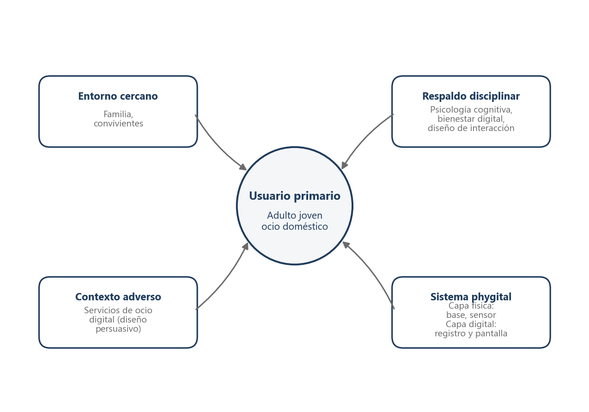
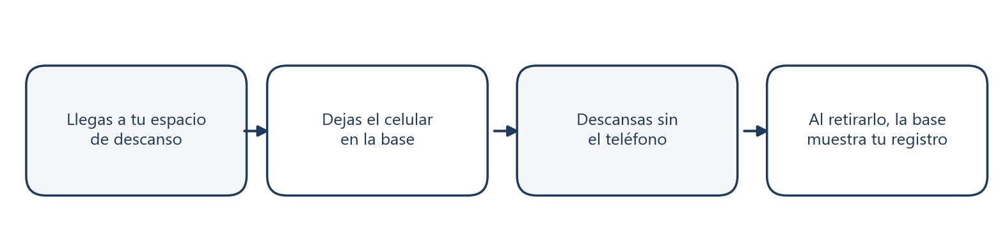

# Memoria E12 de In(Visible) — versión Markdown

## Nota archivística

Entrega histórica del hito E12 y referencia principal de la etapa In(Visible). La comparación de fuentes posterior confirmó que la [memoria final de Relevo del 8 de julio de 2026](../cierre/memoria-final-relevo.md) es el cierre semestral más tardío localizado. Este documento explica el antecedente conceptual, pero no sustituye esa memoria ni las ramas posteriores del semestre 2.

Este archivo conserva el contenido de una fuente local propia dentro del archivo histórico. Su ubicación en `99_archivo` indica que no constituye, por sí sola, una definición vigente del proyecto.

## Contenido migrado

# In(Visible)
## Objeto phygital de registro pasivo para que adultos jóvenes consoliden la memoria de su ocio sin teléfono en el espacio doméstico

**Johan Yantén · Diseño · Universidad Diego Portales · Seminario de Título · 2026, primer semestre**

---

## Resumen

Esta investigación abordó la *amnesia del ocio digital* en adultos jóvenes: la experiencia de dedicar horas al entretenimiento en el teléfono que luego no se consolida como recuerdo propio y deja culpa retrospectiva. El objetivo general fue diseñar un objeto phygital de registro pasivo para consolidar la memoria del ocio sin teléfono en el espacio doméstico. La metodología correspondió a la etapa de seminario: revisión bibliográfica en tres ámbitos teóricos, revisión del estado de la cuestión en investigación en diseño, benchmark de referentes proyectuales y ocho entrevistas semiestructuradas exploratorias en Santiago. La evidencia de campo orientó el problema: varios entrevistados describen no poder recordar qué hicieron en el teléfono, la sensación de haber perdido parte del día y la idea de que debieron hacer algo más productivo. Sobre esa base se formuló In(Visible), una base doméstica phygital con sensor de peso y visualización pasiva en el objeto, sin interacción táctil: el usuario deposita el teléfono para iniciar su ocio y, al retirarlo, la pantalla del artefacto devuelve una visualización acumulativa y no punitiva del tiempo vivido sin pantalla. Se concluyó que existe un vacío de diseño en la representación cualitativa del ocio y que un objeto de registro pasivo constituye una respuesta pertinente, cuya materialización y validación corresponden a la etapa siguiente del proceso de titulación.

**Palabras clave:** ocio digital; memoria episódica; diseño phygital; fricción física

---

## Índice

Resumen
Agradecimientos (pendiente)
1. Motivación Personal
2. Introducción
3. Problemática
4. Antecedentes de investigación en diseño
5. Marco Teórico
   - Ámbito 1: Absorción disociativa, memoria episódica y experiencia del tiempo
   - Ámbito 2: Economía de la atención y diseño persuasivo
   - Ámbito 3: Fricción física, interacción phygital y agencia del usuario
   - Contrapunto crítico: los límites de la desconexión digital
   - Conclusiones del Marco Teórico
6. Estado del Arte / Análisis de referentes
7. Usuario y contexto de aplicación
8. Formulación del Proyecto
   - Problema de diseño
   - Punto de Vista (POV)
   - Hipótesis
   - Objetivo general y específicos
   - Mapa de actores
   - Definición del proyecto
   - Metodología y plan de trabajo
9. Propuesta Proyectual
10. Referencias

---

## 1. Motivación Personal

Este proyecto nace de una incomodidad cotidiana que tardé en saber nombrar. Terminaba una sesión de videojuegos, cerraba una serie, apagaba la música, y lo que quedaba no era satisfacción sino una especie de vacío borroso: la sensación de que esas horas simplemente no habían ocurrido. Las había vivido y disfrutado genuinamente, pero no podía recuperarlas como mías.

Y entonces llegaba la culpa. No una culpa clara, sino una culpa de fondo que decía que ese tiempo había sido desperdiciado. Lo paradójico es que no podía refutarla, porque no podía recordar el disfrute con suficiente nitidez. La culpa ganaba por defecto: no porque tuviera razón, sino porque el recuerdo del disfrute ya no estaba disponible para contradecirla.

Durante mucho tiempo lo atribuí a falta de disciplina. Pero la diferencia entre el ocio digital y otras formas de entretenimiento no era la calidad de la experiencia, sino lo que quedaba después: de otras actividades quedaba algo que señalaba que habían ocurrido; del ocio digital, solo la pantalla apagada. Esta investigación parte de la convicción de que el ocio merece existir en la memoria como experiencia propia, y de que la culpa retrospectiva no debería ganar por falta de evidencia.

---

## 2. Introducción

Muchos adultos jóvenes terminan su jornada con el teléfono en la mano: ven videos, juegan, scrollean. El tiempo pasa de forma intensa y placentera, y sin embargo, al levantar la vista, algo falta: la sesión completa se disuelve y no queda recuerdo nítido de qué se hizo ni de qué se disfrutó. Lo que queda en su lugar es una sensación incómoda de tiempo perdido, y con ella, culpa retrospectiva.

Esta investigación parte de esa experiencia y la nombra: la *amnesia del ocio digital*. Este término se utiliza aquí como **denominación operativa propuesta por el autor** para describir la convergencia, en la experiencia cotidiana, de fenómenos que la literatura aborda por separado: falta de consolidación episódica, absorción prolongada, culpa retrospectiva y captura de la atención. No es un concepto clínico establecido ni un constructo validado en la literatura; articula evidencia de memoria episódica (Staniloiu et al., 2020; Tulving, 2002), culpa mediática (Reinecke & Meier, 2020) y diseño persuasivo (Bhargava & Velasquez, 2021; Montag et al., 2019).

No es un descuido del usuario ni una debilidad de carácter. Es el resultado predecible del cruce entre dos fuerzas: un estado de absorción atencional prolongada que reduce la autoconciencia mientras se disfruta, y un ecosistema de plataformas diseñado para suprimir las pausas que permitirían registrar lo vivido. El usuario disfruta de verdad, pero no consolida ese disfrute como memoria propia; y cuando la cultura le exige rendir cuentas de su tiempo, no tiene evidencia que mostrar, ni siquiera ante sí mismo.

La relevancia del problema se sustenta en el crecimiento sostenido del tiempo en línea a escala global y nacional (Kemp, 2025; Subsecretaría de Telecomunicaciones, 2024a, 2024b), y en un vacío específico del ecosistema de herramientas disponibles: todas cuantifican o restringen el uso del teléfono, pero ninguna registra ni devuelve el descanso como experiencia valiosa (Cecchinato et al., 2019; Lyngs et al., 2019). El diseño —disciplina que contribuyó a crear los mecanismos de captura de atención (Bhargava & Velasquez, 2021; Montag et al., 2019)— tiene aquí una oportunidad y una responsabilidad.

El documento se organiza de la siguiente manera: primero se presenta la problemática con sus indicadores contextuales y aristas; luego, los antecedentes de investigación en diseño que sitúan el proyecto en la disciplina; el marco teórico desarrolla los tres ámbitos que fundamentan la intervención, junto con su contrapunto crítico; el estado del arte analiza seis referentes proyectuales; la evidencia de campo caracteriza al usuario; y sobre esa base se formula el proyecto y su propuesta proyectual: In(Visible).

---

## 3. Problemática

### Contexto global

Para muchos adultos jóvenes, el teléfono ocupa una parte importante del día: no solo para estudiar o trabajar, sino para ver series, escuchar música, jugar o scrollear antes de dormir. Kemp (2025) estima que, a nivel global, el uso de internet alcanzó un promedio de 6 horas y 38 minutos diarios en el tercer trimestre de 2024. Una fracción considerable de ese tiempo es ocio digital —contenido bajo demanda, redes, videojuegos— que la persona suele vivir con intensidad pero que, al cerrar la app, no queda registrado como experiencia recuperable.

Ese ocio no ocurre en un vacío técnico: está mediado por servicios cuyo modelo de negocio depende de que el usuario vuelva, no de que recuerde qué vivió (Bhargava & Velasquez, 2021). Para sostener esa recurrencia, el diseño persuasivo elimina pausas —scroll sin fin, reproducción automática, recompensas variables— que podrían permitir detenerse y reflexionar (Montag et al., 2019). Si el tiempo en línea crece (Kemp, 2025) y las plataformas optimizan la permanencia más que el recuerdo, puede inferirse que parte de ese ocio no se consolida en memoria episódica. Staniloiu et al. (2020) y Tulving (2002) muestran que el recuerdo episódico —la experiencia de «yo estuve ahí»— requiere codificación autorreferencial y segmentación temporal; el consumo en automatismo tiende a debilitar ambas condiciones.

### Contexto nacional

En Chile, esa dinámica se vive con una conectividad muy alta. Según el informe de acceso y uso de internet de la Subsecretaría de Telecomunicaciones (2024a), el 96,5 % de los hogares declara tener acceso propio y pagado a internet fijo o móvil. A diciembre de 2024, la penetración de internet móvil (3G, 4G y 5G) alcanzó 114,8 accesos por cada 100 habitantes (Subsecretaría de Telecomunicaciones, 2024b). Eso significa que el teléfono con datos llega casi a cualquier dormitorio o velador, y que el ocio audiovisual y de entretenimiento digital puede extenderse sin depender de un computador fijo.

En ese entorno, perder la noción del tiempo scrolleando es una experiencia frecuente entre adultos jóvenes urbanos. Sin embargo, las herramientas más visibles —Screen Time, Digital Wellbeing, apps de bloqueo— priorizan contar minutos o restringir apps, no ayudar a recordar cómo fue vivido el tiempo ni a valorarlo después. Esa brecha tiene implicancias documentadas en la literatura sobre culpa mediática y recuperación psicológica (Meier & Reinecke, 2021; Reinecke & Meier, 2020).

### Aristas del problema

El problema no se reduce a una sola causa. Se cruza cuando lo que ocurre en la mente al scrollear, lo que hacen las plataformas para prolongar el scroll, y lo que la cultura exige del descanso coinciden en la misma noche en la cama. Las tres aristas no son ítems de un formulario: son fuerzas que se refuerzan y que esta investigación necesita nombrar con precisión para diseñar una respuesta pertinente.

**Arista psicológica.** Imagina terminar una sesión de TikTok o Instagram: sabes que estuviste entretenido, pero al levantar la vista no puedes narrar qué pasó. No es amnesia clínica ni falta de inteligencia: es que la experiencia transcurre mientras la atención está absorbida y el yo que debería registrar la sesión queda, en la práctica, ausente. La memoria episódica —el tipo de recuerdo que permite decir «yo viví esto, en este momento»— necesita que la persona se reconozca dentro de la escena (Tulving, 2002). Staniloiu et al. (2020) sostienen que eso depende de codificación autorreferencial y de hitos que segmenten el tiempo: inicio, variación, cierre. El scroll infinito homogeniza la tarde; puede quedar un dato semántico —«vi videos»— pero no la experiencia de haberlos vivido.

Cuando el recuerdo no está disponible, aparece otro fenómeno: culpa retrospectiva. Reinecke y Meier (2020) documentan el *guilty pleasure*, el ocio que se evalúa como incongruente con las propias metas. Si nadie regaña en voz alta, la persona igual puede sentir que «perdió» parte del día porque no tiene evidencia del disfrute para contradecir esa evaluación. Khoshnoud et al. (2020) ayudan a precisar que no todo el ocio digital opera igual: un juego que exige foco puede dejar más rastro que un feed pasivo. El problema se concentra en el consumo repetitivo sin marca clara de inicio y cierre.

**Arista tecnológica.** Las plataformas de ocio no son neutras: están diseñadas para que el usuario no suelte el teléfono. Montag et al. (2019) describen mecanismos concretos —scroll sin fin, reproducción automática, notificaciones, recompensa variable— que eliminan el momento en que la persona podría detenerse, evaluar y recordar. Bhargava y Velasquez (2021) argumentan que, cuando el modelo de negocio depende de la retención, esa captura no es un accidente sino una función del producto.

En paralelo, el ecosistema de «bienestar digital» replica un paradigma distinto pero igualmente limitado: cuenta minutos en rojo, impone límites y compara días (Cecchinato et al., 2019; Lyngs et al., 2019). Como se desarrolla en el marco teórico, la mayoría de esas herramientas opera sobre el reloj, no sobre la experiencia vivida. Si el problema es amnesia del ocio —no solo exceso de pantalla—, las herramientas disponibles no atacan la arista correcta.

**Arista cultural.** Incluso cuando nadie dice «deberías estar haciendo algo productivo», muchos adultos jóvenes internalizan que solo «cuenta» el descanso que deja señal visible: leer un libro, salir, terminar una tarea creativa. El scroll en el metro o en una fila pasa casi sin culpa; el mismo consumo en la cama, sin rendimiento que mostrar, convoca la idea de tiempo mal gastado. Han (2010/2012) describe al sujeto que se autoexplota; Rosa (2013/2016) muestra cómo la aceleración social coloniza incluso el tiempo libre. De Masi (2000) defiende el ocio creativo como espacio de elaboración personal: cuando ese tiempo no queda accesible en la memoria, también se pierde la posibilidad de reconocerlo como legítimo.

Han (2010/2012) y Rosa (2013/2016) muestran que el mandato de rendimiento coloniza incluso el tiempo libre: el ocio sin huella visible se juzga con otra escala que el descanso reconocible. Eso orienta la postura de In(Visible): no optimizar rendimiento del descanso ni comparar días, sino devolver un rastro recuperable de lo elegido.

### Justificación y oportunidad de diseño

Abordar este problema desde el diseño es pertinente por dos razones. Primero, el problema fue producido por diseño: los mecanismos que disuelven la memoria del ocio —scroll infinito, autoplay, recompensa variable— son decisiones deliberadas de diseño de interacción (Montag et al., 2019). La disciplina que contribuyó a crear el problema tiene la capacidad y la responsabilidad de proponer condiciones distintas. Segundo, el vacío identificado es específicamente proyectual: no falta información ni regulación, falta un artefacto que convierta el descanso elegido en evidencia recuperable. Esa es una pregunta de forma, materialidad e interacción: el territorio propio del diseño.

De ahí emerge la oportunidad: ninguna herramienta del ecosistema actual de bienestar digital ofrece una representación cualitativa y no punitiva del tiempo de ocio que permita al usuario recuperarlo como experiencia propia. Las herramientas existentes cuantifican sin narrar, muestran sin validar, y en muchos casos refuerzan la culpa en lugar de reducirla. La oportunidad de diseño está en un objeto que registre el tiempo de ocio desde el gesto consciente del usuario, lo acumule como evidencia visual acumulativa y lo devuelva como memoria en lugar de métrica.

---

## 4. Antecedentes de investigación en diseño

El proyecto no aparece en un campo vacío. Durante la última década, la investigación en diseño de interacción ha tratado el bienestar digital como problema de sistemas —no solo de disciplina individual— y ha ido desplazando el foco desde la abstinencia hacia decisiones más conscientes sobre el uso de la tecnología. Ese desplazamiento define el estado de la cuestión en el que In(Visible) se inserta: un territorio donde ya se cuestionó la cuenta de minutos, pero donde todavía falta un objeto que devuelva el ocio como memoria.

### Cuando el diseño solo cuenta minutos

La agenda de investigación formulada en CHI 2019 por Cecchinato et al. (2019) reunió a diseñadores, psicólogos y estudiosos de la interacción bajo una premisa compartida: el bienestar digital no puede reducirse a «usar menos pantalla». Propuso investigar cómo las tecnologías pueden *soportar* elecciones significativas en lugar de castigar el consumo. En el mismo año, Lyngs et al. (2019) revisaron 367 herramientas de autocontrol digital y encontraron un patrón dominante: bloqueos, temporizadores y métricas de tiempo de pantalla. Esas soluciones operan sobre el reloj, no sobre la experiencia. Interrumpen o cuantifican, pero no ayudan al usuario a recordar qué vivió ni a valorarlo después.

Para esta investigación, ese hallazgo es un antecedente directo, no un dato contextual. Si las herramientas más estudiadas del ecosistema de bienestar digital no devuelven memoria episódica, el problema no es falla del usuario sino vacío de representación en el diseño de interacción. In(Visible) responde a esa brecha: no busca reemplazar el teléfono durante el ocio, sino marcar el inicio y el cierre de una sesión y devolver evidencia cualitativa de lo elegido.

### Objetos que registran lo subjetivo

Paralelo a la agenda de bienestar digital, otra línea de investigación exploró cómo un objeto físico puede capturar estados subjetivos que las interfaces tradicionales distorsionan. Adams et al. (2018) presentaron Keppi, una interfaz tangible para autorreporte de dolor: el usuario aprieta una espuma conductiva con distinta intensidad y el gesto codifica la experiencia sin menús ni escalas abstractas. El aporte proyectual es metodológico: demuestra que la materialidad puede registrar un fenómeno interior si el diseño traduce presión, duración o presencia en una forma legible.

Rooksby et al. (2014), en su estudio sobre el seguimiento personal como *lived informatics*, muestran el límite opuesto: cuando el registro solo entrega números —pasos, minutos, notificaciones— el usuario no recupera la *durée* de lo vivido. La métrica existe, pero la experiencia no queda como memoria defendible. Ese contraste orienta la postura de In(Visible): el sensor no produce una estadística comparativa sino un cierre de sesión y evidencia visual acumulativa que el usuario puede interpretar como rastro de su descanso, no como evaluación de rendimiento.

### El ocio como pregunta de diseño en Chile

En Chile, el ocio ya ha sido tratado como territorio proyectual, aunque desde ángulos distintos al de esta memoria. Antivil Santis (2022), en su tesis de arquitectura *Paisajes de recreación*, diseña dispositivos de juego para el ocio en espacio público y vecinal en Santiago. Su trabajo legitima el descanso como objeto de investigación en diseño local y demuestra que un artefacto físico puede mediar la experiencia sin ser equipamiento neutro. Sin embargo, su foco es la interacción colectiva en el barrio, no la memoria individual del ocio digital en el hogar. Otros trabajos del Repositorio Académico de la Universidad de Chile han abordado bienestar mediante juego presencial co-diseñado con universitarios (Zamorano Negretti, 2024) o espacios de bienestar en la formación de diseñadores (Maturana Retamal, 2022), con posturas no punitivas y validación con usuarios, pero sin tocar el registro del ocio doméstico mediado por el teléfono.

En suma, los antecedentes sitúan el problema en la investigación en diseño —cómo registrar lo subjetivo y qué fallan las métricas—, no en el catálogo de productos. El vacío proyectual se contrasta en el estado del arte siguiente.

---

## 5. Marco Teórico

El marco teórico cruza tres campos que se necesitan mutuamente. Primero, el mecanismo psicológico del olvido —absorción disociativa y memoria episódica—. Segundo, el ecosistema que prolonga ese olvido —economía de la atención y diseño persuasivo—. Tercero, las herramientas disciplinares para intervenir —fricción física y diseño phygital—. En esta memoria, *absorción disociativa* y *amnesia del ocio digital* son denominaciones operativas propias: no designan diagnósticos clínicos, sino formas cotidianas en que el ocio digital se vive con intensidad pero queda pobre en memoria episódica cuando termina. *Memoria episódica* —para quien no está familiarizado con el concepto— es el tipo de recuerdo que ubica una experiencia en tiempo y lugar y permite decir «yo estuve ahí»; se distingue de saber un dato abstracto («TikTok existe») de recordar haber pasado una tarde scrolleando. *Diseño phygital* alude al cruce entre objeto físico y capa digital integrada en un mismo sistema, no a una app ornamental pegada a un soporte vacío.

El primero de los ámbitos explica el mecanismo interno; el segundo demuestra que es explotado desde afuera; el tercero identifica cómo responder. Si el entorno digital está diseñado para que el usuario no recuerde, ¿qué condiciones materiales puede crear el diseño para que sí lo haga?

### Ámbito 1 — Absorción disociativa, memoria episódica y experiencia del tiempo

Hay una diferencia incómoda entre disfrutar el ocio digital y recordarlo después. Una tarde de scroll puede sentirse placentera mientras ocurre; al cerrar la app, la tarde se vuelve borrosa. El usuario sabe que estuvo entretenido, pero no puede narrar la experiencia como propia. No es que no haya pasado nada: es que nada quedó anclado en la memoria episódica.

Ese mecanismo no es igual en todo el ocio digital. Cuando la actividad exige atención sostenida y ofrece retroalimentación clara —un puzzle, un juego con desafío calibrado— la persona puede entrar en *flow*: concentración profunda donde el tiempo se deforma y la autoconciencia reflexiva puede disminuir (Csikszentmihalyi, 1990/1997). Khoshnoud et al. (2020) documentan que en estados de alta absorción interactiva también baja el procesamiento autorreferencial. El scroll pasivo de redes opera distinto: no pide habilidad ni entrega eventos singulares; mantiene la atención capturada sin marcar inicio, cierre ni decisión. Esa condición prolongada —absorción disociativa— deja al yo registrador funcionalmente apagado no por logro, sino por pasividad.

Khoshnoud et al. (2020) vinculan la absorción interactiva con correlatos fisiológicos distintos al consumo pasivo: un puzzle o un juego con desafío calibrado puede dejar más rastro mnémico que un feed que no entrega cierre ni variación. El mecanismo no es uniforme en todo el ocio digital; el problema se concentra en el consumo pasivo y repetitivo sin eventos que segmenten la experiencia.

Una videollamada larga con alguien cercano suele quedar narrable al día siguiente porque tiene interlocutor, tema y cierre conversacional. Una tarde con serie y luego memes en redes puede recordarse como bloque, pero el scroll aislado al final de la noche es el fragmento que más se desdibuja: la persona recuerda la serie, no la media hora de feed con sueño ya presente. Eso indica que lo que falta no es «contenido en pantalla», sino estructura episódica —inicio reconocible, variación en el desarrollo y un punto de salida—. El scroll infinito suprime ese armazón; la persona termina entretenida pero sin episodio defendible.

La psicología de la memoria explica por qué eso importa. En su obra sobre memoria y autonoésis, Tulving (2002) distingue memoria semántica —saber hechos descontextualizados— y memoria episódica —experiencias situadas en tiempo y lugar que permiten «viajar mentalmente» al pasado—. La *autonoésis* es la conciencia de que *yo estuve ahí*: sin ella, el disfrute puede ocurrir pero no queda como recuerdo defendible ante la autoevaluación del día siguiente. Staniloiu et al. (2020) sostienen que esa consolidación depende de codificación autorreferencial —la experiencia se registra vinculada al yo— y de hitos que segmenten la experiencia. El scroll infinito homogeniza el tiempo: puede quedar contenido semántico —el video visto— pero no la experiencia de haberlo vivido.

Esa distinción tiene implicancias para el diseño. La memoria episódica no se activa con más información sobre el contenido consumido, sino con marcadores de inicio, cierre y presencia del yo en la escena. Cuando la sesión no entrega esos marcadores —porque el feed no termina y el usuario no decide detenerse— el recuerdo queda sin armazón narrativo. Al día siguiente, la persona puede saber que «estuvo en el teléfono» pero no reconstruir la tarde como episodio propio. Tulving (2002) insiste en que la memoria episódica permite «viajar mentalmente» al pasado; sin ese viaje, el ocio queda fuera de la autobiografía cotidiana y la evaluación retrospectiva opera sobre un vacío.

Hay otra distinción temporal: el reloj homogeneiza y cuantifica; la *durée* bergsoniana —la duración cualitativa de lo vivido— no se reduce a minutos (Bergson, 1896/2006). Las apps de bienestar operan sobre el reloj. In(Visible) no pretende medir algorítmicamente la *durée*; mapear duración a tamaño sigue siendo espacializar el tiempo. Su función es actuar como umbral físico que separa tiempo de pantalla y tiempo de descanso, entregando un hito externo para reconectar con lo vivido.

Cuando el ocio no deja rastro, aparece la culpa. Reinecke y Meier (2020) documentan el *guilty pleasure*: el concepto propone que el ocio se evalúa como incongruente con las propias metas y el disfrute vivido se vuelve difícil de recuperar. Sin hitos episódicos ni evidencia recuperable, la culpa retrospectiva gana por defecto. La amnesia y la culpa son dos fases del mismo vacío. Meier y Reinecke (2021), en su meta-revisión sobre comunicación mediada y salud mental, muestran que el bienestar digital no se reduce al tiempo de pantalla: importa cómo se evalúa retrospectivamente el uso y qué narrativa queda disponible después. Eso refuerza el foco de In(Visible): no sustituir un contador de minutos, sino ofrecer anclaje para valorar el ocio sin teléfono como tiempo elegido, no como falla de disciplina.

De Masi (2000) defiende el ocio creativo como espacio de elaboración personal; cuando ese tiempo no queda accesible en la memoria, se pierde también la posibilidad de reconocerlo como legítimo —el descanso queda indefendible ante la autoevaluación.

El diseño no debe eliminar la absorción —a veces es refugio buscado— sino proveer señales externas de inicio y cierre que el estado no genera por sí mismo. En psicología cognitiva, esas señales se relacionan con *retrieval cues* —indicios que ayudan a recuperar un recuerdo—: si el cerebro no tiene hitos internos durante el scroll, el diseño puede ofrecer bordes externos. Gesto físico al entrar, evidencia visual al salir: un gancho mnemotécnico en los márgenes de la sesión, sin intervenir su interior. Esa lógica distingue In(Visible) de herramientas que interrumpen el contenido o castigan el exceso: el objeto no regula el ocio en pantalla; marca el umbral entre pantalla y descanso elegido, donde la consolidación episódica tiene más probabilidad de ocurrir.

Este ámbito delimita la arista psicológica del problema sin patologizar al usuario. La amnesia del ocio digital, como denominación operativa de esta memoria, no alude a un trastorno clínico ni a una disociación en sentido psiquiátrico: describe una condición cotidiana en la que el disfrute existe pero el yo que debería registrar la experiencia queda funcionalmente ausente. La intervención de diseño no busca «curar» esa ausencia con terapia ni abstinencia, sino proveer condiciones materiales —inicio declarado, cierre visible— que la literatura asocia a codificación autorreferencial y a recuperación retrospectiva. La hipótesis del proyecto se apoya en esa cadena: declarar el inicio antes del ocio altera la codificación afectiva y abre condiciones para recordar después.

### Ámbito 2 — Economía de la atención y diseño persuasivo

El olvido del ocio digital no ocurre solo «adentro» del usuario. Las plataformas de ocio compiten por mantener la atención porque su modelo de negocio depende de la permanencia, no del recuerdo. Cuando la información abunda, el recurso escaso es la atención humana; los sistemas digitales compiten por capturarla y monetizarla (Williams, 2018). Ese cambio de escala transformó el ocio en un producto que se optimiza para que el usuario siga, no para que recuerde.

El costo de esa economía no se mide solo en horas sino en agencia: perder el recuerdo de una tarde de descanso es un daño profundo, no una distracción puntual. Williams (2018), en su análisis de la atención como recurso escaso, distingue tres niveles en que la captura digital puede erosionar al usuario. El *Spotlight* es la atención funcional inmediata —responder notificaciones, abrir la app—. El *Starlight* es la atención existencial de mediano plazo —planear el día, sostener proyectos—. El *Daylight* es la atención más profunda: los valores con los que la persona quiere vivir. Cuando el scroll consume el Spotlight noche tras noche, el usuario puede perder no solo minutos sino la capacidad de saber si descansó porque lo eligió o porque el feed no lo soltó, y qué lugar quiere que tenga el ocio en su vida si ni siquiera puede recordarlo.

Williams (2018) advierte contra soluciones que responsabilizan solo la fuerza de voluntad frente a una industria diseñada para capturar. Sin contradecir a Han (2010/2012) —quien describe la autoexplotación del sujeto de rendimiento—, In(Visible) asume que el usuario puede ser cómplice de su propio mandato de productividad, pero que el entorno digital exacerba esa condición. El objeto no promete curar el capitalismo de plataformas; opera como umbral material que facilita una decisión ya buscada.

La lógica es también ética: el modelo de negocio depende del tiempo de permanencia, los ingresos publicitarios crecen con el enganche, y el diseño se optimiza para retención antes que bienestar (Bhargava & Velasquez, 2021). La captura no es efecto colateral: es función del producto. Si el entorno está diseñado para producir permanencia automática, exigir al usuario que «recuerde por sí mismo» traslada un problema que no creó.

En el detalle del diseño persuasivo, el scroll infinito suprime el final de página: no hay «última página» que invite a cerrar. El autoplay elimina la elección de continuar —el siguiente video arranca sin preguntar—. La recompensa variable mantiene la búsqueda compulsiva —«quizá el próximo contenido sí vale»— y las notificaciones reactivan el ciclo cuando la persona ya había soltado el teléfono (Montag et al., 2019). Cada mecanismo elimina una pausa: el momento en que el usuario podría detenerse, registrar lo vivido y decidir. El diseño persuasivo no acelera al usuario en abstracto; suprime los bordes del tiempo y deja la sesión sin inicio ni cierre reconocibles.

Las herramientas de bienestar digital que ofrecen los propios fabricantes —Screen Time en iOS, Digital Wellbeing en Android— replican ese paradigma cuantitativo: minutos en rojo, límites configurables, comparaciones diarias. Cecchinato et al. (2019) documentan que ese enfoque informa sin transformar la experiencia: el usuario ve que «usó tres horas», pero no recupera qué vivió en ellas ni por qué ese tiempo importó. La métrica sustituye la narrativa y, en muchos casos, intensifica la culpa.

Bhargava y Velasquez (2021) argumentan que el diseño de interacción tiene responsabilidad ética cuando el modelo de negocio depende de la retención. Una intervención desde el diseño no puede limitarse a replicar dashboards corporativos: debe proponer una representación distinta del tiempo de ocio, anclada al gesto del usuario y no solo a la telemetría del dispositivo.

### Contexto chileno: conectividad sin pausas

En Chile, esa lógica global opera con una densidad particular. Según la Subsecretaría de Telecomunicaciones (2024a), el 96,5 % de los hogares declara acceso propio y pagado a internet; la penetración móvil alcanzó 114,8 accesos por cada 100 habitantes a diciembre de 2024 (Subsecretaría de Telecomunicaciones, 2024b). El dormitorio y el velador ya no son espacios neutros: el teléfono llega con redes de alta velocidad y contenido bajo demanda. La desconexión no es un estado por defecto del hogar; requiere un gesto explícito. Kemp (2025) documenta el crecimiento sostenido del tiempo en línea a escala global; en Chile, esa tendencia se combina con una infraestructura que hace el ocio digital casi omnipresente en la vida urbana de adultos jóvenes —un contexto donde la amnesia del ocio no es falla individual aislada, sino condición frecuente de un entorno hiperconectado.

Rosa (2013/2016) describe cómo la aceleración social comprime los intervalos entre actividades y coloniza incluso los momentos que antes funcionaban como respiro. Ese mandato cultural se traduce en culpa retrospectiva tras el scroll en la cama y en la idea de que solo cuenta el ocio que deja señal de productividad o de haber «hecho algo». El scroll en transporte o fila pasa casi sin culpa; el mismo consumo en el dormitorio, sin rendimiento visible, convoca la evaluación de tiempo mal gastado.

Ese contraste articula la arista cultural del problema con datos locales de conectividad y con la literatura sobre aceleración y autoexplotación. In(Visible) no debe reproducir un tono productivista ni comparar días: su visualización apunta a devolver un rastro recuperable de lo elegido, no a puntuar el descanso.

Han (2010/2012) describe al sujeto de rendimiento que se autoexplota, y el entorno digital lo exacerba: el ocio doméstico se evalúa como si debiera rendir cuentas ante una audiencia interna. In(Visible) no pretende curar el capitalismo de plataformas; opera como umbral material doméstico que facilita una decisión ya buscada, no como ascetismo digital. Rechaza convertirse en un «Fitbit del descanso»: la visualización no debe acumular puntos de productividad. Si el ambiente suprime pausas, la respuesta debe materializarse fuera del dispositivo.

### Ámbito 3 — Fricción física, interacción phygital y agencia del usuario

Si el problema es de memoria y el contexto es adverso, la respuesta no puede ser otra notificación en el teléfono. Las herramientas dominantes de bienestar digital —Screen Time, Digital Wellbeing, apps de bloqueo— comparten un paradigma: contar minutos, poner límites y castigar el exceso. Funcionan como contadores y alarmas; rara vez ayudan a recordar cómo fue vivido el tiempo ni conectan al usuario con su propia historia de descanso. Cecchinato et al. (2019), en su agenda de investigación presentada en CHI, llaman a diseñar para decisiones significativas sobre la tecnología, no solo para reducir el uso. Ese vacío es disciplinar: falta un objeto que devuelva experiencia, no solo estadística.

La dimensión phygital se justifica porque el problema ocurre entre cuerpo, teléfono y espacio doméstico. Una intervención solo digital corre el riesgo de devolver al usuario al mismo dispositivo que busca dejar en pausa; una intervención solo física puede separar, pero no necesariamente devolver memoria. El cruce entre ambas dimensiones permite una experiencia donde el gesto material y la representación digital cumplen funciones distintas y complementarias: la base interrumpe el automatismo; la pantalla del objeto devuelve evidencia sin reabrir el ciclo de consumo.

El scroll inercial pertenece al sistema automático de la cognición; las apps que solo informan hablan al sistema reflexivo cuando el comportamiento ya está gobernado por el automático. Lyngs et al. (2019), en su revisión de herramientas de autocontrol digital, muestran que las intervenciones más prometedoras introducen fricción: pequeños obstáculos que interrumpen la cadena y abren una pausa donde retomar la decisión. Pero In(Visible) no es solo fricción pasiva —un obstáculo que el usuario debe querer usar—: funciona como dispositivo de compromiso (*commitment device*). Al depositar el teléfono en un objeto fijo del hogar, la persona declara el inicio del descanso y cambia la arquitectura del entorno: el objeto asume parte de la carga de sostener la separación durante la sesión. La fricción se coloca en la entrada del ocio —soltar el teléfono—, no en su interior.

Lyngs et al. (2019) señalan que las estrategias improvisadas —dejar el teléfono en otra habitación, modo avión, esconder apps en carpetas— funcionan por momentos pero rara vez sostienen el gesto: la persona vuelve a buscar el dispositivo. Un objeto fijo en el velador con función explícita —inicio y cierre de sesión sin teléfono— puede transformar la separación en ritual doméstico. No es «olvidé el celular en el baño»; es «deposité el teléfono para empezar mi ocio». Ese cambio de arquitectura del entorno es lo que Lyngs et al. (2019) identifican como fricción productiva frente al automatismo del scroll.

El benchmark proyectual —desarrollado en el estado del arte— confirma que la fricción física ya existe en el mercado, pero con lógicas distintas a la de In(Visible). Komoru (Cohda Design, 2019) deposita y desconecta sin devolver memoria; Yoro (Diermeier et al., 2019) invita a otra actividad sin registrar la sesión; Opal (2020) y Brick (2023) bloquean o puntúan sin narrar el descanso vivido. In(Visible) no compite en la misma variable: no bloquea señal ni restringe apps; registra el tiempo fuera del teléfono y lo devuelve en el mismo artefacto donde se declaró el inicio. Esa coherencia entre gesto y evidencia es central para el diseño phygital de este proyecto.

Incluso sin usarse, el teléfono en el entorno reduce el rendimiento en memoria de recuerdo; separarse físicamente del dispositivo mejora ese rendimiento (Tanil & Yong, 2020). El teléfono ocupa recursos cognitivos inhibiendo su propio llamado. Depositarlo en la base no es solo un gesto simbólico: libera atención para consolidar lo que se vive después. El objeto debe sacar el dispositivo del foco, no mantenerlo visible como un cargador convencional. La base no es soporte de carga: el gesto es depósito y retiro, no permanencia del teléfono conectado a la rutina de alimentación del dispositivo.

Las herramientas de bienestar digital suelen operar en funcionalidad y datos; In(Visible) apunta al nivel reflexivo del diseño. En *El diseño emocional*, Norman (2004/2005) distingue lo funcional, lo comportamental y lo reflexivo; el mapa acumulado del descanso no es útil en sentido funcional: es significativo. En el nivel comportamental, depositar y retirar el teléfono entrega retroalimentación inmediata —peso, silencio, breve destello al cierre— sin menús ni configuración. El nivel reflexivo llega cuando el mapa acumulado permite decir que esas horas existieron y fueron elegidas. Construye un relato personal del tiempo de ocio y devuelve agencia sobre la historia que el usuario puede contar de su descanso.

Mantener la visualización en el objeto —y no en una app que el usuario abre al retirar el teléfono— preserva esa coherencia fenomenológica. Una alternativa con el sensor conectado a una app móvil vía Bluetooth reintroduciría el teléfono como interfaz del registro justo cuando la persona lo separa para descansar. La pantalla en la base devuelve la evidencia donde ocurrió el gesto de depósito: el circuito memoria–valoración se cierra en el mismo lugar físico del umbral, no en el dispositivo que se buscaba dejar fuera del foco.

La tradición de interfaces tangibles (TUI) ofrece precedente disciplinar para esa postura. Adams et al. (2018) demuestran que un objeto físico puede codificar estados subjetivos —dolor, presión, duración— sin menús ni escalas abstractas. Rooksby et al. (2014) muestran, por contraste, que el seguimiento personal reducido a números no devuelve la experiencia vivida. In(Visible) se sitúa entre ambos polos: no autorreporta con menús, pero también evita la métrica comparativa; el gesto de depositar y la forma visual al cierre constituyen el registro.

La tradición de *slow technology* propone artefactos presentes, lentos, que despliegan su sentido con la convivencia prolongada (Hallnäs & Redström, 2001). In(Visible) pertenece a esa línea: objeto doméstico silencioso, sin notificaciones, cuyo valor —el mapa acumulado— se revela con las semanas.

La pantalla de In(Visible) no debe ser un dashboard. Thudt et al. (2018) fundamentan que una visualización puede organizar datos como relato interpretable, no solo como métrica. La visualización cualitativa de este proyecto —formas de baja resolución que evocan contemplación— puede leerse como una *pátina digital*: un rastro ambiental que reconoce que ese tiempo existió sin juzgarlo, en contraste con dashboards productivistas. Su fin no es un «puntaje de descanso», sino cristalizar memoria sin convertir el ocio en rendimiento. En el prototipo, una OLED breve al retirar el teléfono puede bastar para validar la lógica de visualización.

En síntesis, este ámbito entrega cuatro decisiones disciplinares: operar en el nivel reflexivo (Cecchinato et al., 2019), usar fricción física para interrumpir el automatismo (Lyngs et al., 2019), separar el dispositivo del campo de atención (Tanil & Yong, 2020) y dar forma al registro como tecnología lenta de visualización cualitativa (Hallnäs & Redström, 2001; Thudt et al., 2018). El diseño phygital aquí no concatena una app ornamental a un objeto vacío: la capa física produce la interrupción y la capa digital en el objeto devuelve el registro; ambas son necesarias para cerrar el circuito memoria–valoración que las herramientas solo digitales no logran.

### Contrapunto crítico: los límites de la desconexión digital

Incorporar una perspectiva crítica evita que el marco teórico transite por una sola vereda. La evidencia sobre la desconexión digital no es unánime, y eso obliga a precisar qué puede y qué no puede prometer este proyecto.

Radtke et al. (2022), en una revisión sistemática de 21 estudios de intervención con más de 3.600 participantes, muestran que los efectos del *digital detox* sobre el bienestar, las relaciones sociales y el autocontrol son inconsistentes: algunos estudios reportan mejoras, otros no encuentran efecto alguno y algunos registran consecuencias negativas, como estrés por miedo a perderse información. Los autores concluyen que se necesita investigar los mecanismos de cambio específicos antes de asumir que la separación del dispositivo produce beneficios por sí sola.

Przybylski y Weinstein (2017), con una muestra de 120.115 adolescentes ingleses, evidencian que la relación entre tiempo de pantalla y bienestar es curvilínea: el uso moderado no es intrínsecamente dañino e incluso puede ser ventajoso en un mundo conectado. El problema, por tanto, no es el consumo digital en sí mismo.

Este contrapunto redefine el proyecto en dos sentidos. Primero, In(Visible) no promete que separarse del teléfono produzca bienestar por sí solo: su palanca no es la abstinencia sino la consolidación del recuerdo y la valoración del tiempo vivido —precisamente el tipo de mecanismo de cambio que Radtke et al. identifican como vacío en la literatura. Segundo, la evidencia de Przybylski y Weinstein refuerza la postura no punitiva del proyecto: si el ocio digital moderado no es dañino, el problema no es el consumo sino su invisibilidad en la memoria. El objeto no castiga el uso del teléfono; registra el descanso elegido fuera de él.

### Conclusiones del Marco Teórico

La revisión bibliográfica no acumula hallazgos aislados: construye una cadena causal en la que cada ámbito hace legible al siguiente. El primero describe un mecanismo psicológico preciso: bajo absorción prolongada, el ocio digital se vive con intensidad pero no se consolida en memoria episódica, porque la autoconciencia que codifica la experiencia como propia queda suspendida. Sin hitos de inicio y cierre, el disfrute ocurre y al mismo tiempo se borra; cuando retorna la evaluación retrospectiva, la culpa encuentra un vacío que no puede refutar.

Ese mecanismo interno no opera en el vacío. El segundo ámbito muestra cómo una economía de la atención lo explota sistemáticamente: el scroll infinito, el autoplay y la recompensa variable suprimen las pausas que podrían restaurar la autoconciencia justamente cuando el usuario más necesitaría registrar lo vivido. La amnesia del ocio no es, entonces, falla personal; es el producto previsto de entornos optimizados para permanencia. Exigir que el usuario recuerde por sí mismo traslada a la subjetividad individual un problema que el diseño persuasivo produce desde fuera.

De ahí la necesidad del tercer ámbito. Si el dispositivo está diseñado para impedir el recuerdo, ninguna intervención dentro de él puede devolver agencia sobre la historia del descanso: contadores y notificaciones hablan al sistema reflexivo cuando el comportamiento ya está gobernado por el automatismo. La respuesta debe materializarse fuera del teléfono, mediante fricción física que interrumpa la cadena, separación del dispositivo que libere atención para consolidar y visualización cualitativa lenta que devuelva evidencia sin convertir el ocio en métrica de rendimiento. El contrapunto crítico acota esa promesa: no se trata de bienestar por abstinencia ni de demonizar el consumo digital moderado, sino de memoria y valoración del descanso elegido.

De esa intersección emerge la oportunidad de diseño con autoridad disciplinar: un objeto phygital doméstico que marque el inicio del ocio con un gesto físico, registre la sesión sin intervenir en ella y la devuelva al cierre como evidencia visual acumulativa y no punitiva.

---

## 6. Estado del Arte / Análisis de referentes

### Objetivos de la búsqueda

El estado del arte compara artefactos y servicios existentes frente a In(Visible): ¿qué intervenciones hay hoy para cambiar la relación del usuario con su teléfono durante el ocio, y en qué lógica operan —restricción, fricción, registro—? La búsqueda se orientó por tres criterios de selección: (1) intervenciones que operan en el cruce teléfono–descanso–hogar; (2) referentes con disponibilidad verificable —producto comercial, experimento documentado o objeto de diseño con registro público—; (3) diversidad de estrategia —restricción, fricción, objeto físico, visualización— para no sesgar el análisis hacia una sola familia de solución. Se analizaron seis referentes con criterios cualitativos (mecanismo de interacción, postura frente al usuario, relación con la memoria de la experiencia) y cuantitativos (tipo de soporte, disponibilidad comercial, escala de adopción cuando es pública).

### Benchmark

La Tabla 1 resume el análisis comparativo de los seis referentes seleccionados.

| Referente | Qué es | Por qué es referente | Qué no resuelve para este proyecto |
|---|---|---|---|
| **Komoru** (objeto físico, cohda.com/projects/komoru) | Bowl metálico torneado a mano con microesferas recubiertas de níquel que bloquean la señal del teléfono depositado (Cohda Design, 2019) | El gesto de depositar como interrupción del automatismo; objeto doméstico no punitivo | Solo desconecta: no registra cuánto descansaste ni devuelve ningún recuerdo de la experiencia |
| **Opal** (Opal, 2020) | App de control de pantalla con sesiones de foco, bloqueo de apps distractoras y puntuación diaria de atención y descanso | Populariza la intención antes de usar el teléfono y hace visible el tiempo sin distracciones mediante métricas y rachas | Opera en el paradigma restrictivo: bloquea, puntúa y optimiza productividad; no registra qué viviste en el descanso ni reduce la culpa del scroll |
| **Yoro** (Diermeier et al., 2019) | Base de carga con lámpara que enciende al depositar el teléfono e invita a tomar un libro en la base | Invita a cambiar de actividad sin regañar ni mostrar métricas en rojo | Proyecto de diseño, no producto comercial; pensado para lectura nocturna; no registra el ocio ni guarda historial |
| **Paper Phone** (Google Creative Lab, 2019) | Imprime en papel contactos, mapas y agenda del día para salir sin el celular | Traslada lo digital a un soporte físico tangible | Asume el teléfono como enemigo a abandonar; no habla de ocio ni de validar el descanso |
| **Brick** (objeto físico + app; Brick LLC, 2023) | Dispositivo NFC doméstico: al tocar el teléfono contra él, se bloquean las apps distractoras | Usa un objeto físico fijo del hogar como llave de un estado digital distinto; gesto deliberado de inicio | Bloquea y restringe: su lógica es impedir el uso, no registrar ni valorar el descanso vivido |
| **One Sec** (app; Riedel, 2020) | Introduce una pausa de respiración forzada antes de abrir apps distractoras | Aplica fricción deliberada para interrumpir la apertura automática, validando empíricamente el principio de Lyngs et al. (2019) | La fricción es digital y momentánea; no produce evidencia acumulativa ni memoria del tiempo de descanso |

*Tabla 1. Benchmark de referentes proyectuales analizados frente a In(Visible). Elaboración propia del autor, 2026.*

### Conclusiones del Estado del Arte

El análisis cruzado de los seis referentes arroja tres conclusiones. Primera: existe demanda real y validada comercialmente por una relación distinta con el teléfono —Opal (2020), Brick (2023) y One Sec (2020) consolidan un mercado activo de bienestar digital—, lo que respalda el supuesto de adopción del proyecto. Segunda: la fricción y el objeto físico son estrategias ya probadas en el mercado, no apuestas especulativas; Komoru (Cohda Design, 2019), Brick (2023) y Yoro (Diermeier et al., 2019) demuestran que el usuario acepta incorporar un objeto doméstico a su rutina de descanso. Tercera, y decisiva: ninguno de los seis registra el descanso sin teléfono ni lo devuelve como evidencia visual acumulativa; varios bloquean o desconectan, otros puntúan productividad, pero ninguno consolida memoria episódica del ocio. El cuadrante que combina registro pasivo, evidencia acumulativa y postura no punitiva está vacío. Ese es el cuadrante de In(Visible).

---

## 7. Usuario y contexto de aplicación

El usuario central es el adulto joven de entre 18 y 30 años que disfruta regularmente de ocio digital con el teléfono en su espacio doméstico —dormitorio, escritorio, velador— y experimenta culpa o vacío retrospectivo al terminar. No es un usuario en abstinencia ni en tratamiento: es alguien que valora su descanso pero no logra retenerlo como experiencia propia.

### Evidencia de campo: entrevistas semiestructuradas

Para validar el problema con investigación primaria se realizaron **ocho entrevistas semiestructuradas habladas** con adultos jóvenes en Santiago (junio de 2026), aplicando el guion de esta investigación en embudo: rutina de tiempo libre, sesión reciente, momento posterior, valoración y contexto social. Al final del guion se incluyeron dos bloques de repreguntas en las ocho entrevistas: primero, si el participante había intentado antes dejar el teléfono aparte y qué estrategias usó —equivalente a preguntar «¿alguna vez intentaste descansar sin celular?»—; segundo, cómo reaccionaría al concepto de In(Visible) —depositar el teléfono en un objeto antes del ocio y ver un registro después— y qué tendría que mostrar para no sentirse como castigo. El instrumento evitó términos inductores como culpa, adicción o problema. Las transcripciones completas constan en el anexo de entrevistas del proyecto. Los hallazgos se organizan en cinco patrones.

**Patrón 1 — Tiempo entretenido que no queda en la memoria.** Varias respuestas describen pasar tiempo en el teléfono sin poder reconstruir después qué ocurrió: «los videos en tik tok son tan adictivos que al fin y al cabo uno ve muchos pero a la vez no se le queda nada en la mente»; «termino haciendo siempre lo mismo, que ya no sabría cómo describirlo bien»; «sentí que solamente estaba matando el tiempo sin estar conciente de el». Incluso quien busca en el teléfono una «dopamina más saludable» —leyendo manga en lugar de TikTok— puede al día siguiente responder «dormir» cuando le preguntan qué hizo: el disfrute existió, pero no quedó como episodio narrable.

**Patrón 2 — Malestar y mandato de productividad al cerrar la sesión.** Tras el scroll aparece culpa o vacío sin que nadie regañe en voz alta: «me hace sentir un poco mal conmigo»; «sentía que perdia algo de mi dia viendo el celular»; «actividades que me hagan sentir lleno o sentir que vivo». Otra respuesta resume la tarde como «nada» tras terminar «aburrida» en TikTok. También aparece la deriva con sueño: «Sentí que ya era momento de ir a dormir y a pesar de saber que tengo mucho sueño, seguí pegada a la pantalla», y esa sesión «no tanto» cuenta como descanso. Este patrón confirma la arista psicológica y la arista cultural del problema.

**Patrón 3 — El contraste: ocio con foco deja recuerdo.** No todo el ocio digital se disuelve. Una videollamada larga con una amiga cercana quedó narrable al día siguiente: universidad, trabajo, un viaje planeado, salidas de la semana. Una sesión de sudoku exigió «tomar atención» en el juego y, al terminar, «pude enfocarme en mi alrededor». P2 (22) recuerda con nitidez una tarde hasta el momento en la cama —serie con su pareja—, pero el tramo final en Instagram, con sueño ya presente, es el que no cuenta como descanso y se desdibuja. El contraste refina el problema: lo que se pierde no es el ocio digital en general, sino el consumo en automatismo sin marca clara de inicio y cierre.

**Patrón 4 — El problema no es universal.** Un participante declara que el teléfono no le genera «una laguna mental» y que cualquier tarde sin obligaciones es tiempo bien gastado. Otro describe el scroll como ocasional y poco frecuente en su caso. Esos casos delimitan el alcance: In(Visible) apunta a quienes sí experimentan la brecha entre tiempo vivido y tiempo recordado.

**Patrón 5 — Separación informal y condiciones para un descanso real.** Los intentos previos de evitar el teléfono son habituales pero frágiles: dejarlo en otra pieza, cargarlo en el baño, modo avión por una hora, borrar TikTok una semana, esconder Instagram en carpetas, ponerlo boca abajo al leer. Casi siempre la persona vuelve a buscarlo. Las respuestas también señalan qué haría falta: «desconectarme del celular», tener materiales a mano y «poder realizar mis hobbies en paz» —manualidades, pintar, dibujar— en lugar de scrollear. La fuerza de voluntad sola no sostiene el gesto; falta estructura en el entorno.

Ante la descripción de In(Visible), las reacciones varían pero convergen en condiciones de diseño: sin castigo, sin comparación con otros días, simple, no punitivo. Algunos lo usarían para TikTok o Instagram, no para actividades que ya recuerdan con nitidez. Otros piden evidencia de un ocio «lleno», no un contador. Un participante no lo necesita pero lo probaría por curiosidad. La tabla siguiente resume esas dos repreguntas —intentos previos de separación y reacción al objeto— por participante:

| Participante | Intentos previos de dejar el teléfono | Reacción al concepto In(Visible) |
|---|---|---|
| P3 (19) | Cuando quiere descansar sin celular, suele dejarlo en otra pieza de la casa; también configuró un límite de tiempo en Instagram. | Le gustaría usar In(Visible) si no lo castiga; quiere que muestre evidencia de un ocio que se sienta «lleno». |
| P4 (22) | Dejó el celular en el living, borró TikTok por una semana y alguna vez salió a pasear sin auriculares. | Lo usaría para TikTok, aunque la primera vez le generaría ansiedad; rechaza cualquier tono productivista. |
| P5 (20) | Carga el teléfono en el baño o activa modo avión por una hora cuando intenta separarse. | Está a favor si el objeto es simple y no la hace sentir culpable. |
| P6 (27) | Pone el teléfono en silencio o boca abajo, y a veces lo deja en otra habitación cuando lee. | Lo usaría en situaciones de scroll; no lo vería necesario para videollamadas que ya recuerda con nitidez. |
| P7 (21) | Solo deja el teléfono cuando juega fútbol; ocasionalmente lo deja en el comedor. | Dice que no lo necesita, pero probaría el objeto por curiosidad. |
| P8 (19) | Deja el celular en el comedor y esconde Instagram en carpetas para no abrirlo tan fácil. | Lo usaría al pasar del scroll al computador; rechaza que compare su descanso con el de ayer. |
| P1 (21) | Prefiere manga en lugar de TikTok; cuando cocina o hace ejercicio deja el teléfono porque necesita concentrarse. | Le gustaría si registra ocio con intención —manga, deporte, tiempo con sus perros— sin castigo ni comparación. |
| P2 (22) | Cuando quiere dejar el scroll, intenta desconectarse del celular y tener materiales a mano para manualidades, pintar o dibujar. | Lo usaría al pasar del scroll en la cama a sus hobbies; pide que no genere culpa ni compare días distintos. |

### Contexto de aplicación y declaración ética

El objeto opera en el espacio doméstico del usuario: escritorio o velador, donde los entrevistados sitúan su ocio con el teléfono —scrollear en la cama, ver series, revisar redes antes de dormir.

La participación en las entrevistas fue voluntaria e informada: los participantes conocieron el propósito académico del estudio y la confidencialidad del material. En este documento se citan únicamente nombre de pila y edad, y las citas textuales se transcriben sin corrección que altere su sentido. El instrumento fue diseñado para evitar inducción de respuestas y los datos se utilizan exclusivamente para esta investigación.

---

## 8. Formulación del Proyecto

### Problema de diseño

Un segmento de adultos jóvenes experimenta lo que esta investigación denomina, como **denominación operativa propia**, *amnesia del ocio digital*: el tiempo de descanso transcurre intensamente pero desaparece de la memoria, generando culpa retrospectiva. El problema central no es cuánto tiempo se descansa, sino que ese tiempo no se recuerda ni se valora porque nunca fue declarado conscientemente.

### Punto de Vista (POV)

Los adultos jóvenes disfrutan su ocio digital con intensidad, pero al terminar no logran recuperarlo como experiencia propia. Esa amnesia del ocio digital deja un vacío que se llena de culpa retrospectiva: el tiempo parece no haber contado, aunque sí fue vivido. Necesitan declarar y conservar ese ocio como algo valioso, pero el único dispositivo disponible para registrarlo es el mismo que los mantiene en automatismo. Sin evidencia del descanso elegido, la agencia llega tarde: la culpa gana porque el recuerdo del disfrute ya no está disponible para contradecirla.

### Hipótesis

Si el usuario declara el inicio de su ocio depositando el teléfono en In(Visible) —una base phygital de registro pasivo separada del dispositivo que genera el automatismo— y ese tiempo se acumula como evidencia visual acumulativa en el mismo objeto, entonces **favorecerá la consolidación del recuerdo del ocio vivido y una valoración más consciente de ese tiempo**.

La cadena causal que sostiene la hipótesis puede leerse como un recorrido completo, no como una lista de citas. El scroll prolongado entra en un estado de absorción que mantiene la atención capturada sin entregar eventos singulares ni momentos de autoconciencia; la experiencia no deja anclajes en la memoria episódica, ese registro de «yo estuve ahí» que requiere codificación autorreferencial y hitos que segmenten el tiempo (Staniloiu et al., 2020). Csikszentmihalyi (1990/1997) diferencia este automatismo pasivo del *flow* con desafío: aquí la persona queda entretenida pero con poco material mnémico recuperable.

Depositar el teléfono en In(Visible) introduce fricción física y un dispositivo de compromiso que interrumpe la cadena automática y abre una pausa de decisión (Lyngs et al., 2019). Separar el dispositivo del entorno libera atención que antes ocupaba su mera presencia, condición favorable para consolidar lo que ocurre después (Tanil & Yong, 2020). Declarar el inicio antes de descansar —no después— altera la codificación afectiva: el concepto de *guilty pleasure* propone que la culpa retrospectiva crece cuando el ocio se evalúa como incongruente con las propias metas y el disfrute vivido ya no puede recuperarse; un gesto previo de reconocimiento desplaza esa evaluación (Reinecke & Meier, 2020). Al cierre, la visualización cualitativa acumulada devuelve evidencia no punitiva del tiempo registrado y cierra el circuito con un hito externo que el scroll no genera por sí mismo (Thudt et al., 2018).

### Objetivo general

Diseñar un objeto phygital de registro pasivo para consolidar la memoria del ocio sin teléfono en el espacio doméstico de adultos jóvenes que experimentan la brecha entre tiempo vivido y tiempo recordado.

### Objetivos específicos

1. **Investigación:** Identificar los patrones de experiencia temporal, memoria y culpa asociados al ocio digital en adultos jóvenes chilenos, mediante entrevistas semiestructuradas y análisis de fuentes secundarias, como base empírica de las decisiones de diseño.

2. **Diseño:** Desarrollar el sistema phygital In(Visible) —base con sensor de peso y visualización pasiva en el objeto, sin interacción táctil— que registre las sesiones de ocio sin teléfono y devuelva al cierre evidencia visual acumulativa.

3. **Validación:** Obtener evidencia exploratoria de que el sistema favorece indicadores de recuerdo episódico del ocio y de menor culpa autorreportada al cierre, mediante protocolo cualitativo pre/post en la etapa de titulación con el mismo guion en embudo.

### Mapa de actores

El usuario primario es el adulto joven de 18 a 30 años con ocio digital doméstico y culpa o vacío retrospectivo; su experiencia define todas las decisiones de diseño. Lo rodea un círculo de actores secundarios: el entorno cercano —familia, convivientes— cuya percepción del descanso ajeno participa de la arista cultural del problema. En tensión con ambos están los servicios de ocio digital: no son interlocutores del proyecto sino el contexto adverso que genera el problema; su diseño persuasivo es la condición que hace necesaria la intervención. Como respaldo opera la investigación en psicología cognitiva, bienestar digital y diseño de interacción que fundamenta las decisiones. La dimensión phygital atraviesa el sistema completo: la capa física (base, sensor de peso, espacio doméstico) y la capa digital en el objeto (registro de sesiones, visualización generativa) funcionan como una sola unidad —el artefacto detecta presencia y ausencia del teléfono, y la pantalla devuelve evidencia visual acumulativa.

**Figura 2.** *Mapa de actores del sistema In(Visible).* Elaboración propia del autor, 2026.

### Definición del proyecto

In(Visible) es una base doméstica phygital de registro pasivo del ocio sin teléfono. Interviene porque el descanso en automatismo no deja recuerdo defendible y deriva en culpa retrospectiva, y ninguna herramienta existente devuelve ese tiempo como evidencia cualitativa. Opera mediante un sensor de peso que detecta el depósito y retiro del teléfono, y una pantalla que al cierre muestra la duración de la sesión y su acumulación en un mapa visual, sin menús ni interacción táctil. **El sistema no busca medir la calidad del descanso ni garantizar bienestar, sino ofrecer evidencia material que facilite la recuperación y valoración retrospectiva de la experiencia.** Se ubica en el espacio doméstico de descanso —escritorio o velador— y se usa en los momentos cotidianos de ocio, especialmente al final del día, cuando el usuario elige separarse del teléfono para descansar.

### Metodología y plan de trabajo

La metodología articula cuatro etapas, cada una con métodos y resultados esperados.

**Etapa 1 — Investigación (ejecutada en esta etapa).** Revisión bibliográfica en tres ámbitos con contrapunto crítico; estado de la cuestión en investigación en diseño (CHI, repositorios chilenos); benchmark de referentes; ocho entrevistas semiestructuradas con guion en embudo y análisis por patrones. Resultado: problema validado en campo y marco teórico con autoridad disciplinar.

**Etapa 2 — Definición (en curso).** Síntesis de hallazgos en criterios de diseño; consolidación del escrito de seminario; storyboard del flujo de uso; validación exploratoria del concepto mediante las repreguntas sobre separación del teléfono y reacción a In(Visible) en las entrevistas. Las etapas 1 y 2 corresponden al seminario; las 3 y 4, a la titulación siguiente. Resultado: principios de registro, visualización y cierre de sesión fundamentados, y primera lectura de aceptación del concepto por parte de los participantes.

**Etapa 3 — Desarrollo proyectual (siguiente fase).** Boceto volumétrico y pruebas de forma; prototipo funcional con sensor de peso y visualización en el objeto; iteración del lenguaje visual generativo. Resultado: artefacto phygital operativo en contexto doméstico.

**Etapa 4 — Validación con prototipo (titulación siguiente).** Se aplicará el mismo guion en embudo pre y post uso con 6 a 8 participantes (19–28 años, Santiago, perfil de patrones 1 y 2), durante 7 a 10 días de uso doméstico del prototipo. Indicadores exploratorios: detalle episódico del descanso sin teléfono, culpa autorreportada (escala Likert en la repregunta de valoración posterior) y frecuencia de depósitos registrados por el sensor. Resultado esperado: evidencia exploratoria del mecanismo de diseño, no de eficacia clínica.

---

## 9. Propuesta Proyectual

### Abanico de posibilidades

La investigación abre tres familias de respuesta posibles, ordenadas de menor a mayor complejidad técnica y evaluadas en una matriz de esfuerzo e impacto. El resultado del proyecto debe ser **phygital**: mezcla de objeto físico y capa digital integrada en el sistema.

| Posibilidad | Complejidad | Impacto | Evaluación |
|---|---|---|---|
| **Objeto físico puro** (alcancía de teléfono sin capa digital) | Baja | Medio | Interrumpe el automatismo pero no registra ni devuelve memoria; replica la lógica de Komoru (Cohda Design, 2019). |
| **App complementaria con Bluetooth** (sensor en objeto + registro y visualización en el teléfono al retirarlo) | Media | Alto | El sensor enviaría la señal por Bluetooth y, al sacar el teléfono, los datos se verían en una app móvil; desplaza la visualización al teléfono y aleja el registro del objeto físico. |
| **Base phygital de registro pasivo** (sensor de peso + visualización en el objeto) | Media-alta | Alto | Une la fricción física del depósito con la evidencia visual acumulativa en la pantalla del artefacto; responde a interrumpir el automatismo y consolidar el recuerdo. |

### El artefacto: In(Visible)

In(Visible) es una base de escritorio o velador con sensor de peso y pantalla de visualización pasiva. El usuario **deposita** el teléfono: el sensor registra el inicio de la sesión. El ocio transcurre **sin el dispositivo** —sin categorías, sin menús, sin configuración. Al **retirar** el teléfono, la pantalla del objeto muestra de forma breve y no punitiva cuánto duró esa sesión y cómo se suma a un mapa generativo acumulativo: cada forma codifica duración (tamaño), frecuencia semanal (densidad) y recencia (tono de color), como evidencia visual del ocio sin teléfono. El teléfono no se carga en la base: el gesto es solo de depósito y registro.

### Especificación preliminar

La especificación describe un **prototipo funcional de seminario**, no un producto comercial. Prioriza componentes accesibles en taller de diseño o kits de electrónica básica, con ensamble manual y posibilidad de iterar sin maquinaria especializada.

| Componente | Decisión de diseño |
|---|---|
| **Escala** | Objeto de mesa compacto, similar a una base de velador pequeña: aprox. 12 × 8 × 4 cm; bandeja de depósito suficiente para un teléfono estándar |
| **Material** | Carcasa impresa en 3D (PLA del taller); superficie superior en madera contrachapada fina, acrílico mate recortado o PLA texturizado |
| **Electrónica** | Arduino Uno o ESP32 de desarrollo; alimentación por cable USB desde adaptador de pared o hub; montaje abierto para pruebas y ajustes |
| **Sensor** | Celda de carga pequeña con módulo HX711 (componentes habituales en kits); detección de peso al depositar o retirar el teléfono. Si la calibración retrasa el prototipo, interruptor magnético (Hall) como respaldo temporal |
| **Pantalla** | Prototipo inicial: OLED de 0,96" de kit o tira de LEDs; depuración del registro por monitor serial durante desarrollo |
| **Visualización** | Mapa generativo acumulativo en la pantalla del objeto: **duración** = tamaño de la forma; **frecuencia semanal** = densidad del trazo; **recencia** = tono de color. Legibilidad breve al retirar el teléfono |
| **Interacción** | Depositar (inicio) y retirar (cierre + visualización breve, unos 8 s). Sin menús ni configuración en pantalla durante el ocio |
| **Ensamble** | Carcasa modular impresa en 3D, bandeja rebajada y tapa atornillada o con clips; cable USB visible; electrónica accesible para recablear y reprogramar |

El objeto debe leerse como pieza doméstica discreta —base de mesa o velador, sin pantalla siempre encendida— y no como gadget de productividad. El mandato cultural de rendimiento sobre el descanso (Han, 2010/2012) exige que la forma no reproduzca la lógica de Opal (2020) ni Brick (2023).

### Esquema de flujo de uso

In(Visible) no pide nada mientras descansas: dejar y retirar el celular marca el inicio y el cierre de la sesión. La Figura 1 resume esa lógica; el storyboard de la Etapa 2 la desarrollará en detalle.

**Figura 1.** *Esquema de flujo de uso de In(Visible).* Elaboración propia del autor, 2026.

### Integración de la dimensión física y digital

Las dos capas operan como un solo sistema y ninguna es decorativa. La capa física —la base, el peso real del teléfono, el gesto de soltarlo— produce la interrupción del automatismo que ninguna notificación logra (Lyngs et al., 2019). La capa digital en el objeto —registro de sesiones y visualización generativa en la pantalla— produce la evidencia acumulativa que ningún objeto pasivo puede devolver. La fricción es física; la memoria es digital; la experiencia es una sola.

### Escenario de uso

Un usuario tipo —adulto joven con ocio digital doméstico y vacío retrospectivo tras el scroll— llega a su dormitorio tras la universidad. Deposita el teléfono en In(Visible) sobre el velador: el sensor registra el inicio sin pedirle nada. Lee un capítulo o descansa sin pantalla. Al retirar el teléfono, la pantalla del objeto muestra unos ocho segundos la duración de la sesión y una nueva forma en el mapa acumulado —sin rojo, sin metas, sin comparación. Con las semanas, el mapa en la base crece: evidencia de que su descanso existió y fue elegido.

### Fundamentación

Esta forma responde al problema planteado porque ataca sus dos caras simultáneamente. Contra el automatismo, la fricción física del depósito (Lyngs et al., 2019; Tanil & Yong, 2020). Contra la amnesia, la evidencia visual al cierre en el objeto (Thudt et al., 2018). Contra la culpa, la lógica no punitiva (Radtke et al., 2022; Reinecke & Meier, 2020). El sensor opera con convención semántica fija —duración, frecuencia, recencia—: el artefacto no captura la cualidad subjetiva del descanso, sino que entrega umbral físico y gancho mnemotécnico para reconectar con lo vivido. **In(Visible) no promete bienestar ni calidad de descanso medible; ofrece un umbral material y un registro visual que pueden facilitar la recuperación episódica y la valoración retrospectiva del tiempo elegido.** La literatura sobre memoria episódica y estructura de sesión respalda la decisión: el ocio que deja recuerdo suele tener foco y marca de inicio y cierre; In(Visible) apunta a producir esa marca materialmente. En la etapa de titulación, el protocolo de validación previsto —entrevistas pre y post con el mismo guion en embudo— permitirá contrastar si el gesto de depósito y la evidencia visual alteran cómo la persona narra su descanso, sin pretender medir bienestar clínico ni garantizar eficacia terapéutica.

---

## 10. Referencias

Adams, A. T., Murnane, E. L., Adams, P., Elfenbein, M., Chang, P. F., Sannon, S., Gay, G., y Choudhury, T. (2018). Keppi: A tangible user interface for self-reporting pain. En *Proceedings of the 2018 CHI Conference on Human Factors in Computing Systems* (Paper n.º 502). Association for Computing Machinery. https://doi.org/10.1145/3173574.3174076

Antivil Santis, F. (2022). *Paisajes de recreación: dispositivos de juego para el ocio y la interacción vecinal* [Tesis de pregrado, Universidad de Chile]. Repositorio Académico de la Universidad de Chile. https://repositorio.uchile.cl/handle/2250/197203

Bergson, H. (2006). *Materia y memoria: ensayo sobre la relación del cuerpo con el espíritu* (P. Ires, Trad.). Cactus. (Obra original publicada en 1896).

Bhargava, V. R., y Velasquez, M. (2021). Ethics of the attention economy: The problem of social media addiction. *Business Ethics Quarterly*, *31*(3), 321–359. https://doi.org/10.1017/beq.2020.32

Brick LLC. (2023). *Brick* [Dispositivo y aplicación móvil]. Recuperado el 12 de junio de 2026, de https://getbrick.app

Cecchinato, M. E., Rooksby, J., Hiniker, A., Munson, S., Lukoff, K., Ciolfi, L., Thieme, A., y Harrison, D. (2019). Designing for digital wellbeing: A research and practice agenda. En *Extended Abstracts of the 2019 CHI Conference on Human Factors in Computing Systems* (pp. 1–8). Association for Computing Machinery. https://doi.org/10.1145/3290607.3298998

Cohda Design. (2019). *Komoru* [Objeto de diseño]. Recuperado el 12 de junio de 2026, de https://www.cohda.com/projects/komoru

Csikszentmihalyi, M. (1997). *Fluir (Flow): una psicología de la felicidad* (N. López Buisán, Trad.). Kairós. (Obra original publicada en 1990).

De Masi, D. (2000). *L'ozio creativo: conversazione con Maria Serena Palieri* [El ocio creativo: Conversación con Maria Serena Palieri]. Rizzoli. (Obra original publicada en 1995).

Diermeier, D., Jehu, C., Camerin, P., y Johansson, J. E. (2019). *Yoro* [Proyecto de diseño, Umeå Institute of Design]. Recuperado el 12 de junio de 2026, de https://www.diermeierdaniel.com/yoro

Google Creative Lab. (2019). *Paper Phone* [Experimento]. Experiments with Google. https://experiments.withgoogle.com/paperphone

Hallnäs, L., y Redström, J. (2001). Slow technology – designing for reflection. *Personal and Ubiquitous Computing*, *5*(3), 201–212. https://doi.org/10.1007/PL00000019

Han, B.-C. (2012). *La sociedad del cansancio* (A. Saratxaga Arregi, Trad.). Herder Editorial. (Obra original publicada en 2010).

Kemp, S. (2025). *Digital 2025: Global overview report*. DataReportal. https://datareportal.com/reports/digital-2025-global-overview-report

Khoshnoud, S., Alvarez Igarzábal, F., y Wittmann, M. (2020). Peripheral-physiological and neural correlates of the flow experience while playing video games: A comprehensive review. *PeerJ*, *8*, e10520. https://doi.org/10.7717/peerj.10520

Lyngs, U., Lukoff, K., Slovak, P., Binns, R., Slack, A., Inzlicht, M., Van Kleek, M., y Shadbolt, N. (2019). Self-control in cyberspace: Applying dual systems theory to a review of digital self-control tools. En *Proceedings of the 2019 CHI Conference on Human Factors in Computing Systems* (pp. 1–18). Association for Computing Machinery. https://doi.org/10.1145/3290605.3300361

Maturana Retamal, E. (2022). *Hacia una enseñanza del diseño más sana: proyecto experimental que desarrolla espacios de bienestar a través del juego utilizando metodologías de co-diseño* [Tesis de pregrado, Universidad de Chile]. Repositorio Académico de la Universidad de Chile. https://doi.org/10.58011/sesj-rx16

Meier, A., y Reinecke, L. (2021). Computer-mediated communication, social media, and mental health: A conceptual and empirical meta-review. *Communication Research*, *48*(8), 1182–1209. https://doi.org/10.1177/0093650220958224

Montag, C., Lachmann, B., Herrlich, M., y Zweig, K. (2019). Addictive features of social media/messenger platforms and freemium games against the background of psychological and economic theories. *International Journal of Environmental Research and Public Health*, *16*(14), 2612. https://doi.org/10.3390/ijerph16142612

Norman, D. A. (2005). *El diseño emocional: por qué nos gustan (o no) los objetos cotidianos* (F. Meler Ortí, Trad.). Paidós. (Obra original publicada en 2004).

Opal. (2020). *Opal* [Aplicación móvil]. Recuperado el 12 de junio de 2026, de https://www.opal.so

Przybylski, A. K., y Weinstein, N. (2017). A large-scale test of the Goldilocks hypothesis: Quantifying the relations between digital-screen use and the mental well-being of adolescents. *Psychological Science*, *28*(2), 204–215. https://doi.org/10.1177/0956797616678438

Radtke, T., Apel, T., Schenkel, K., Keller, J., y von Lindern, E. (2022). Digital detox: An effective solution in the smartphone era? A systematic literature review. *Mobile Media & Communication*, *10*(2), 190–215. https://doi.org/10.1177/20501579211028647

Reinecke, L., y Meier, A. (2020). Guilt and media use. En J. Van den Bulck, D. R. Ewoldsen, M.-L. Mares, y E. Scharrer (Eds.), *The international encyclopedia of media psychology* (pp. 1–5). Wiley. https://doi.org/10.1002/9781119011071.iemp0183

Riedel, F. (2020). *one sec* [Aplicación móvil]. Recuperado el 12 de junio de 2026, de https://one-sec.app

Rooksby, J., Rost, M., Morrison, A., y Chalmers, M. (2014). Personal tracking as lived informatics. En *Proceedings of the 2014 CHI Conference on Human Factors in Computing Systems* (pp. 1163–1172). Association for Computing Machinery. https://doi.org/10.1145/2556288.2557039

Rosa, H. (2016). *Alienación y aceleración: hacia una teoría crítica de la temporalidad en la modernidad tardía* (CEIICH-UNAM, Trad.). Katz Editores. (Obra original publicada en 2013).

Staniloiu, A., Kordon, A., y Markowitsch, H. J. (2020). Quo vadis 'episodic memory'? Past, present, and perspective. *Neuropsychologia*, *141*, 107362. https://doi.org/10.1016/j.neuropsychologia.2020.107362

Subsecretaría de Telecomunicaciones. (2024a). *Informe final: Undécima encuesta sobre acceso, usos y usuarios de internet en Chile 2024* [Archivo PDF]. Ministerio de Transportes y Telecomunicaciones, Gobierno de Chile. https://www.subtel.gob.cl/wp-content/uploads/2025/02/Informe-Final-Subtel-Acceso-y-Uso-Internet-2024.pdf

Subsecretaría de Telecomunicaciones. (2024b). *Informe del sector telecomunicaciones: Cierre 2024* [Archivo PDF]. Ministerio de Transportes y Telecomunicaciones, Gobierno de Chile. https://www.subtel.gob.cl/wp-content/uploads/2025/02/Informe_del_Sector_Telecomunicaciones_Dic24.pdf

Tanil, C. T., y Yong, M. H. (2020). Mobile phones: The effect of its presence on learning and memory. *PLoS ONE*, *15*(8), e0219233. https://doi.org/10.1371/journal.pone.0219233

Thudt, A., Walny, J., Gschwandtner, T., Dykes, J., y Stasko, J. (2018). Exploration and explanation in data-driven storytelling. En N. Henry Riche, C. Hurter, N. Diakopoulos, y S. Carpendale (Eds.), *Data-driven storytelling* (pp. 59–83). A K Peters/CRC Press. https://doi.org/10.1201/9781315281575-3

Tulving, E. (2002). Episodic memory: From mind to brain. *Annual Review of Psychology*, *53*, 1–25. https://doi.org/10.1146/annurev.psych.53.100901.135114

Williams, J. (2018). *Stand out of our light: Freedom and resistance in the attention economy*. Cambridge University Press. https://doi.org/10.1017/9781108453004

Zamorano Negretti, C. S. (2024). *Comunidad a través del juego: codiseño de un juego de mesa para promover el sentido de comunidad y bienestar emocional entre jugadores universitarios* [Tesis de pregrado, Universidad de Chile]. Repositorio Académico de la Universidad de Chile. https://repositorio.uchile.cl/handle/2250/203653

---

## Registro de cambios (disclaimer)

- **Cambio realizado:** migración al repositorio con metadatos archivísticos, nota de vigencia y estructura Markdown normalizada.
- **Estado anterior:** archivo local `Yanten Johan E12 - Memoria final.md` sin clasificación integrada en el repositorio.
- **Motivo:** asegurar trazabilidad, navegación y diferenciación entre antecedentes históricos y documentos vigentes.
- **Alcance:** se preservó el contenido sustantivo y su orden. Solo se normalizaron saltos de línea, encabezados envolventes y datos sensibles cuando correspondía.
- **Anonimización:** los nombres identificables de participantes detectados fueron sustituidos por códigos P1–P8; además, la edad de P6 se corrigió de 24 a 27 años según la aclaración posterior del investigador.
- **Control aplicado:** 8 patrones de identificación o edad fueron sustituidos durante esta conversión.
- **Criterio de uso:** antes de reutilizar afirmaciones, cifras o decisiones de este documento, deben contrastarse con las fuentes vigentes enlazadas desde el índice maestro.

### 2026-08-23 — Reclasificación archivística

- **Cambio realizado:** se reemplazó la identificación genérica de memoria final del semestre 1 por memoria E12 de In(Visible) y se enlazó su sucesora de Relevo.
- **Estado anterior:** el nombre local se interpretaba como prueba suficiente de que este documento representaba el cierre definitivo.
- **Motivo:** la auditoría de los PDF de `Fin semestre 1` localizó una memoria posterior de Relevo, fechada el 8 de julio de 2026.
- **Medios:** se incorporaron sin edición `assets/mapa_actores.png` y `assets/flujo_invisible.png`, ya enlazados por el cuerpo histórico pero ausentes en la primera migración.
- **Alcance:** no se modificó el cuerpo histórico de In(Visible); solo cambiaron metadatos, título envolvente, nota archivística, jerarquía de uso y disponibilidad de sus dos figuras propias.
